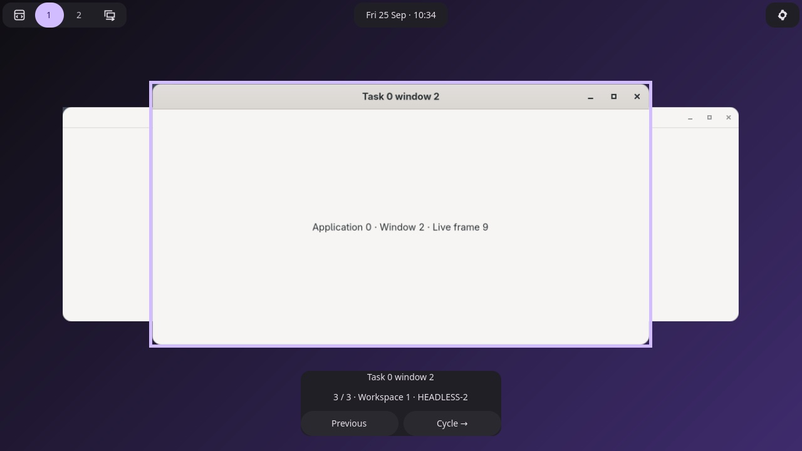

# Global window switcher — native validation

Pearl and Aqueous now cycle eligible windows across every workspace and powered
output. The compositor activates each destination without moving its window;
the deck stays on the initiating display. Finishing restores the normal scene
and moves the initiating seat's cursor into the selected content. Physical
pointer intent and lifecycle cancellation suppress that handoff.

- [Default pointer policy: 31 native checks](verification.json)
- [Mouse follows focus enabled, including XWayland: 32 checks](follow-focus/verification.json)
- [Global geometry before/after](session/global-geometry.json)
- [Rotated, scaled, negative-origin destination and cursor](session/scaled-handoff.json)
- [Restored scene](session/scaled-scene.txt)
- [Build and regression summary](verification-summary.json)
- [Bar layout regression](regressions/bar-layout/metadata.json)
- [Preferences regression](regressions/preferences/metadata.json)



The native checks exercise three windows spread across two outputs and active
and inactive workspaces, forward/reverse wrap, bursts, global counts and labels,
legacy workspace requests, immediate keyboard focus, cursor handoff after
explicit/idle/Escape/typing dismissal, physical-motion cancellation, fullscreen,
tiling, reduced motion, pointer controls, IPC owner disconnect, window close,
lock, output power-off, and compositor shutdown. A mixed XDG/XWayland run
verifies global membership and cursor placement inside a remote X11 window.

A rotated output at scale 1.25 and a negative origin verifies logical cursor
coordinates. This fixture explicitly arranges the destination window after
output reconfiguration: the floating layout can retain a saved position outside
the new output bounds. Offscreen windows retain keyboard focus but receive no
warp when no valid input point exists.

## Reproduce

Build the compositor with the repository's patched wlroots and Zig 0.16:

```sh
cd /home/zoey/RiderProjects/Aqueous/compositor
ZIG_GLOBAL_CACHE_DIR=/home/zoey/Pearl/.cache/zig-global \
PKG_CONFIG_PATH=/home/zoey/Pearl/.cache/window-switcher-wlroots/lib/pkgconfig \
zig build -Doptimize=ReleaseSafe -Dllvm -Dxwayland \
  --prefix /home/zoey/Pearl/.cache/aqueous-global-switcher
```

Build `settingsApplication` into the same prefix to provide `aqueous-config`.
From Pearl:

```sh
zig build test -Doptimize=ReleaseSafe
zig build test-window-switcher -Doptimize=ReleaseSafe -- \
  --prefix /home/zoey/Pearl/.cache/aqueous-global-switcher \
  --output artifacts/global-window-switcher
zig build test-window-switcher -Doptimize=ReleaseSafe -- \
  --prefix /home/zoey/Pearl/.cache/aqueous-global-switcher \
  --output artifacts/global-window-switcher/follow-focus \
  --mouse-follows-focus --xwayland
```

Also verified: Pearl's production ReleaseSafe build, Aqueous's ReleaseSafe
compositor tests, the existing overview and output-focus/pointer-constraint
regressions, and Pearl's bar-layout and preferences regressions. Logs are in
`regressions/`. The bar-layout suite uses its pinned compositor; the preferences
suite uses the new local compositor prefix.

The builds are local changes based on Pearl `2ff702c` and Aqueous `c2d89d5`;
capability `global_window_switcher_v1` identifies the required paired behavior.
Pearl falls back to its existing workspace-only interface when only
`workspace_switcher_v1` is available. No binaries were installed system-wide and
the user's desktop was not restarted.

Hardware scanout, physical multi-seat devices, screen-reader speech output, and
the full scale/rotation matrix remain outside this headless validation. Per-seat
rings and ownership are implemented; one compositor presentation is active at a
time, and another seat's invocation cancels the previous presentation without
moving its cursor.
