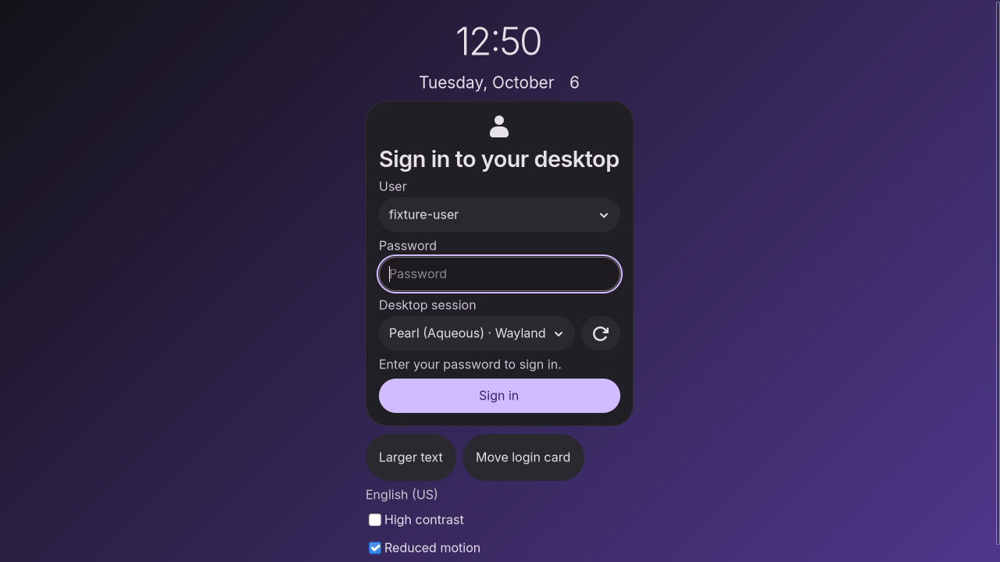

# Pearl greeter login form validation

The native greeter displays User, Password and Desktop session together. The
password-first setting supports pre-entry and one Sign in action; the default
explicit mode enables the visible response field when PAM requests input.

Validation uses fixture accounts, fake greetd and private Aqueous sessions.
No installed display manager, system PAM configuration or real login was changed.
Real greetd/PAM prompt order and desktop handoff remain deployment acceptance.

## Results

| Check | Result |
| --- | --- |
| Optional greeter production and instrumented builds | Passed, Zig 0.16.0 and ReleaseSafe |
| Pure and output unit tests | 23 passed, including 6 pending-password tests |
| Native password-first login suite | 20 scenarios passed |
| Existing native UI suite | 18 checks passed, including a 65-second idle measurement |
| greetd IPC | 13 adversarial scenarios passed |
| Catalog | Session policy, prompt-policy booleans and invalid config rejection passed |
| Private service and output suites | Account discovery, power capabilities, monitor identity and hotplug passed |
| Appearance sync | New password policy preserved while appearance fields change |
| Package staging | Production hook exclusion, linkage and closed real-login acceptance gate passed |

[Verification summary](verification.json) records matching native/UI test binary
hashes and source hashes. [Native report](native/report.json) and
[UI regression report](regression/report.json) include individual checks and
screenshot paths. [Unit output](unit-summary.txt), [integration output](integration-checks.txt),
[appearance sync](appearance-sync.txt) and [package checks](package-checks.txt)
retain the other results. [Baseline report](baseline/report.json) records the
pre-change form after restoring the missing account parser.

The new login suite checks one Enter submission; changing listed users;
Other user, empty discovery and disabled discovery; fingerprint-only success;
an explicit empty response; additional secret and visible questions; refresh and
desktop changes; cancellation, authentication failure and changed session
metadata; oversized ASCII and UTF-8 input; changed policy, failed catalog
validation and a 30-second pending-password timeout. A monitor loss while the
password is queued keeps exactly one attempt. No test credential appears in
greeter logs.

## Native screenshots

These are unedited native GTK captures, using fixture accounts.



- [User dropdown](native/session/login-switch-menu.png)
- [Manual user and password](native/session/login-other-user.png)
- [Inline authentication failure](native/session/login-failure.png)
- [Additional secret challenge](native/session/login-otp-additional-prompt.png)
- [Oversized UTF-8 response rejection](native/session/login-oversize-utf8.png)
- [Default explicit mode](regression/session/greeter-material_dark.png)
- [Light theme](regression/session/greeter-material_light.png)
- [Small output](regression/session/greeter-small.png)

The [HTML mockup](../../docs/mockups/greeter-login/index.html) is a separate design
preview. The [implementation plan](../../docs/GREETER_LOGIN_FORM_IMPLEMENTATION_PLAN.md)
and [usage documentation](../../docs/GREETER.md) explain the password-first policy.
The packaged value remains false until an administrator validates the deployment.

## Reproduce

```sh
ZIG_GLOBAL_CACHE_DIR="$PWD/.cache/zig" zig build build-greeter test-greeter-unit -Doptimize=ReleaseSafe
ZIG_GLOBAL_CACHE_DIR="$PWD/.cache/zig" zig build test-greeter-login test-greeter-ipc test-greeter-catalog test-greeter-outputs test-greeter-services test-greeter-sync -Doptimize=ReleaseSafe
python3 tests/integration/test_greeter_ui.py --greeter zig-out/test/pearl-greeter-test --output artifacts/greeter-login/regression
python3 tests/test_greeter_package.py
```

The isolated UI suites need local D-Bus and Wayland sockets and the repository's
private Aqueous test binary. They do not require access to the current desktop.
