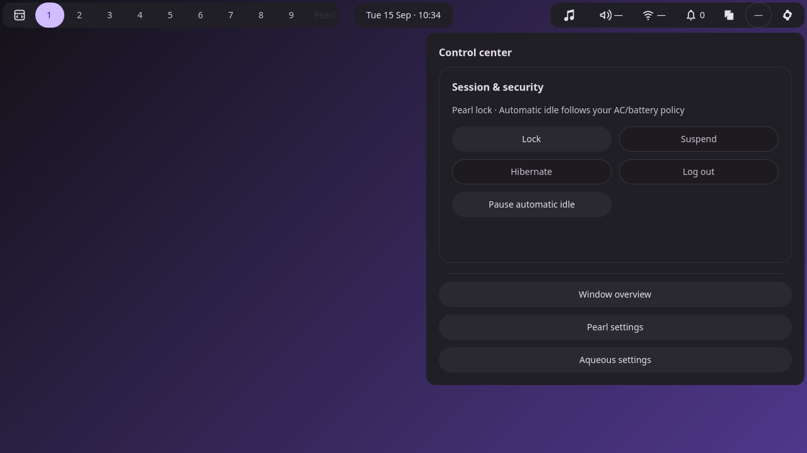
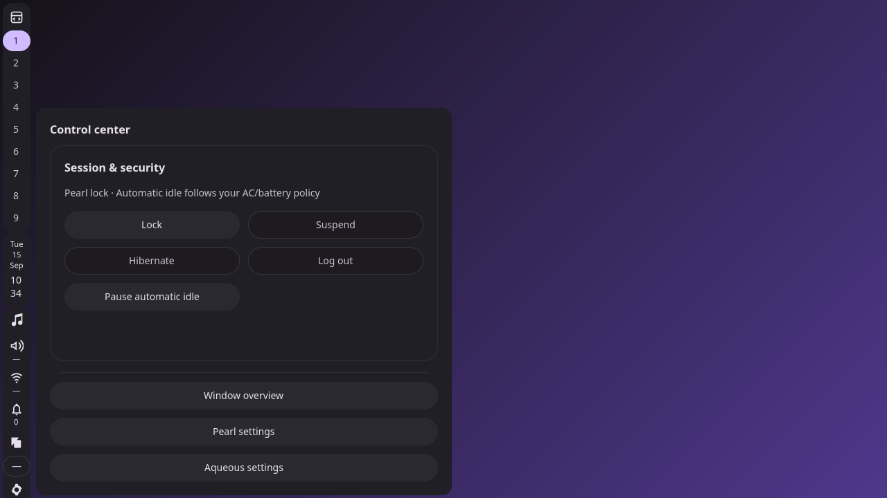

# F1 — Routes and navigation state

Status: complete; awaiting user review before F2.

## Implemented

- Shared registry in `src/desktop/settings_navigation.zig`: all eleven planned
  application routes, names and compact-page eligibility. Compact pages are
  Overview, Sound, Network, Bluetooth and Power & battery.
- Typed settings target in `Bar.Event`, preserving existing task-pane events.
- Pure transition covering opening, selecting, toggling closed and replacing
  across outputs. It rejects invalid destinations and unavailable outputs before
  returning any decision. External navigation requests heading reset; internal
  navigation requests restoration of page-local scroll/focus state.
- Optional `--page` for `control-center show|toggle`; omitted page means Overview.
  CLI and wire validation reject unknown/app-only pages, duplicates, wrong types,
  null pages, malformed output IDs and fields on unrelated commands.
- CLI help documents the accepted page IDs.

## Staged behavior

This checkpoint establishes the contract. The existing combined Control center
is still the live UI. Explicit Overview and legacy commands work as before.
Sound, Network, Bluetooth and Power requests return `Unsupported` and preserve
the current popup until F2/F3 connect their bodies and navigation. The new typed
bar event is available; service icons are wired in F4.

The pure transition is tested here; the surface manager will consume it in F3.
No claim of page separation, page lifecycle or state restoration in GTK is made
at this checkpoint.

## Validation

All Zig builds used `-Doptimize=ReleaseSafe --global-cache-dir .cache/zig`.

| Check | Result |
| --- | --- |
| `zig build test` | 89/89 tests passed, including new route/parser/transition cases |
| `zig build test-surfaces` | Passed: reservations, dismissal, hotplug, isolation and native blur |
| `zig build test-desktop` | Passed: existing bar/task controls, launchers and desktop behavior |
| `capture.py --pearl … --ctl …` | Passed: CLI defaults, wire rejection, invalid output preservation, staged unavailable pages, output replacement and Escape |
| `zig fmt --check` and `git diff --check` | Passed |

Machine-readable evidence and executable hashes:

- [Surface suite](surfaces/results.json)
- [Desktop suite](desktop/results.json)
- [Focused F1 checks](baseline/results.json)

The surface suite ran before the final temporary error response was changed from
an unrecognized error (reported as `Internal`) to the existing `Unsupported` code.
The desktop suite and focused checks used the final executable.

The initial private-session attempt could not bind local sockets in the sandbox;
the tests passed with local socket access. The capture harness also waits for
Wayland mapping before sending Escape, as the existing keyboard harness does.

## Actual baseline screenshots

These are private-session captures of the existing flyout after F1, with services
unavailable in the isolated environment. They document the starting point for
F2; they are not the standalone mockups or completed compact pages.

### Horizontal bar

### Vertical bar

## Next review step

F2 separates the four service page bodies and adds the fixed header, section
chooser and page-local viewports, while preserving access to existing controls.
F2 has not started.
