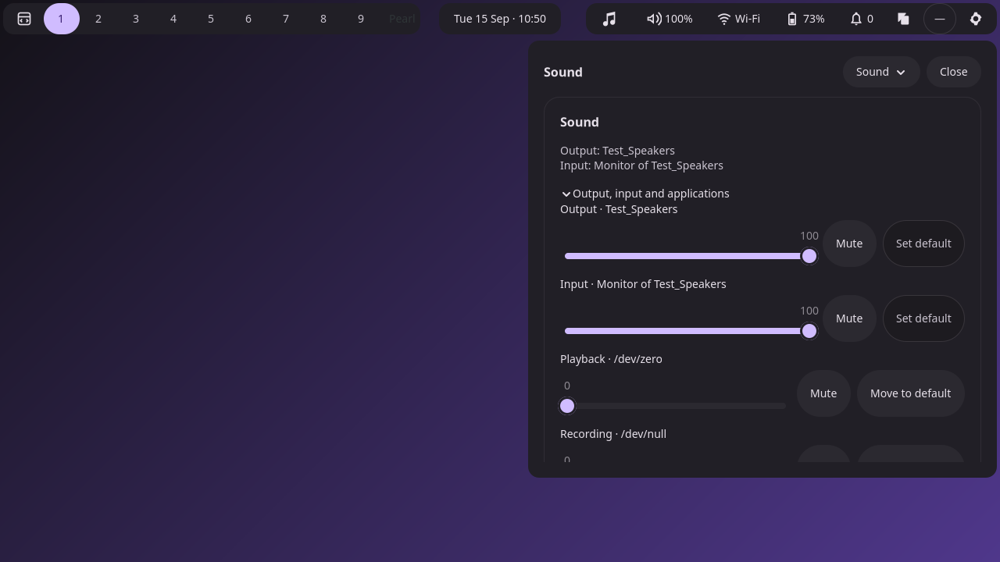
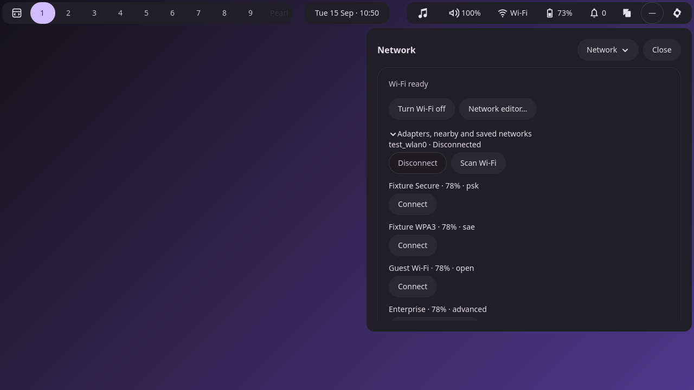
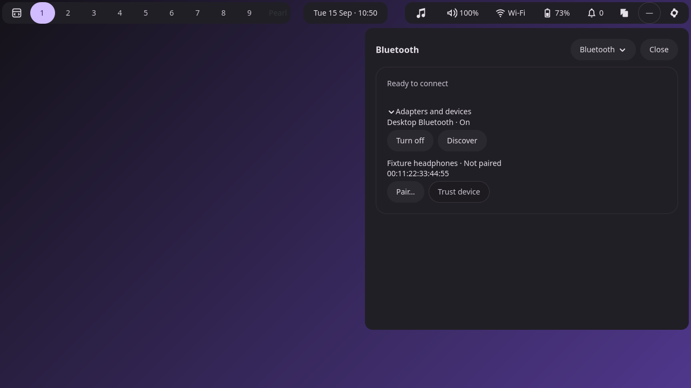
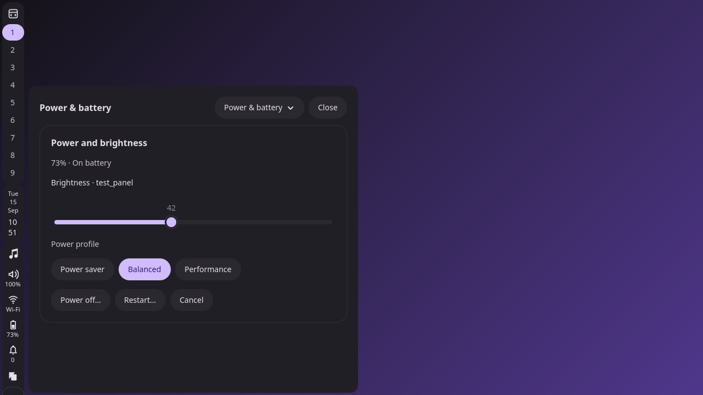

# F2 — Separate compact page bodies

Status: complete; awaiting user review before F3.

## Result

The compact flyout now has a fixed page heading, keyboard-accessible section
chooser, Close button and one stack with five independent scrolling viewports.
Only the selected page contains a live body. Network and Bluetooth device lists
use the page's viewport, eliminating the former nested scroll containers.

| Page | Retained controls |
| --- | --- |
| Overview | Four category links, media controls link, window overview, Pearl/Aqueous settings links, session actions and workspace layout |
| Sound | Output/input volume and mute, default devices, playback/recording streams and stream routing |
| Network | Radio state, adapters, explicit scan, nearby/saved networks, credential prompt and network editor |
| Bluetooth | Adapter power, devices, explicit discovery, pairing, trust and connection controls |
| Power & battery | Battery, brightness, supported profiles, power-off/restart confirmation and cancellation |

The existing service objects, identity/generation checks, confirmation logic and
error reporting remain authoritative. Navigation destroys the departing service
view and disconnects its widget callbacks. Existing cleanup clears credential
entries, cancels outstanding prompts and stops discovery. Opening pages does not
start Wi-Fi scans or Bluetooth discovery.

## Screenshots from actual private sessions

These captures use isolated PipeWire, power, NetworkManager and BlueZ fixtures.
Device names and values come from those services, not mockup data in the UI.

| Page | Horizontal bar | Vertical bar |
| --- | --- | --- |
| Overview | [Screenshot](pages/populated/top-overview.png) | [Screenshot](pages/populated/left-overview.png) |
| Sound | [Screenshot](pages/populated/top-sound.png) | [Screenshot](pages/populated/left-sound.png) |
| Network | [Screenshot](pages/populated/top-network.png) | [Screenshot](pages/populated/left-network.png) |
| Bluetooth | [Screenshot](pages/populated/top-bluetooth.png) | [Screenshot](pages/populated/left-bluetooth.png) |
| Power & battery | [Screenshot](pages/populated/top-power.png) | [Screenshot](pages/populated/left-power.png) |

### Sound

### Network

### Bluetooth

### Power & battery on a vertical bar

Additional evidence:

- [Network scrolled to saved networks, header fixed](pages/populated/network-scrolled.png)
- Unavailable services: [Sound](pages/unavailable/sound.png),
  [Network](pages/unavailable/network.png), [Bluetooth](pages/unavailable/bluetooth.png)
- [No battery or supported backlight](pages/unavailable/power.png)
- [Actual page-tree and selected-service reports](pages/populated/pages.json)

## Validation

All builds used `-Doptimize=ReleaseSafe --global-cache-dir .cache/zig` and private
fixtures. No host services or device settings were changed.

| Check | Result |
| --- | --- |
| `zig build test` | 89/89 pure tests passed |
| `zig build test-settings-pages` | Passed: page separation, real keyboard chooser navigation, fixed-header pixel comparison while scrolling, Overview links, selected-page service interest, prompt/discovery departure and unavailable states |
| `zig build test-services` | Passed: audio/streams, brightness/profiles, generation checks, actual power confirmation and denied/accepted actions |
| `zig build test-connectivity` | Passed: scans, credentials/retry, saved networks, radio block, discovery expiry, pairing/trust, cancellation and service restarts |
| `zig build test-desktop` | Passed |
| `zig build test-surfaces` | Passed |
| `zig build test-session-services` | Passed |
| Formatting, whitespace and Python syntax | Passed |

Result files include executable hashes:
[pages](pages/results.json), [services](services/results.json),
[connectivity](connectivity/result.json), [desktop](desktop/results.json),
[surfaces](surfaces/results.json), [session services](session-services/result.json).

The final focused run adds a read-only focused-button field to the private
widget-tree probe; the other suites passed before that test-only addition.
The unavailable-audio assertion accepts the existing disconnected-service error,
and input activation waits for the virtual keyboard as the existing harness does.

## Checkpoint boundary

For review, open `pearlctl control-center show`, then select a page through the
Overview links or the section chooser. Bar icons still open Overview at this
checkpoint. The new CLI service-page arguments remain gated with `Unsupported`.

F3 will connect route-aware popup transitions, update public route status, restore
page-local scroll/focus state, and complete owner-scoped lifecycle behavior. F2
recreates service bodies on internal navigation and does not yet restore that
state. F4 wires service icons and completes accessibility/handoff work; F5 owns
the full navigation acceptance matrix. Those steps have not started.
