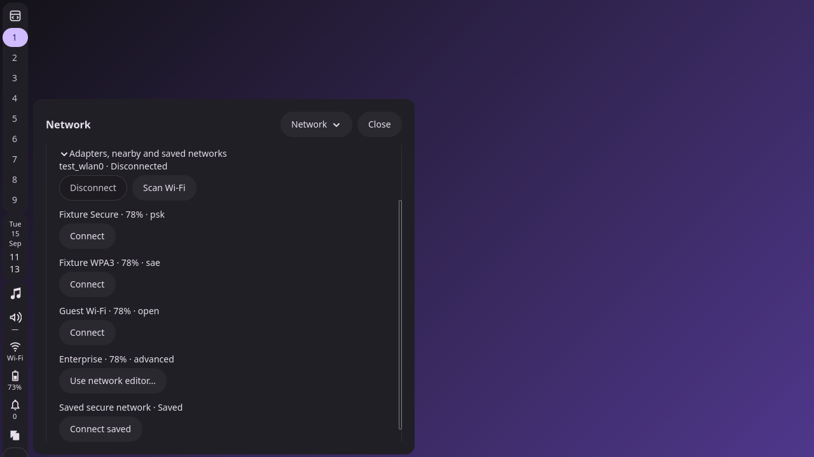
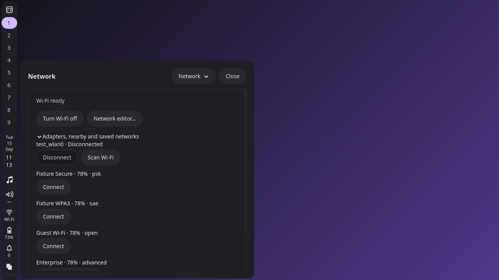

# F3 — Popup routing and lifecycle

Status: complete; awaiting user review before F4.

## Result

- `pearlctl control-center show/toggle --page PAGE` now opens the requested
  compact page. Omitting `--page` selects Overview.
- Same-output page changes keep the existing flyout window. Toggling the current
  page closes it; selecting another page switches directly. Another output
  replaces the popup. Invalid routes and outputs leave visible state unchanged.
- Public `status.popup.page` reports the selected compact route. Task popups
  report `null` for this field. The section chooser updates the same route state.
- Internal navigation restores each page's scroll, expander and keyboard-focus
  state. External navigation starts at the heading. Focus identities include
  device identity/generation; stale or unavailable controls fall back to the
  heading. Prompt controls and secret entries are never restoration targets.
- Page enter/leave/destroy hooks acquire and release service interest, disconnect
  callbacks and clear secrets. Pending prompts and discovery belong to the
  initiating owner. Closing one frontend cannot cancel another frontend's work.
  Established Wi-Fi and Bluetooth connections survive navigation and close.
- Lock and compositor/session loss revoke interactive leases. Unlock cannot
  replay a revoked token or unexpectedly reopen the flyout. Existing anchoring,
  reservations, blur and dismissal paths remain in use.

The [backend ownership contract](../../../docs/SETTINGS_SERVICE_OWNERSHIP.md)
is linked from the standalone application plan. Concurrent ownership is verified
with a second-frontend fixture in the integration build. The standalone process
and authenticated frontend transport remain separate planned work.

## Screenshots from actual private sessions

These are compact flyouts captured under private NetworkManager, BlueZ, power
and audio fixtures. They are separate from the full-window application mockups.

| Page | Horizontal bar | Vertical bar |
| --- | --- | --- |
| Overview | [Screenshot](pages/populated/top-overview.png) | [Screenshot](pages/populated/left-overview.png) |
| Sound | [Screenshot](pages/populated/top-sound.png) | [Screenshot](pages/populated/left-sound.png) |
| Network | [Screenshot](pages/populated/top-network.png) | [Screenshot](pages/populated/left-network.png) |
| Bluetooth | [Screenshot](pages/populated/top-bluetooth.png) | [Screenshot](pages/populated/left-bluetooth.png) |
| Power & battery | [Screenshot](pages/populated/top-power.png) | [Screenshot](pages/populated/left-power.png) |

### Internal return restores the saved network control and scroll

### Explicit navigation returns to the page heading

The lifecycle suite asserts the actual focus target and scroll value in addition
to capturing the images. [CLI routing captures](lifecycle/session/top-network.png)
exercise the same flyout host through successive page changes.

## Validation

All builds use `-Doptimize=ReleaseSafe --global-cache-dir .cache/zig`.
Integration suites use private compositor and service fixtures.

| Check | Evidence |
| --- | --- |
| Pure tests | 90/90 passed, including bounded independent ownership and revoked-token cases |
| `test-settings-lifecycle` | [Results](lifecycle/results.json): direct CLI routing, reuse/toggle/output policy, restored focus/scroll, stale identity fallback, independent prompt/discovery/power interest, established connections and lock/replay denial |
| `test-settings-pages` | [Results](pages/results.json): five pages, keyboard chooser, fixed header, retained controls, no automatic scans and unavailable states |
| `test-services` | [Results](services/results.json) |
| `test-connectivity` | [Results](connectivity/result.json) |
| `test-desktop` | [Results](desktop/results.json) |
| `test-surfaces` | [Results](surfaces/results.json) |
| `test-session-services` | [Results](session-services/result.json) |
| `test-security` | [Results](security/report.json) |
| Zig formatting, whitespace, Python syntax | Passed |

Result files record executable hashes. The keyboard helper now waits for GTK to
finish page restoration before sending chooser input.

## Review checkpoint

Try `pearlctl control-center show --page sound`, then
`pearlctl control-center toggle --page network`. Network should replace Sound
inside the same flyout. Repeating the Network toggle should close it. Use the
section chooser to verify page-local return behavior.

F4 is awaiting user approval. It will wire the four service icons to their routes
and complete accessibility, documentation and the available app-handoff contract.
At this checkpoint those icons still open compact Overview. F5 owns the full
bar-input and display/theme acceptance matrix.
