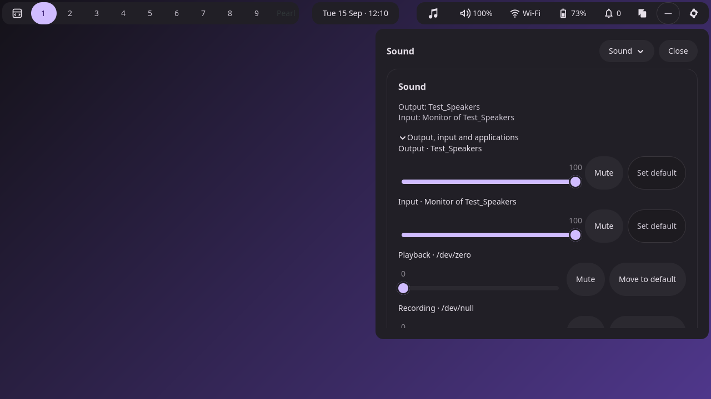
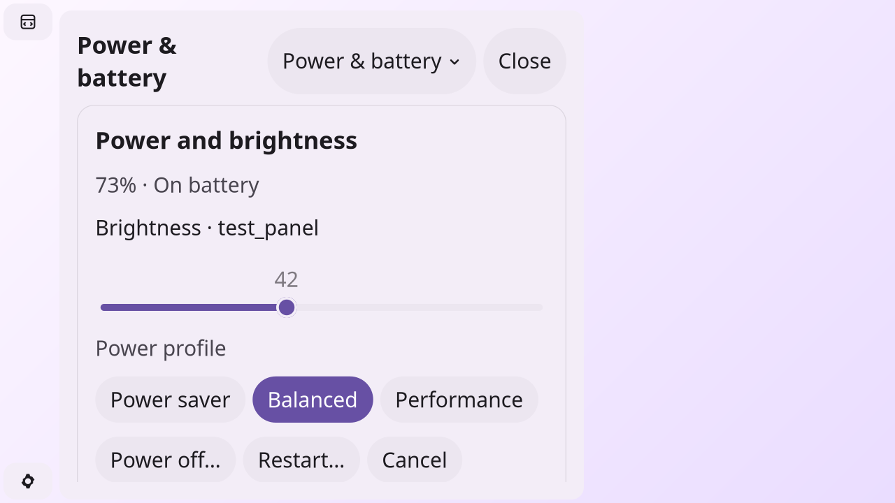
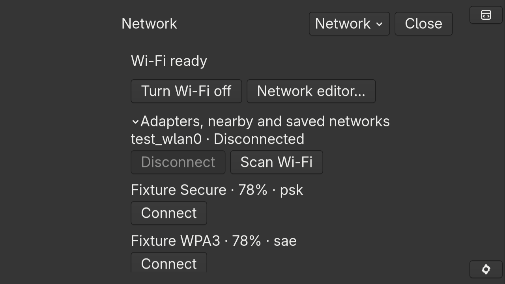

# F4 — Bar wiring, accessibility and presentation

Status: complete and approved. The user chose to retain the bar's no-keyboard-focus
policy and authorized F5.

## Implemented

| Bar item | Compact destination |
| --- | --- |
| Speaker | Sound |
| Network | Network |
| Bluetooth | Bluetooth |
| Battery | Power & battery |
| Settings gear | Overview |

Real pointer tests cover each item on all four edges, repeated-click dismissal,
and direct Sound → Network → Bluetooth → Power switching. Other bar items retain
their task actions. Missing services still open their own page with an honest
unavailable state. Battery retains its existing absent-battery visibility rule;
Power remains reachable from Overview and the section chooser.

Service buttons expose stable accessible action names, such as **Open Sound
controls**, alongside a current-status description. Custom-content buttons now
start without an empty GtkButton label, which previously masked their accessible
names. Selected page titles have heading semantics and emit low-priority AT-SPI
announcements. Hidden pages have no controls in the visible accessibility tree.
The heading has a keyboard-focus outline in Material and native GTK themes.

The existing reduced-motion preference now matches the Material CSS selector;
the older gallery selector remains supported. Page changes already use no stack
animation. Dark, light, native GTK and large-text navigation have been exercised
at 100%, 125%, 150% and 200% scale, including a short logical output.

CLI help and the Desktop, Surfaces, Services, Connectivity and Session Services
docs describe the compact routes and their lifecycle.

## Screenshots

These are actual compact flyouts from private compositor/service sessions.

| Page | Horizontal bar | Vertical bar |
| --- | --- | --- |
| Overview | [Screenshot](pages/populated/top-overview.png) | [Screenshot](pages/populated/left-overview.png) |
| Sound | [Screenshot](pages/populated/top-sound.png) | [Screenshot](pages/populated/left-sound.png) |
| Network | [Screenshot](accessibility/session/top-network.png) | [Screenshot](accessibility/session/left-network.png) |
| Bluetooth | [Screenshot](accessibility/session/bottom-bluetooth.png) | [Screenshot](accessibility/session/right-bluetooth.png) |
| Power & battery | [Screenshot](accessibility/session/top-power.png) | [Screenshot](accessibility/session/left-power.png) |

### Sound with populated audio fixtures

### Light theme, enlarged text, vertical bar

### Native GTK theme, enlarged text

Additional evidence includes [bar names and status descriptions](accessibility/bar-accessibility.json),
[page accessibility trees](accessibility/page-accessibility.json),
[actual AT-SPI announcements](accessibility/session/announcements.log),
and [presentation geometry](accessibility/presentation.json).
The [scrolled Power page at 200% scale](accessibility/session/static-dark-24-2-power-scrolled.png)
shows lower controls reached through actual Tab input with 24px text.
AT-SPI assertions verify exported names, roles and announcement events; this is
not a claim of a completed manual screen-reader usability review.

## Validation

All builds use `-Doptimize=ReleaseSafe --global-cache-dir .cache/zig`, with private
compositor and service fixtures. Result files include executable hashes.
The final page/accessibility captures follow a comment-only relocation in the
bar source; the other suites cover the same behavior before that relocation.

| Check | Evidence |
| --- | --- |
| Pure tests | 90/90 passed |
| `test-settings-accessibility` | [Results](accessibility/results.json) |
| `test-settings-pages` | [Results](pages/results.json) |
| `test-settings-lifecycle` | [Results](lifecycle/results.json) |
| `test-desktop` | [Results](desktop/results.json) |
| `test-surfaces` | [Results](surfaces/results.json) |
| `test-services` | [Results](services/results.json) |
| `test-connectivity` | [Results](connectivity/result.json) |
| `test-session-services` | [Results](session-services/result.json) |
| `test-preferences` | [Results](preferences/metadata.json) |
| Formatting, whitespace and Python syntax | Passed |

## Review decisions and dependency boundary

**Bar keyboard focus:** the user explicitly chose to retain layer-shell keyboard
mode `none`. Flyout keyboard navigation is implemented and tested; the bar does
not accept on-demand keyboard focus. F5 tests pointer input on bar buttons and
keyboard input within the flyout under this approved policy.

**Full application handoff:** no `pearl-settings` executable or implemented launch
contract is available in this repository/environment. The standalone plan still
marks the application as proposed. The handoff remains deferred under the plan's
explicit dependency boundary; every existing control stays available locally.

F4 review is complete. F5 owns the final navigation acceptance target and matrix.
