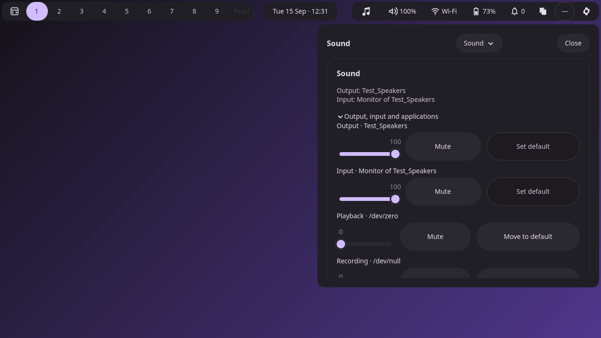
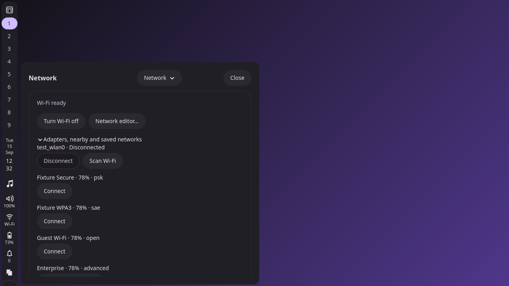
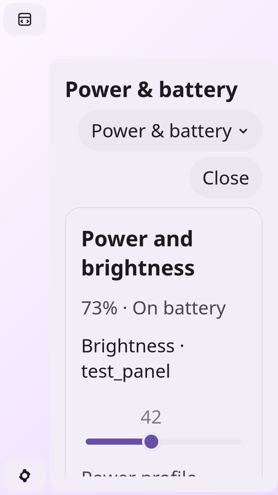

# F5 — Final compact-settings acceptance

Status: complete, reviewed and approved by the user. September 15, 2026.

## Delivered

The four service icons open Sound, Network, Bluetooth and Power & battery
directly. The gear opens Overview. A different icon switches pages in the same
flyout; repeating the current icon closes it. Each page has its own viewport,
scroll/focus state and service-view lifetime. Overview retains routes to all
existing control-center capabilities.

The bar keeps keyboard mode `none`, following the user's F4 decision. Tests use
real pointer input on bar buttons, actual keyboard input within the flyout, CLI
requests and private AT-SPI inspection. No on-demand bar focus was introduced.

F5 found and fixed two acceptance issues:

- **Narrow output layout:** header and service action groups wrap, button and
  expander captions can wrap, and page bodies remain independently scrollable.
  Keyboard traversal and page-local focus restoration still work after wrapping.
- **Radio-off state:** saved Wi-Fi activation now checks device readiness and the
  wireless radio/hardware gate. Nearby and saved Wi-Fi controls reflect that
  availability; wired adapters retain their independent readiness. Bluetooth
  device buttons are disabled when their adapter is off, matching backend policy.

## Repeatable acceptance target

```sh
zig build test-settings-navigation -Doptimize=ReleaseSafe --global-cache-dir .cache/zig
```

The final run passed **90/90 pure tests and all eight private integration suites**
with `-Doptimize=ReleaseSafe` (15/15 build steps succeeded).

The target runs pure tests and private page, lifecycle, accessibility,
desktop, surface, audio/power, connectivity and session-service suites. Each
suite has isolated compositor/service fixtures and writes its own result and
binary hashes. [Consolidated results](results.json) link to all suite receipts.
Use `-- --output DIRECTORY` to select another evidence directory.

The presentation matrix covers all five pages on all four bar edges at 100%,
125%, 150% and 200% scale with 14px and 24px text, plus light/native GTK cases and
a narrow portrait case: **35 configurations and 175 page checks**. Assertions
check actual allocated panel bounds and keyboard reachability below the fold.

## Acceptance matrix

| Requirement | Evidence |
| --- | --- |
| Four service icons and gear, initially closed | [Pointer and accessibility results](accessibility/results.json), screenshots below |
| Direct page switching and repeat-icon dismissal | Pointer checks on all four edges; [CLI/lifecycle results](lifecycle/results.json) also assert same-host reuse |
| Two outputs, all edges, one principal popup | Real pointer switching between outputs; validated CLI targets; output-removal tests |
| Retained controls and internal return | [Page coverage](pages/results.json); lifecycle checks restore scroll/focus and reject stale device-generation focus |
| Unavailable service, no battery, radio off | Unavailable-page captures; radio-off AT-SPI disabled-button assertions and backend request rejection |
| Prompt/discovery departure, close, lock and output removal | Lifecycle suite and [connectivity regressions](connectivity/result.json), including late callbacks, secret exclusion and established-connection preservation |
| Independent frontend interest | Second-owner fixture verifies prompt, discovery and Power polling ownership; lock revokes all owners |
| Escape, Close and backdrop policy | Actual keyboard Close/Escape and permitted/denied backdrop clicks; [surface regressions](surfaces/results.json) cover input leakage, blur and hotplug |
| CLI defaults, optional page and invalid IDs | Pure parser/state tests, page default commands and unchanged-visible-state rejection checks |
| Heading announcement and hidden controls | [AT-SPI trees](accessibility/page-accessibility.json) and [announcement events](accessibility/session/announcements.log) |
| Scale, narrow/short outputs, large text and themes | [Presentation matrix and geometry](accessibility/presentation.json) |
| Existing task actions and services | [Desktop](desktop/results.json), [audio/power](services/results.json), [session services](session-services/result.json) |

## Actual compact-page screenshots

| Page | Horizontal bar | Vertical bar |
| --- | --- | --- |
| Overview | [Screenshot](pages/populated/top-overview.png) | [Screenshot](pages/populated/left-overview.png) |
| Sound | [Screenshot](pages/populated/top-sound.png) | [Screenshot](pages/populated/left-sound.png) |
| Network | [Screenshot](pages/populated/top-network.png) | [Screenshot](pages/populated/left-network.png) |
| Bluetooth | [Screenshot](pages/populated/top-bluetooth.png) | [Screenshot](pages/populated/left-bluetooth.png) |
| Power & battery | [Screenshot](pages/populated/top-power.png) | [Screenshot](pages/populated/left-power.png) |

### Sound



### Network on a vertical bar



### Narrow portrait output, 200% scale and 24px text



[Lower Power controls reached by keyboard](accessibility/session/static-light-24-2-power-portrait-left-scrolled.png)
remain in the same page beneath the fixed header.

## Dependency boundary and review

The standalone application and launch contract are still unimplemented, so
installed-app/launch-failure handoff cases remain deferred under the original
plan's dependency boundary. The concurrent-frontend test exercises backend owner
leases with a private fixture; it does not claim a running standalone app.
All current compact controls remain available without that application.

AT-SPI checks verify exported names, roles, disabled state and announcement events.
The screenshots and final user review complement these automated checks; they
do not claim a completed manual screen-reader usability review.

The user approved F5, including the final compact pages and wrapping layout.
