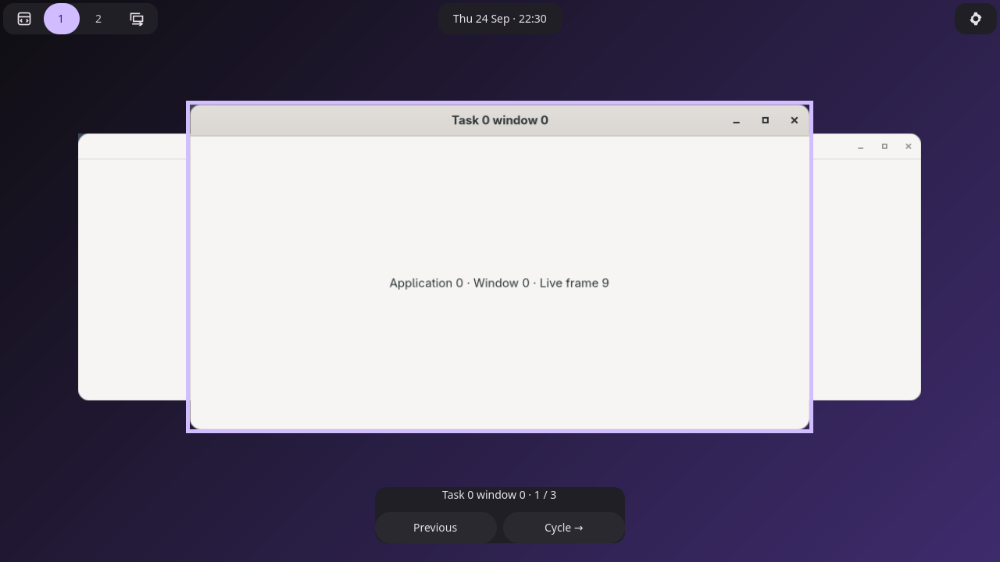

# Workspace window switcher — native validation

The coordinated Pearl/Aqueous implementation renders live client textures in a
compositor-owned stack. The selected window receives real focus on every step.
The bar widget and separate non-keyboard HUD send commands through the same ring
as native Aqueous shortcut actions.



- [Machine-readable switcher checks](verification.json)
- [Native scene graph](session/native-stack-scene.txt) and [confirmed state](session/native-stack-state.json)
- Animation frames: [forward start](session/forward-0.png), [middle](session/forward-1.png), [settled](session/forward-2.png); [reverse start](session/reverse-0.png), [middle](session/reverse-1.png), [settled](session/reverse-2.png)
- [Live client update](session/live-update.png), [reduced motion](session/reduced-motion.png), [vertical bar](session/vertical-bar.png)
- [Original interactive mockup](../../docs/mockups/window-switcher/index.html)

## Reproduce

Build both repositories with Zig 0.16 and the patched wlroots dependency required
by Aqueous. This run used the isolated prefixes `.cache/window-switcher-wlroots`
and `.cache/aqueous-switcher` under Pearl. The Aqueous compositor build enabled
Vulkan effects and ReleaseSafe; its configuration helper was also rebuilt.

From Pearl:

```sh
zig build test -Doptimize=ReleaseSafe
zig build test-window-switcher -Doptimize=ReleaseSafe -- --prefix /path/to/aqueous-prefix
zig build test-settings-bar-editor test-bar-layout test-preferences test-running-apps -Doptimize=ReleaseSafe
```

From Aqueous, with the matching wlroots library on the build/runtime search path:

```sh
cd compositor
zig build test -Doptimize=ReleaseSafe -Dllvm
cd ..
AQUEOUS_COMPOSITOR_BIN=/path/to/aqueous-prefix/bin/aqueous AQUEOUSCTL_BIN=/path/to/aqueous-prefix/bin/aqueousctl bash compositor/scripts/test-overview.sh
```

The native switcher test starts disposable sessions with two outputs, animated
GTK clients, physical pointer/key injection, session locking, and output power
management. It checks real focus, stable wrap across idle dismissal, forward and
reverse motion, texture changes, geometry preservation, IPC owner disconnect,
window churn, and cleanup. `G_DEBUG=fatal-warnings` checks Pearl teardown.
Regression reports are retained in [regressions](regressions/).

An existing output-disable assertion was found by the overview regression and
fixed in Aqueous: disabled output heads now preserve their previous mode data
while being excluded from coordinate validation. The full overview regression
then passed, including repeated scene cleanup and disabling its owning output.

## Scope and appearance

These captures are actual native compositor output. The HTML mockup remains a
design reference: production uses the existing overview renderer's selection
outline and app-provided corners, a 240 ms cubic ease-out, and immediate scene
restoration on dismissal. Pearl's reduced-motion preference applies to requests
from Pearl; native bindings follow compositor animation support.

Hardware scanout, XWayland, multi-seat interaction, screen-reader speech output,
and the complete fractional-scale/rotation matrix have not been manually
validated by this run. Native bindings are unassigned by default; assign them in
Aqueous settings without duplicating the existing `cycle_focus` shortcut.

This work builds local binaries and does not install them or restart the user's
desktop. Both updated components must run together to expose the new capability.
