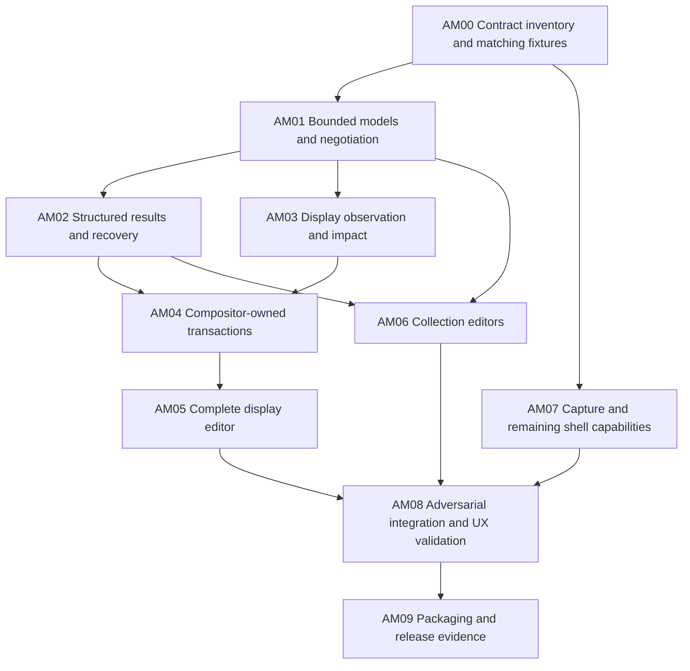

# Updating Pearl to current Aqueous capabilities

Status: **AM00–AM09 implemented; automated acceptance passed; public release acceptance pending**.
Updated September 14, 2026. The pinned source exposes several non-composable or
hardware-gated contracts; their exact remaining work is recorded in
[AQUEOUS_MASTER_DEPENDENCIES.md](AQUEOUS_MASTER_DEPENDENCIES.md).
This is the implementation specification for the integration update following
Pearl's initial release-candidate implementation. It supersedes the pending-upstream
assumptions in [AQUEOUS_T11_ADDITIONS.md](AQUEOUS_T11_ADDITIONS.md).

## Objective and pinned baseline

Expose Aqueous's current user-facing configuration and shell capabilities through
Pearl, with complete state reporting, appropriate GTK controls and safe apply and
recovery behavior. Keep the Material-style appearance, detached islands, always-visible
workspaces, native GTK themes and native lock screen already implemented.

The remote master hash was verified with `git ls-remote` on September 14, 2026:

- Repository: `https://github.com/Seafoam-Labs/Aqueous-clean.git`.
- Target commit: **`1d038dc3bafa0044d9599f8f51f84105a6a85bb3`**.
- Additions landed principally in `3b97b1e45e457e4e4b1496998e3e926bfad2d4bc`
  and `25c8c1d`; the target also includes the later packaging cleanup.
- Canonical helper: **aqueous-config 0.8.0**, helper protocol 1 with additive
  capability/version fields.
- Pearl: **Zig 0.16.0**, GTK4 and Ghostty's generated Zig bindings. Generate missing
  Wayland bindings from pinned XML; do not introduce a custom C bridge.

Pin this commit in fixtures and test-build metadata. Do not silently follow later
master changes during implementation. A newer target requires a recorded source
comparison and refreshed acceptance inventory. Preserve the upstream checkout;
use a private source archive/worktree and build prefix for matching test binaries.

The original plan was based on source inspection. Implementation evidence now
uses matching pinned tools under [artifacts/aqueous-master](../artifacts/aqueous-master/README.md).
The older baseline and Vulkan-effects evidence remains historical; it does not
certify these new contracts.

## What changes for users

| Area | Pearl before this update | Implemented result, subject to the gates below |
| --- | --- | --- |
| Standard settings | Controls for 221 helper fields; five display-policy fields are apply-gated | Preserve coverage; field definitions are unchanged in the inspected master |
| Display information | Legacy monitor projection | Show configured declarations, effective/live state, profile, identity, rejection reasons and per-feature support |
| Display editing | Position, scale, rotation and advertised modes for enabled outputs | Also expose enablement, mirroring, primary selection, profiles, policies, matching and custom modes where the complete protected transaction is supported |
| HDR/VRR | Not exposed through protected apply | Show settings/current state and explain capabilities; enable live apply only when upstream permits it |
| Preview/rollback | Pearl-owned Wayland guardian | Aqueous-owned lease with generation/digest checks and coordinated persistence |
| Raw configuration | Broad output-section deny rules | Use authoritative candidate impact; preserve unknown content and block unclassified changes |
| Save recovery | Legacy stderr reload report and file comparison | Structured results and durable operation receipts, including recovery after Pearl restarts |
| Rules/keybindings/snap layouts | Inventories and advanced request JSON | Accessible structured editors driven by collection schemas and identity rules |
| Capture | SDR output/region screenshots | Native isolated-window capture and capability-aware color handling, with honest unsupported states |
| Release | Older integration evidence | Matching master compositor/helper builds, complete coverage matrix and new release evidence |

“Expose everything” means every user-facing feature has a recorded disposition:
working control, read-only information, capability-gated control, or an explicit
reason it belongs outside Pearl. Do not equate a protocol request count with UI
coverage. DRM leasing, client rendering protocols, compositor implementation policy,
and portal-backend ownership do not automatically become shell settings.

## Non-negotiable integration rules

1. **Aqueous remains authoritative.** Use the canonical helper and compositor
   projection. Do not add a TOML parser/serializer, duplicate configuration precedence,
   or infer a display's effective state from draft text.
2. **Negotiate capabilities, not just versions.** New settings integration targets
   helper 0.8.0 and the required additive capabilities. Missing support produces an
   actionable unavailable state for the affected operation, not a whole-shell crash.
   Introduce the modern path alongside existing code during development; retire the
   old display guardian after the new path passes. Do not fall back to legacy apply
   after a modern transaction has started or failed.
3. **Keep identities separate.** Configuration generation, candidate digest, IPC
   session, display revision, output instance and operation ID are different values.
   Carry them through the operation without truncation or substituting connector names.
4. **Preserve unknown outcomes.** Acknowledgement, persistence, reload, display commit
   and toolkit synchronization are separate results. Lost replies never authorize a
   second write, reload or toolkit action.
5. **Respect hardware gates.** Current master permits native protected previews only
   on headless outputs. HDR/VRR preview remains unavailable; mirroring also depends on
   renderer support. Read `store`, `test`, `preview` and `reason` separately. `store=true`
   is not permission to bypass the protected-apply contract.
6. **Keep interaction responsive.** All helper work is cancellable and off the GTK
   thread. Keep polling limited to active leases/operations. Preserve bounded decoding,
   queues and caches, native GTK-theme behavior, keyboard access and reduced motion.
7. **Keep tests private.** Temporary HOME/XDG paths, private sockets/buses and virtual
   outputs only. Do not install into the host root, modify upstream, enable services,
   replace host PAM, switch shells or invoke physical power actions automatically.

## Source and ownership map

Paths in the first column are relative to the pinned Aqueous checkout.

| Aqueous authority | Pearl integration points |
| --- | --- |
| `settingsApplication/src/backend/schema.zig`, `src/config_main.zig` | `src/config/aqueous_model.zig`, `aqueous_client.zig` |
| `settingsApplication/docs/aqueous-config-additions-v1.schema.json` | New bounded models/fixtures for additive helper results |
| `settingsApplication/src/backend/operations.zig`, `impact.zig`, `candidate_review.zig` | Request validation, draft review, display projection and apply routing |
| `settingsApplication/src/backend/receipts.zig` | New operation tracking/reconciliation service |
| `compositor/aqueous/ConfigTransaction.zig` | Canonical writer/journal remains upstream; Pearl consumes results |
| `compositor/protocol/aqueous-ipc-v1.schema.json`, `aqueous-display-v1.schema.json` | `src/aqueous/codec.zig`, `transport.zig`; new dedicated display IPC client |
| `compositor/aqueous/DisplayModel.zig`, `DisplayPreview.zig` | `src/config/display_guard.zig` replacement and GTK display workflow |
| `settingsApplication/src/backend/operations.zig` collection schemas/preconditions | `src/desktop/aqueous_settings.zig` and new structured editor modules |
| Capture globals and their exact protocol XML in the pinned build/dependencies | `build.zig`, `bindings/protocols`, `src/services/capture.zig`, `src/desktop/clipboard_capture.zig` |
| Helper-only build/install and Aqueous packaging | `packaging`, compatibility docs and release tooling |

Some upstream helper documentation links refer to files absent from this commit.
Use the checked-in schemas, implementation and tests as the authority; do not
invent contracts to fill those missing documents.

## Delivery order

Each work package below is independently reviewable. Complete its acceptance
checks and update the coverage inventory before moving to dependent work.

### AM00 — Freeze contracts and build a complete feature inventory

**Depends on:** none. **Deliverable:** target metadata, versioned source fixtures,
and `docs/AQUEOUS_CAPABILITY_COVERAGE.md`.

- Inventory helper capabilities, snapshot/result fields, collection operations,
  IPC commands and native shell/capture globals from the pinned source and registry.
  Compare against Pearl's actual consumers, not just generated bindings or docs.
- Give each user-facing item a source reference, required capability, Pearl consumer,
  UI/CLI entry point, current disposition, implementation owner and acceptance test.
  Include input-device policy, window/workspace actions and compositor effects in
  this audit; record any additional gaps rather than limiting it to the table above.
- Build matching compositor, aqueousctl and aqueous-config into a private prefix.
  Record source/dependency patches, compiler flags, renderer, binary hashes and
  helper capabilities. Make new tests accept an explicit prefix so they cannot
  silently pick up installed 0.7.2 tools or the old cached compositor.
- Capture source-derived and live private fixtures: healthy snapshot, configured
  offline output, disabled output, profile, raw changes, unknown property, rejected
  declaration, competing edit, operation receipt and unsupported hardware feature.
- Record exact schemas and tests with provenance. Keep existing older fixtures as
  compatibility/history evidence, clearly labelled.

**Done when:** a private session runs the pinned binaries; every new contract has
an inventory entry; all newly discovered gaps have a work-package assignment or
explicit outside-Pearl rationale. Merely advertised support is labelled unverified.

### AM01 — Add bounded models and capability negotiation

**Depends on:** AM00. **Primary files:** `src/config/aqueous_model.zig`, new
`aqueous_contract.zig` / `aqueous_display_model.zig`, `src/aqueous/codec.zig`.

- Decode display configuration/declarations/model/observation, candidate review and
  impact, collection schema/identity/preconditions, structured results and receipts.
- Preserve unknown optional fields where needed for faithful editing; reject unknown
  versions or malformed required data only at the dependent feature boundary.
- Represent support and reason explicitly per feature/output. Distinguish missing,
  false, unknown, configured, effective and observed values; no false defaults for
  absent HDR/VRR/enablement information.
- Centralize capability selection. Cover `display_model_v2`, `candidate_impact_v1`,
  `display_observation_v1`, `display_preview_commit_v1`, `apply_result_v1`,
  `operation_receipts_v1`, `recoverable_commit_v1`, `collection_schema_v1` and
  `collection_preconditions_v1`, plus the required underlying legacy capabilities.
- Derive bounds from the pinned contracts; retain the 16 MiB helper-response and
  4 MiB advanced-request ceilings unless an actual fixture justifies a reviewed change.
  Keep the shell control socket bounded; expose summaries or local-file requests
  rather than silently expanding it to the helper's maximum size.

**Tests:** valid fixtures, missing capabilities, unknown versions, malformed enums,
overflow/oversized collections, truncated replies and optional-field preservation.
**Done when:** pure decoder tests pass and UI/service code can query one consistent
feature model without ad hoc JSON interpretation.

### AM02 — Adopt structured apply results and operation recovery

**Depends on:** AM01. **Primary files:** `aqueous_client.zig`, new
`aqueous_operations.zig`, `src/config/process.zig`, GTK status presentation.

- Use `apply --result v1 --operation-id ID --shell none --request -`.
  Generate IDs in the exact upstream timestamp/random format; do not substitute
  an arbitrary UUID. Aqueous currently bounds receipt lifetime to seven days and
  rejects expired/reused IDs according to its source rules.
- Before dispatch, atomically retain a small private pending-operation record:
  operation ID, helper endpoint/version, request fingerprint, original generation,
  candidate digest and expected session where relevant. Store no raw secrets or
  unnecessary configuration contents; use 0700 directories/0600 files and a bound.
- Decode structured failure results even when the subprocess exits unsuccessfully.
  Present save/reload/display/toolkit outcomes independently, including unchanged,
  partial, unknown, recovery conflict and receipt-unavailable states.
- After a lost response or Pearl restart, call
  `operation-status --operation-id ID` before offering any further write.
  Unknown, expired or inaccessible records remain unresolved; do not invent success
  from `.ok` alone or reissue apply with a new ID.
- Let the backend own locking and journalling. Surface writer-busy and recovery
  conflicts; retry reads within a deadline, and require explicit retry for writes.
  Keep a recovery page/action available when a draft can no longer be safely applied.

**Tests:** lost stdout before/after persistence, process death, restart recovery,
ID reuse with changed request, expiry, capacity, writer contention, saved-but-reload-
failed, recovered save with unknown toolkit outcome, malformed result and cancellation.
**Done when:** every interrupted operation reaches either a proven terminal outcome
or an explicit unresolved state, with no duplicated side effect.

### AM03 — Observe complete displays and classify candidate changes

**Depends on:** AM01. **Primary files:** new display IPC client/model;
`aqueous_client.zig`, `src/desktop/aqueous_settings.zig`.

- Read `display.snapshot` and helper display projections. Show live output instance,
  configured/offline declarations, matching, active/effective/fallback profiles,
  primary state and per-feature reasons without flattening them into legacy monitors.
- Validate drafts through the helper and retain its candidate digest and impact:
  `none`, `runtime_non_display`, `display_live`, `display_deferred`, `unknown`.
  Treat effects as a set; a candidate may affect both current and future output state.
- Replace broad raw-section heuristics on the modern path only when the helper's
  authoritative report is complete and bound to the current candidate/generation.
  Preserve the complete candidate sources required by native preview.
- Use `protected_apply` for the modern path. Non-display edits can proceed through
  structured apply. Unknown impact blocks apply with a useful explanation. Display
  effects, including deferred/offline/profile policy changes, route through AM04.
  Do not interpret `store=true` or `display_deferred` as permission for an unleased save.

**Tests:** comments-only changes, malformed/unknown syntax, mixed effects, raw legacy
wm display sections, profile activation, offline declarations, stale observation,
compositor disconnect and canonical edits between validate and apply.
**Done when:** every supported draft gets a reviewable routing decision; no unknown
or display-affecting edit can enter the unprotected write path.

### AM04 — Replace the guardian with compositor-owned transactions

**Depends on:** AM02, AM03. **Primary files:** new
`src/config/aqueous_display_transaction.zig`, display IPC transport, settings client.

- Implement `display.preview.begin`, `.status` and `.revert` on a dedicated persistent
  connection. Preserve ownership of that connection throughout the uncommitted lease;
  a short-lived aqueousctl invocation would disconnect the owner and trigger rollback.
- Bind begin to original generation, session/revision, candidate digest and exact
  validated wm/output sources. Keep the full candidate immutable during preview;
  editing cancels/reverts and requires a new validation.
- Show Keep/Revert with the compositor's remaining lease time, not an independently
  extended GUI timer. Poll only while active with bounded backoff/timeouts.
- On Keep, send the same candidate through the canonical helper with protected apply,
  preview token, candidate digest, operation ID and required observation fields.
  **The helper owns `display.preview.authorize`, journalled persistence and
  `display.preview.finalize`; Pearl must not duplicate those calls or reloads.**
- Track applying, previewing, commit-authorized, kept, reverting, reverted,
  invalidated and failed outcomes. After commit authorization, query the receipt
  and native state rather than assuming owner disconnect means rollback.
- On hotplug, lock, shell shutdown or lost connection, follow the upstream state
  machine. Do not issue a legacy rollback against a newer configuration. Report
  partial rollback/fallback explicitly and release all timers/transport references.
- Once this path passes, remove the old guardian from current-master production
  operation. Older missing-capability environments get a clear unavailable display
  workflow; do not keep two competing rollback owners.

**Tests:** begin test failure, deadline, GUI crash, owner disconnect, hotplug, concurrent
preview, competing canonical writer, changed display revision, stale digest, last-output
rejection, failure between authorize/write/finalize, lost Keep reply, restart during
commit, parent cancellation and no accidental second reload.
**Done when:** private tests prove that an unconfirmed candidate is not persisted,
a confirmed candidate has a queryable durable outcome, and races cannot overwrite
newer configuration. Hardware support remains gated exactly as upstream advertises.

### AM05 — Complete the GTK display editor

**Depends on:** AM04. **Primary files:** `src/desktop/aqueous_settings.zig`, new
`src/desktop/aqueous_displays.zig`, shared form/preview widgets.

- Provide explicit connected, disabled and configured-offline entries. Show inherited
  versus explicit values and source precedence. Edit identity matching without treating
  a current connector as a permanent hardware identity.
- Add enablement, primary selection, mirroring, profiles/fallback, the five display
  policies, custom modes, HDR/SDR white/auto-HDR controls and adaptive sync as supported
  by the source model. Preserve absent/inherited values on round-trip.
- Use a capability-aware editor: inspection and draft validation can be available
  while protected apply is disabled. Explain which output/feature blocks the whole
  candidate. Do not silently drop unsupported changes or apply only a subset.
- Add a placement preview with editable numeric geometry and keyboard movement;
  drag placement is an enhancement to those accessible controls. Support negative
  origins, rotated dimensions and fractional scales.
- Route all writes through AM03/AM04. Present candidate effects and the existing
  Keep/Revert flow consistently under Material and arbitrary GTK themes.

**Tests:** lossless field round-trip; missing monitor; scale/rotation/placement; mirror
source selection; primary/profile precedence; mixed supported/unsupported changes;
keyboard-only editing; enlarged text; current-master hardware refusal messages.
**Done when:** every display model field has a control or a documented read-only/gated
presentation, and unsupported HDR/VRR/physical preview cannot be enabled through UI or CLI.

### AM06 — Add structured collection editors

**Depends on:** AM01, AM02. **Primary files:** new rule, keybinding and snap-layout
editor modules under `src/desktop`; shared draft and collection model.

- Render window-rule fields/options/ranges from `collection_schema`, including matcher
  semantics, first-match ordering and the difference between inheritance and false/zero.
  Support add/update/delete/move with a preview of the canonical request.
- Add custom shortcut rows, command type/arguments, collision feedback and the existing
  acknowledged shortcut-inhibition recorder. Preserve compositor command semantics;
  editing a spawn command must not execute it.
- Add snap-zone/layout CRUD, normalized numeric geometry and an optional canvas.
  Preserve ordering, duplicates where meaningful and current default selection.
- Respect generation-scoped identities: these are not durable IDs across arbitrary
  snapshots. Use `collection_preconditions` only in the cases upstream accepts;
  its stale-generation path permits collection-only edits, not mixed raw/field edits.
  Rebase with a fresh snapshot and explicit conflict resolution rather than replaying
  stale source indices after reorder.
- Retain Advanced for unsupported extensions, backed by the same validation/apply
  pipeline. Do not maintain independent UI and JSON drafts that can diverge.

**Tests:** reordered/duplicate rules, missing inherited fields, each supported rule type,
stale-generation collection-only acceptance, mixed-request rejection, concurrent edits,
shortcut cancellation/restoration, invalid snap geometry and UI/Advanced round-trip.
**Done when:** common collection operations no longer require JSON, and concurrent edits
cannot change a different rule/binding/zone through a stale index.

### AM07 — Adopt capture interfaces and close remaining shell gaps

**Depends on:** AM00; use AM01 where a shared capability model helps.
**Primary files:** `build.zig`, `bindings/protocols`, `src/services/capture.zig`,
`src/desktop/clipboard_capture.zig`; additional consumers identified in AM00.

- Pin and generate the exact image-copy, output/window source and Aqueous color
  protocol versions supplied by the matching compositor/dependencies. Inspect the
  XML and registry before selecting a version; do not guess request layouts.
- Add native isolated-window source selection tied to current toplevel identity.
  Never substitute an output rectangle for an isolated-window request. Handle closed,
  unmapped, minimized and protected windows according to compositor responses.
- Negotiate supported buffer formats and color metadata. Keep SDR PNG export correct;
  if safe HDR conversion/export is not implemented, explain the limitation and reject
  it rather than tagging HDR bytes as SDR. Add HDR export only with an explicit
  conversion/format design and reference validation.
- Preserve capture cancellation, lock-time privacy, transfer bounds and output/region
  behavior. Keep portal/screensharing ownership unchanged.
- For other gaps discovered in AM00, add bounded sub-tasks to its inventory before
  implementation: identify the real user action, protocol consumer, GTK/CLI entry
  point and test. Every such entry must be resolved before AM08 acceptance; this
  work package is not permission to mark unimplemented controls covered.

**Tests:** isolated-window pixels with overlapping unrelated windows, source destroyed
mid-transfer, unsupported source/version/format, scale/rotation, buffer size limits,
lock during capture, protected content denial and color reference samples.
**Done when:** available user-facing capture operations have honest controls/results;
unsupported formats/features are explicitly gated and all AM00 shell gaps have a disposition.

### AM08 — Run adversarial, visual and accessibility validation

**Depends on:** AM05, AM06, AM07. **Primary files:** `tests/integration`, fixtures,
`scripts/release-validate.py`, capability coverage document.

- Add a current-master integration target using matching helper/compositor/aqueousctl.
  Add adversarial fixture tests for every failure boundary above; fixtures supplement
  rather than replace the real private-master round trips.
- Re-run existing settings, surfaces, dock/islands, desktop, capture and security tests
  affected by the new clients. Run the full release matrix after the slices pass.
- Capture displays, rule editor, shortcuts, snap layouts, operation recovery and
  capture in dark/light, compact/default, arbitrary GTK themes, enlarged text and
  mixed scales. Verify names/roles, focus restoration and keyboard-only workflows.
- Repeat production idle/startup/PSS and 1,000-cycle soak measurements, adding native
  preview/revert, helper contention, service replacement and virtual output reconnects.
  Ensure display observation does not introduce permanent idle polling.
- Preserve separate physical/AT-SPI/presentation signoffs. Current-master refusal of
  physical preview is an expected upstream capability result, not a failed test to
  work around or evidence that physical preview succeeded.

**Done when:** all automated checks pass against the pinned artifacts, the coverage
matrix has no unexplained item, and remaining upstream/hardware limits are explicit.

### AM09 — Package, document and hand off the updated release candidate

**Depends on:** AM08. **Primary files:** `packaging/release.json`, Arch recipe,
release scripts, README, compatibility/settings/coverage/release documentation.

- Record new compiler/library/helper floors, commit and separate compositor/helper
  binary hashes. Audit actual upstream package dependencies and service enablement;
  helper-only build support does not imply every distribution package is shell-neutral.
- Verify a fresh staged Pearl plus matching helper/aqueousctl works without the retired
  settings GUI. Preserve the user's original shell/configuration and existing DMS
  import/rollback behavior. No installation script may auto-switch the desktop.
- Reproduce release binaries in distinct build roots and build a checksum-locked Arch
  package. Extend the release gate to require matching master-integration evidence,
  helper/compositor provenance and the completed capability inventory.
- Replace stale upstream-additions language with implemented/currently-gated status.
  Update the 221-field inventory to include new non-scalar display/collection contracts;
  a scalar field count alone is no longer the coverage claim.
- Publish a concise migration note: required helper, changed display workflow,
  operation recovery, removed guardian behavior and upstream hardware restrictions.
  Choose a new candidate version only when preparing this build; do not overwrite
  prior release evidence or claim previous binaries include these additions.

**Done when:** reproducible package and full automated evidence agree on the new
artifacts; docs match source and tested capabilities; release remains unaccepted
where license, physical, visual or assistive-technology signoffs are still pending.

## Review and acceptance checklist

- [x] AM00: complete inventory and matching pinned private test environment.
- [x] AM01: bounded additive models and capability negotiation.
- [x] AM02: structured results and restart-safe operation reconciliation.
- [x] AM03: authoritative display observation and candidate routing.
- [x] AM04: native lease/commit replaces the old guardian for this target.
- [x] AM05: complete display controls with faithful capability gating.
- [x] AM06: structured collection editors and correct concurrency semantics.
- [x] AM07: native capture and remaining inventoried shell gaps resolved.
- [x] AM08: automated regression, adversarial, visual and performance evidence.
- [x] AM09: updated package, provenance, documentation and honest release gate.

The checked implementation slices include explicitly gated operations, not claims
that upstream can persist every valid draft. AM05 retains read-only controls for
missing structured display mutations; AM06 blocks unclassified collection saves;
AM07 withholds undescribed isolated-window PNGs. These satisfy the specified
capability gates and preserve the canonical helper as the only configuration writer.
All automated gates pass for Pearl 1.0.0-rc.2. The 17-target regression matrix
includes 107 Zig tests and four release-tooling tests; separate suites cover
canonical journal/lease failures, nine GTK validation checks, and a 1,000-cycle
production soak. Idle PSS was 30.1 MiB, idle CPU 0.017%, warm-start p95 81 ms,
and retained soak growth 7.8 MiB. Two fresh build roots and the staged Arch package
agree on all three production binaries. See the
[evidence index](../artifacts/aqueous-master/README.md) and
[machine-readable gate](../artifacts/aqueous-master/gate.json).

Human/hardware/public release acceptance remains separate: project license,
direct/UWSM login, visual review, physical displays/security/services,
accessibility and presentation performance are still pending. AT-SPI names/roles
and real keyboard editing passed; direct AT-SPI focus returned an error on this
GTK stack, so these tests do not constitute screen-reader acceptance.

## Continuing from this implementation

This pinned update is implemented. For a newer Aqueous commit, compare source and
contracts first, refresh the capability inventory and private fixtures, and rerun
the dependent acceptance suites against matching tools. Address the precise
contracts in [AQUEOUS_MASTER_DEPENDENCIES.md](AQUEOUS_MASTER_DEPENDENCIES.md) before
enabling currently gated operations. A missing upstream capability is a recorded
dependency, not permission to bypass a transaction or write raw configuration.
