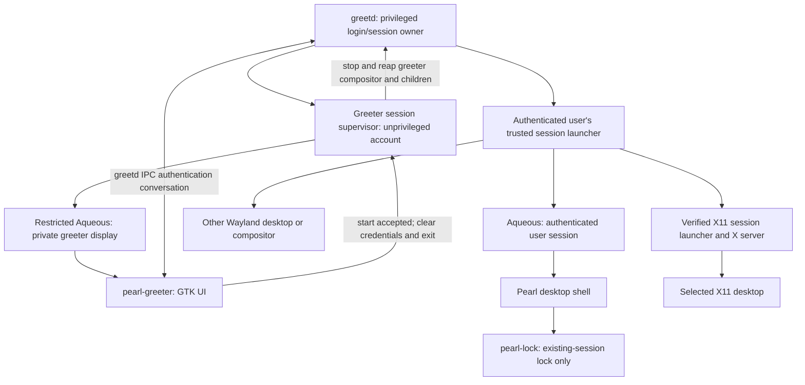

# Pearl greeter implementation plan

Status: **Pearl implementation and private tests available; production integration remains gated**.
No host login configuration has been changed. See [current status and evidence](GREETER_COMPATIBILITY.md)
and [build/configuration instructions](GREETER.md).
Prepared September 14, 2026. This is a specification for sequential implementation
by a person or an AI agent, with reviewable deliverables and acceptance gates.

## Objective and decisions

Build **`pearl-greeter`**, a Zig 0.16.0 / GTK4 login screen for greetd, using
Ghostty's generated GTK bindings. It should look like Pearl's native lock screen:
wallpaper, prominent clock and date, a rounded account/authentication card,
Material colors or an installed GTK theme, and restrained motion. It must launch
**Pearl on Aqueous and other installed Wayland and X11 desktop sessions**.
Other-desktop support is a first-release requirement. Pearl's desktop shell
remains Aqueous-specific; the greeter's authenticated session chooser does not.

The recommended architecture uses a dedicated, unprivileged greeter account and
a restricted Aqueous compositor instance before login. greetd owns authentication,
account policy and creation of the authenticated session. Pearl owns the UI,
bounded IPC client, trusted session selection and orderly greeter shutdown.
greetd explicitly supports independently implemented greeters over its IPC
interface. [Upstream greetd](https://github.com/kennylevinsen/greetd)

These decisions are the implementation defaults, not questions left for each task:

| Area | Decision |
| --- | --- |
| Login backend | greetd; no new privileged authentication daemon |
| Greeter compositor | Restricted Aqueous; prove the required isolation in GR01 |
| Authenticated desktops | Discover and launch installed Wayland and X11 sessions, including Pearl + Aqueous; honor each desktop's startup contract |
| Session selection | Accessible desktop chooser with trusted system entries, administrator policy and optional remembered session IDs |
| Managed startup | UWSM only for explicitly enabled, separately tested compatible session profiles |
| Presentation | Reuse/refactor lock-screen presentation, retaining a separate login controller |
| Surface protocol | GTK layer-shell windows in the disposable greeter compositor; no session-lock acquisition |
| Configuration | Separate administrator-owned greeter configuration and assets |
| User discovery | Optional AccountsService list, with manual username entry always available |
| Packaging | Optional `pearl-greeter` package; ordinary Pearl installation does not replace a display manager |
| First release | One seat, multiple monitors, keyboard login, complete greetd conversations, restart/power-off where permitted |

Deferred: autologin, fast user switching/resuming existing sessions,
remote login, account creation, credential storage, network configuration, suspend
controls, and a bundled on-screen keyboard. Fingerprint, smart-card and password
change flows are supported only to the extent the tested greetd/PAM stack exposes
them through its normal conversation; do not implement an independent factor or
password-change backend. Screen-reader acceptance remains a release requirement.

## Baselines and facts established during planning

- Pearl source HEAD inspected: `5fcc60db0e61365a2d78e56c4f734f0cb478606a`.
  Preserve the recent vertical-bar/clock behavior and other existing work.
  GR00 records the actual implementation starting revision and worktree state.
- Compiler: exactly **Zig 0.16.0**. Reuse the existing dependency pins and generated
  bindings; new missing bindings are generated, not implemented as a C bridge.
- Installed greetd inspected: **0.10.3-2.1**; upstream IPC documentation reports
  **0.10.3**. This is a candidate test baseline, not proof of a tested login.
  GR00 must record the distribution patches, source revision and binary hash.
- Local Aqueous HEAD inspected: `d63ecd716e3eb30ef064e4e6b3bc630649378b4e`.
  Its checkout has unrelated uncommitted settings work. Do not modify it or
  silently include that work in a greeter build. Use an archive of the selected
  commit and record any separately authorized patches.
- Pearl's previous release evidence pins Aqueous `1d038dc3…`. It does **not**
  certify the newer local checkout or pre-login use. GR00 selects and pins one
  greeter baseline after comparing both; no claim here that remote master was checked.
- Aqueous `compositor/aqueous/main.zig` implements `-c` as a **startup shell
  command**, not a configuration-file option. `-no-xwayland` exists. Configuration
  resolution includes `XDG_CONFIG_HOME`, `AQUEOUS_CONFIG`, `AQUEOUS_LAYOUT` and
  `AQUEOUS_INPUT`; missing files can fall back to system defaults.
- `compositor/aqueous/wm/config/loader.zig` starts from default actions, and
  `actions.zig` includes launch/screenshot/overview bindings. An empty config and
  a fullscreen greeter are insufficient evidence of a restricted login environment.
- The existing locker authenticates the current UID through a fixed `pearl` PAM
  service and does not open a login session. See [LOCK_SCREEN.md](LOCK_SCREEN.md),
  [SESSION_SECURITY.md](SESSION_SECURITY.md), `src/lock/screen.zig`,
  `src/lock/pam.zig` and `src/lock/conversation.zig`.

## Process ownership and security boundaries

The supervisor's final arrow means **process termination observed by greetd**,
not an invented IPC acknowledgement. The supervisor/compositor process structure
must be proven against the pinned daemon: if greetd tracks the outer compositor,
exiting only the GTK child cannot complete login. The IPC manual specifies that
the selected session starts after the greeter terminates.
Reference: installed `greetd-ipc(7)` and
[greetd's session worker](https://raw.githubusercontent.com/kennylevinsen/greetd/master/greetd/src/session/worker.rs).

Non-negotiable rules:

1. `pearl-greeter` never runs as root, calls the locker's `--pam` path, sets a UID,
   opens a PAM session, or forks the authenticated desktop itself. greetd and its
   installed PAM policy remain authoritative for credentials and account/session policy.
2. Greeter layer surfaces are presentation inside an isolated login session;
   they are not an alternative implementation of `ext-session-lock-v1`.
   `pearl-lock` keeps its existing acknowledgement and unlock rules.
3. No terminal, launcher, shell bar, clipboard manager, screenshot service,
   arbitrary session-command editor or user-startup script runs in the greeter.
   Aqueous's command/keybinding surface must enforce the restricted host contract.
4. Never read an unauthenticated user's home directory, Pearl preferences,
   wallpaper, executable configuration or session environment. Encrypted and
   unavailable home directories must not prevent the login UI from appearing.
5. No credentials in argv, environment, files, logs, screenshots, crash dumps,
   persistent JSON documents or diagnostics. Wipe Pearl-owned response/frame
   buffers, clear secure GTK entries, disable core dumps and restrict clipboard
   interaction. Do not claim complete erasure of GTK/IME/PAM internal copies.
6. There is one authentication controller and one active prompt owner across
   outputs. User/session changes cancel the old attempt; late replies cannot
   authorize the new selection. Never duplicate a typed response across monitors.
7. UI process failure, transport loss and compositor loss never imply successful
   login. The supervisor exits/reaps its own children so greetd can recover. No
   fallback shell, local PAM bypass or automatic replay of `start_session`.
8. Production startup validates `GREETD_SOCK` and daemon peer credentials under
   the verified launch contract. Socket-file ownership alone is insufficient:
   upstream creates the listener as the daemon and chowns its path to the greeter
   account. Same-UID fixture peers are allowed only in a non-installed test build.
   [greetd server implementation](https://raw.githubusercontent.com/kennylevinsen/greetd/master/greetd/src/server.rs)
9. All development uses private HOME/XDG paths, sockets, buses and virtual outputs.
   Real daemon/PAM/seat tests use a disposable VM. This plan does not authorize
   replacing host PAM, enabling greetd, disabling the current display manager,
   switching the active VT or invoking physical power actions.

## User experience

The initial screen shows the date/time, system wallpaper, account chooser or
username field, selected desktop, and a “Sign in” action. Provide a keyboard- and
screen-reader-accessible chooser for installed desktops, with localized names and
Wayland/X11 labels. Disambiguate duplicate names without exposing raw commands.
With one usable session, show its label without requiring another selection.
With none, explain the missing session/dependency and disable login submission.
Never silently substitute Pearl/Aqueous for a selected desktop that is unavailable.

After username submission, render the daemon's actual prompt. A password is not
assumed to be the first or only question. Enter answers the current prompt once;
Tab/Shift+Tab navigate; Escape cancels. Informational messages remain readable
and advance through automatic null acknowledgements without Enter, as specified
by the [fingerprint integration](FINGERPRINT_LOGIN_IMPLEMENTATION_PLAN.md),
and errors distinguish incorrect credentials from unavailable login services.
Do not reveal whether an arbitrary username exists through Pearl-generated
authentication errors. Selected usernames/session choices remain fixed until
cancellation completes. Successful authentication proceeds to one session start.

Use Pearl's clock/date, wallpaper treatment, rounded card, spacing, focus rings,
Caps Lock indication and reduced-motion behavior. Show one interactive card on
the preferred output; other outputs show the backdrop and a non-secret status.
Allow moving the card to another output. Moving it or losing its output clears
the unsent response. If every output disappears, cancel the attempt; returning
outputs show a clean login screen. Output names are preferences, not identities
that authorize authentication. A short output scrolls the form and hides decoration.

The footer provides keyboard-layout selection and accessibility controls, plus
power-off/restart only when logind permits the greeter to perform them without
opening another authentication flow. Power actions have confirmation and first
cancel any pending login. Denials/inhibitors remain authoritative; do not install
a permissive polkit rule to make the buttons work. A trusted fixed screen-reader
launcher can be administrator-enabled; it is never an arbitrary command field.

## Required desktop discovery and launch contract

The restricted **greeter host** always uses Aqueous. The **authenticated session**
may use another compositor or an X11 desktop, with its own shell, locker, agents
and startup services. Do not start Pearl, pearl-lock, Pearl's polkit agent or an
authenticated Aqueous instance for a non-Aqueous session. Disabling Xwayland in
the greeter host does not prohibit an authenticated X11 session.

- Discover system `.desktop` session entries under `/usr/share/wayland-sessions`
  and `/usr/share/xsessions`, plus explicitly configured administrator-owned
  roots such as `/usr/local/share` equivalents. Validate ownership and write
  permissions of entries and their resolved paths. Do not use the greeter's
  inherited `XDG_DATA_DIRS`, user home entries or remembered commands as trust
  sources. Define deterministic directory precedence and masking rules; session
  IDs include session type and filename, so identically named Wayland/X11 entries
  remain distinct. System session discovery is also an established greetd greeter
  pattern. [tuigreet session support](https://github.com/tuigreet/tuigreet#sessions)
- Specify and test session-entry metadata handling: `Type=Application`, localized
  `Name`, `Exec`, `TryExec`, `Hidden`, `NoDisplay`, optional icon and desktop identity.
  Hidden/masked and NoDisplay entries stay out of the chooser; invalid entries or
  missing launch dependencies have bounded diagnostics. Do not apply an application
  menu's `OnlyShowIn`/`NotShowIn` filtering using the greeter host's Aqueous identity.
  Document supported desktop-specific extension keys and reject launch requirements
  the selected adapter cannot meet. Metadata parsing follows the
  [Desktop Entry keys specification](https://specifications.freedesktop.org/desktop-entry/latest/recognized-keys.html).
- Parse `Exec` into arguments with the specified quoting, escaping and field-code
  rules, including expansion without file/URL inputs; reject invalid or unsupported
  forms explicitly. Never use whitespace splitting or evaluate the line as shell
  code. Test the parser separately from process startup. A metadata API must not
  launch applications as the greeter account. See the
  [Desktop Entry Exec specification](https://specifications.freedesktop.org/desktop-entry/latest/exec-variables.html).
- Use a fixed trusted post-authentication launcher invoked by greetd. Carry only
  a bounded validated session ID and catalog fingerprint across the handoff using
  a defined non-secret channel; no UI-supplied command or username interpolation.
  GR00 pins greetd's command/shell semantics before choosing that channel. The
  launcher reopens trusted metadata, checks the selected fingerprint and uses the
  verified launch adapter as the authenticated user. A changed or removed entry
  aborts the launch and returns to a fresh greeter; it cannot select another desktop.
- Direct Wayland, distribution-specific desktop wrappers, X11, and optional UWSM
  are explicit adapter contracts. X11 support must start and manage a real user
  X server/session with the distribution's verified authorization and teardown
  mechanism; executing an X11 desktop inside the greeter display is insufficient.
  Missing adapters/dependencies make affected entries unavailable, with a reason.
- Derive `XDG_SESSION_TYPE`, `XDG_CURRENT_DESKTOP`, `XDG_SESSION_DESKTOP` and
  `DESKTOP_SESSION` from verified session metadata/adapter policy, as appropriate.
  Preserve PAM-created identity/runtime values and establish the selected desktop's
  D-Bus/systemd environment without importing greeter display, bus or loader values.
  Never hardcode Aqueous identity for other desktops or wrap every desktop in UWSM.
- Allow administrator defaults and allow/deny policy. Unless an administrator
  forces a session, prefer a valid remembered per-user session ID, then the configured
  default, then the first usable entry in a documented stable order. Persist IDs
  only after accepted authenticated handoff; acceptance does not prove desktop
  readiness. Resolve IDs against the current trusted catalog on every attempt.
  Freeze the chosen ID/fingerprint during authentication; changing it requires
  confirmed cancellation. Refresh discovery between attempts and revalidate before
  submitting the single start request.

GR00 pins packages and launcher contracts for the required release matrix:

| Required target | Real-login acceptance |
| --- | --- |
| Pearl / Aqueous | Direct login, one Pearl instance, existing lock and clean logout |
| GNOME Wayland | Packaged session startup, correct desktop identity, native lock and logout |
| Plasma Wayland | Packaged session startup, correct desktop identity, native lock and logout |
| Another standalone Wayland compositor | At least one pinned Sway, Hyprland or niri session; its configured shell/services and logout |
| X11 desktop | At least one pinned Xfce or Plasma X11 session; owned X server, authorization, lock and clean teardown |
| UWSM profile, if shipped | Separately verified startup, environment finalization and logout for each enabled profile |

These are required test targets, not claims of existing compatibility. Record
distribution-specific prerequisites and failures in `GREETER_COMPATIBILITY.md`.
Generic session discovery must not be limited to these desktop names. Mock-only
coverage or a successful Pearl login cannot satisfy another desktop's release gate.

## Protocol and lifecycle contract

Implement greetd IPC directly in Zig using asynchronous GIO Unix-socket I/O.
Do not reuse Aqueous's newline protocol or the locker's fixed binary PAM packets.
The wire format is a native-endian 32-bit length followed by UTF-8 JSON.
The request and response schemas come from the pinned greetd source, including
the actual `auth_message_type` and `auth_message` keys; some documentation examples
use different names. [IPC types and framing](https://raw.githubusercontent.com/kennylevinsen/greetd/master/greetd_ipc/src/lib.rs)

| Request | Expected transition |
| --- | --- |
| `create_session` with username | Enter authentication; consume an auth message, authentication success, or error |
| `post_auth_message_response` with a string | Answer exactly the current visible/secret prompt; accept further prompts or a terminal result |
| `post_auth_message_response` with null | Acknowledge an info/error message without inventing a credential |
| `cancel_session` | Await cancellation before accepting another attempt |
| `start_session` with trusted launcher and allowed environment | Request one authenticated launch; success means accepted, not that the selected desktop is already ready |

These transitions follow the upstream
[request definitions](https://docs.rs/greetd_ipc/0.10.3/greetd_ipc/enum.Request.html).
Responses are `success`, `error`, or `auth_message`; prompt kinds are `visible`,
`secret`, `info`, and `error`. Render arbitrary prompt text as plain text, not
markup. [Response definitions](https://docs.rs/greetd_ipc/0.10.3/greetd_ipc/enum.Response.html)

Cancellation while a create/answer is in flight terminates the owned greeter even
after a second-connection acknowledgement: the pinned daemon can still have an
older handler settling its global state. Only cancellation from a displayed prompt
or another state without an in-flight request permits another attempt. This is
a conservative implementation rule until real-daemon evidence resolves the race.

The pure controller states are `idle`, `connecting`, `authenticating`, `prompt`,
`cancelling`, `authenticated`, `starting`, `handoff`, `failed`, and `unavailable`.
Track connection generation, attempt generation and prompt generation separately.
The protocol has no caller-chosen request IDs: keep one ordered request in flight
on the conversation connection and validate each response against its current state.

Cancellation needs a real design, not a queued button event. A PAM operation can
hold the conversation connection while awaiting an external factor. GR00 must
prove cancellation on a separate connection to the same daemon for the selected
greetd build, or document a daemon-supported alternative. Do not assume EOF
cancels the daemon's global pending session. If cancellation cannot be confirmed,
clear credentials and terminate the owned greeter session for daemon recovery;
do not begin a second login. A cancelled generation never queues a start.

When `start_session` succeeds, clear sensitive state and exit through the
supervisor. If its reply is lost after sending, enter terminal handoff/recovery
and end the owned greeter session; never send another start or claim that login
definitely failed. greetd resolves its own pending session. There is no receipt
query analogous to Aqueous's settings operations. The new user session reports
its own startup failure, if any, and its termination returns control to greetd.

Implementation limits are explicit Pearl limits, not claims about greetd limits:

| Resource | Initial bound / behavior |
| --- | --- |
| Incoming/outgoing frame | 64 KiB before allocating the payload; depth 16; reject malformed UTF-8, NUL and duplicate decision keys |
| Username / prompt / response | 256 / 16,384 / 4,096 UTF-8 bytes; reject overlength values, never truncate credentials |
| Prompt exchanges | 128 per attempt; exceeding this cancels with a clear unsupported-flow message |
| Accounts / visible message history | 256 / 8; no retained credential history |
| Session catalog | 256 entries, 64 KiB per file, 8 MiB total scanned content; bounded asynchronous discovery, explicit overflow diagnostics |
| Session launch data | 256-byte ID, 256 arguments, 32 KiB expanded argv; reject overlength entries, never truncate commands |
| Outputs | 64; additional outputs receive compositor background coverage, never extra authentication controllers |
| Greeter config / wallpaper | 64 KiB JSON; 16 MiB input image and 16 megapixels decoded; bounded worker decoding |
| Deadlines | 5 s connect/cancel/frame-progress, 30 s start acknowledgement, 120 s absolute attempt and input inactivity by default; administrator-configurable authentication timeout up to 300 s |
| Handoff cleanup | Supervisor requests graceful compositor exit, waits at most 5 s, then terminates/reaps only its tracked children |

Timers apply to the relevant state, do not run permanent polling loops, and do
not turn a timeout into authorization. Secret packets have short-lived dedicated
storage; generic owning JSON snapshots must never retain them.

## Source and reuse map

Paths below describe implementation ownership; the standalone backdrop file remains optional.

| Responsibility | Existing source to inspect | Planned owner |
| --- | --- | --- |
| Secure entries, clock/card, Caps Lock, focus and sizing | `src/lock/screen.zig` | `src/ui/auth/prompt_view.zig`; locker and greeter adapters |
| Lock acquisition and PAM | `src/lock_main.zig`, `src/lock/pam.zig`, `conversation.zig` | Remain locker-only |
| Application entry / IPC | GIO patterns in `src/config/aqueous_client.zig`, `src/aqueous/transport.zig` | `src/greeter_main.zig`, `src/greeter/ipc.zig`, `protocol.zig` |
| Auth state and cancellation | Existing lock flow for UX comparison only | `src/greeter/controller.zig` |
| Monitor surfaces | `src/ui/surfaces/manager.zig`, generated layer-shell bindings | `src/greeter/screen.zig` surface owner; no dependency on the shell manager |
| Appearance | `src/config/preferences.zig`, `resources/style.css`, `gtk-theme.css` | `src/greeter/config.zig`; shared rendering tokens with independent config loading |
| User list / power | Existing GIO/logind patterns | `src/greeter/accounts.zig`, `power.zig` |
| Desktop discovery / selection / metadata | GIO metadata patterns in the application launcher | `src/greeter/sessions.zig`, `desktop_entry.zig`; shared bounded catalog/parser |
| Greeter compositor lifecycle | Aqueous startup/exit contracts | `src/greeter_host_main.zig`, `src/greeter/host.zig` |
| Authenticated startup | `packaging/examples/aqueous-init-pearl`, `docs/RELEASE.md`, pinned desktop session entries | `src/greeter_session_main.zig`, verified adapters/examples under `packaging/greeter/` |
| Build/install/tests | `build.zig`, `packaging/install.sh`, private-session scripts | Separate build/install targets and greeter evidence |

Extract only presentation that genuinely has two consumers. Shared widgets must
not depend on PAM status codes, greetd sockets, lock instances, the shell's
control server, PulseAudio, polkit agents or the full preferences service.
Keep the locker controller untouched except for the presentation adapter, and
rerun its security tests after extraction. Audit executable imports/linkage so
the greeter does not start the desktop's service graph just to obtain a theme.

## Aqueous host requirements and upstream gates

GR01 must prove each row, with source references and a private integration test.
Do not invent an existing `--greeter` switch, trust a normal desktop profile, or
use another compositor for the pre-login host without revising this host contract.
This restriction does not apply to the authenticated desktop selected by the user.

| Requirement | Existing lead / unresolved work |
| --- | --- |
| Dedicated startup | `main.zig` has `-c`, but it invokes `/bin/sh -c`; use only a fixed administrator-owned command, never interpolated login fields |
| Isolated configuration | Pin all source resolution and fallback behavior; missing/corrupt greeter files must stop startup, not enable ordinary desktop defaults |
| No application escape | Disable default/custom keybindings, gestures, exec hooks, launchers, screenshots, overview, config reload and command paths that can spawn arbitrary processes; test the effective policy, not only the file contents |
| No X11 guest clients | Launch with verified Xwayland-disabled behavior |
| No user startup leakage | Do not load a real user's init, DMS startup, system desktop autostarts or the ordinary user-session UWSM setup in the greeter |
| Endpoint/seat isolation | Dedicated greeter UID/runtime/bus; prevent other users' clients from using its Wayland, capture, virtual-input or privileged IPC paths; allow only explicitly trusted accessibility clients |
| Exit on greeter loss | The parent must stop Aqueous when the UI exits/crashes and reap the process tree; normal `-c` child exit alone is not established as sufficient |
| Safe display defaults | System-owned output/input profile, no user saved profiles; readable fallback and coverage during hotplug or no-output recovery |

If configuration cannot satisfy these requirements, write
`docs/AQUEOUS_GREETER_REQUIREMENTS.md` with the smallest proposed upstream
contract: explicit greeter startup mode, restrictive effective command policy,
no ordinary config fallback, controlled accessibility exceptions, and owned-child
exit semantics. That is an upstream dependency, not permission to patch around
the restriction in Pearl or to mark a production greeter accepted. Continue the
mock-backed UI and IPC tasks while the host requirement remains gated.

## Delivery tasks

### GR00 — Freeze contracts and prove the login lifecycle

**Depends on:** none. **Deliverables:** `docs/GREETER_COMPATIBILITY.md`,
`tests/fixtures/greetd/`, and a small protocol/lifecycle spike.

- Record Pearl, Aqueous, greetd, GTK/layer-shell, systemd/logind and PAM package
  versions, source hashes/patches and binary hashes. Preserve unrelated worktrees.
- Pin session packages, trusted desktop entries and direct/managed/X11 startup
  contracts for every required desktop in the release matrix. Define the launcher
  selection channel and catalog identity rules; record missing adapter dependencies.
- Capture the actual greetd schemas and fixtures, including its prompt field
  names, native-endian framing and success/error responses. Record redistribution
  licenses; implementation from the protocol does not require copying GPL code.
- Inspect startup argument interpretation, socket peer identity, daemon/session
  cleanup, cancellation on an independent connection, and start-response loss.
- Prepare a disposable VM test recipe. Demonstrate login to a harmless fixed
  user-session probe and return to the greeter; record UID, groups, PAM session,
  logind class/seat and teardown order. A mock-only spike is not real-login evidence.

**Done when:** the minimal round trip and handoff are understood and reproduced,
or an exact external dependency is recorded. This task produces no host installation.

### GR01 — Build the restricted Aqueous greeter host

**Depends on:** GR00. **Deliverables:** host supervisor, explicit greeter compositor
profile, process ownership tests, and any upstream requirements document.

- Use a distinct unprivileged account and private runtime/bus. Verify the Aqueous
  requirements table above, including all default binding and config fallback paths.
- Keep the greeter home/config and startup files administrator-owned; grant the
  greeter write access only to designated runtime/cache/state directories. The
  proposed greetd configuration uses `source_profile=false` so profile sourcing
  cannot bypass the restricted startup. Document the authenticated launcher's
  required environment explicitly; any optional user profile runs only after login.
- Track the UI, compositor and trusted accessibility child lifetimes with owned
  process handles. Do not use `pkill aqueous`, username-wide kills or stale PID files.
- Define an inherited supervisor channel for UI completion/failure that contains
  no credentials. Its message requests cleanup; it cannot authenticate a user.
- Make UI crash, compositor crash, missing assets/config and shutdown timeout end
  the greeter session predictably. Bound restart backoff; no busy respawn loop.

**Done when:** the greeter host cannot launch a terminal/desktop service through
its ordinary controls, and process loss returns to greetd cleanly. Unsupported
upstream enforcement remains a production gate, with executable private tests.

### GR02 — Implement bounded greetd IPC and the pure controller

**Depends on:** GR00. **Deliverables:** `protocol.zig`, `ipc.zig`, `controller.zig`,
pure tests and a private fake daemon.

- Implement partial reads/writes, frame bounds, socket verification, asynchronous
  I/O, cancellation, connection/attempt generations and the state transitions above.
- Keep transport failure separate from credential rejection. Unknown response
  types and illegal transitions fail closed; harmless additive fields may be ignored.
- Handle repeated visible/secret/info/error prompts, explicit empty versus null
  responses, factor waits, cancellation races and duplicate Enter submissions.
- Implement exactly-once start submission per authenticated attempt and the
  terminal policy for an unacknowledged start. Clear all temporary secret storage.

**Done when:** fragmented/coalesced frames, oversized/malformed input, late replies,
daemon disconnect, cancellation during factor waits and lost start replies pass
adversarial tests, with no credential logging and no unauthorized/replayed launch.

### GR03 — Extract reusable authentication presentation

**Depends on:** GR00. **Deliverables:** shared visual components and locker adapter.

- Extract clock/date, wallpaper/card layout, secure prompt entry, Caps Lock,
  announcements and focus handling into presentation-only modules.
- Preserve the locker's secure-buffer type, current-UID authentication, cancellation,
  session-lock acknowledgement, output ownership and ready-descriptor behavior.
- Provide a mock-only greeter preview that does not connect to greetd, authenticate
  real users or launch sessions. Never silently fall back to preview in production.

**Done when:** lock screenshots retain the intended appearance and `test-lock` /
`test-security` pass; the shared components have no authentication backend authority.

### GR04 — Implement the login UI and monitor lifecycle

**Depends on:** GR02, GR03; restricted production hosting additionally needs GR01.
**Deliverables:** `greeter_main.zig`, `screen.zig` surface owner and account/prompt screens.

- Create full-output layer-shell backdrops and one active card with explicit
  keyboard ownership. Do not route through Pearl's session surface manager.
- Bind the controller to username entry, login/cancel/retry, arbitrary daemon
  prompts, feedback and handoff state. Disable edits while their request is pending.
- Add the desktop chooser against a fixture catalog, with localized/type labels,
  unavailable-entry reasons, empty-list handling and cancellation before selection
  changes. GR07 connects trusted discovery and real startup.
- Handle preferred-output loss, moving the card, mixed scale/rotation, reconnect
  bursts and all-output loss without duplicate submits or copying secrets.
- Preserve large text, scrolling form, reduced motion, locale-aware clock/date,
  password accessibility, logical tab order and restored focus.

**Done when:** real keyboard/pointer workflows drive the fake daemon correctly,
the secure prompt remains usable on small outputs, and GTK emits no lifecycle warnings.

### GR05 — Add trusted accounts, configuration and appearance

**Depends on:** GR04. **Deliverables:** `config.zig`, `accounts.zig`, configuration
schema/examples and system asset handling.

- Load bounded JSON from a fixed root-owned greeter config path, proposed
  `/etc/pearl/greeter.json`. Separate trusted configuration from optional private
  last-selection state under the greeter account. State can remember a username
  and per-user session ID, never a command, environment fragment or credential.
  Configure trusted discovery roots, desktop allow/deny rules, default selection
  and verified launch adapters independently from appearance preferences.
- Make AccountsService optional and asynchronous; filter displayed system accounts,
  bound enumeration and handle daemon restarts. Manual username entry works without it.
  Do not use a successful account lookup as authentication or require it for login.
- Use only administrator-provisioned local avatars/wallpapers and trusted installed
  GTK themes; default avatars and static Material colors work without external tools.
  No remote URLs, per-user CSS/scripts or automatic reads of user home directories.
- Provide an optional explicit appearance export from Pearl as a reviewable bundle.
  Export does not install globally; reject secrets, commands and arbitrary path references.

**Done when:** missing AccountsService, encrypted homes, corrupt images/config,
unavailable themes and malicious stored selections produce usable safe fallbacks
or an explicit startup failure for invalid security-critical settings.

### GR06 — Add keyboard, accessibility and permitted power controls

**Depends on:** GR01, GR04, GR05. **Deliverables:** input/action adapters and tests.

- Support administrator-configured keyboard layouts with an accurate indicator;
  verify that switching changes input on the active greeter seat. Use Aqueous's
  negotiated input API, with a documented gate if restricted mode cannot expose it.
- Add text-size, contrast/reduced-motion controls and an optional trusted screen
  reader. Prove the private AT-SPI session and announcements work; a GTK test
  accessible name alone is not proof of Orca speech or credential privacy.
- Query logind action capability, confirm reboot/power-off, cancel pending login
  first and handle denial/service loss. Do not reuse the whole session-service graph.

**Done when:** keyboard-only navigation, layout changes and cancellation work;
power requests are tested through private fixtures, and real accessibility/power
policy signoffs are recorded separately. Touch-only operation remains deferred.

### GR07 — Discover, select and launch installed desktop sessions

**Depends on:** GR01, GR02, GR04, GR05. **Deliverables:** `sessions.zig`,
`desktop_entry.zig`, authenticated launcher, Wayland/X11 adapters, optional UWSM
profiles, catalog fixtures and VM handoff tests.

- Implement the required desktop discovery and launch contract above. Connect
  the bounded trusted catalog to the chooser, administrator policy and remembered
  IDs. Support installation/removal between attempts without restarting the host.
- Implement and test desktop-entry parsing, localized metadata, precedence/masking,
  executable availability, argument expansion and per-session adapter resolution.
  Preserve distinct Wayland/X11 entries and report unsupported startup requirements.
- Implement the fixed authenticated launcher and validated selection channel.
  Revalidate selected metadata before start and again after authentication in the
  launcher. Do not assume greetd's command array bypasses shell/profile semantics.
  The outer greetd command and Pearl adapter's Aqueous `-c` command remain trusted;
  parsed desktop arguments reach their intended executable without shell re-evaluation.
- Send only a bounded allowlist of session environment assignments, such as the
  verified session type/desktop identity. Preserve PAM-produced user identity and
  runtime values. Never forward the greeter's HOME, runtime directory, D-Bus
  address, `GREETD_SOCK`, Wayland/Aqueous sockets or loader/module overrides.
- The new Aqueous instance publishes its own endpoints before starting one Pearl.
  Build on the existing direct-startup example for the Pearl entry only. Other
  desktops start their own shell, services and locker through their verified adapter.
- Implement real X11 startup/authorization/teardown using the pinned distribution
  mechanism; prove no greeter display or authorization state is reused. Validate
  GNOME, Plasma and the selected standalone Wayland compositor's packaged startup.
- Enable each UWSM profile only after proving a real managed login starts its
  selected compositor and intended services once, correctly finalizes environment,
  and tears down on logout. The Pearl profile must start exactly one Pearl; never
  combine direct Pearl startup with a concurrently enabled Pearl user unit.
- Freeze selection at authentication; send one start; clear inputs; end the entire
  greeter session. Test user startup failure, greeter crash after acceptance,
  stale replies and logout returning to a fresh unauthenticated greeter.

**Done when:** disposable VM tests log in through real greetd to every required
desktop target with the correct UID, environment and session type, log out, and
then select a different desktop successfully. No orphaned compositors/X servers,
stale buses, duplicated shell startup, silent fallback or credential reuse remains.

### GR08 — Validate failure handling, visuals and resource behavior

**Depends on:** GR02–GR07. **Deliverables:** automated targets and
`artifacts/greeter/<candidate>/` with pinned hashes, logs and screenshots.

Implemented targets include `test-greeter-unit`, `test-greeter-ipc`,
`test-greeter-ui`, `test-greeter-host`, `test-greeter-catalog`,
`test-greeter-session`, `test-greeter-services` and `test-greeter-soak`.
The separate real-desktop VM runner remains gated on GR01 and a pinned guest.

- Protocol matrix: split headers/bodies, short writes, invalid JSON/UTF-8, huge
  frames/prompts, unknown enums, duplicate decisions, secret/visible/multi-factor
  conversations, cancellation while blocked, retries and start-response loss.
- Session matrix: invalid account, PAM account denial, unavailable user home,
  trusted-launcher missing/crash, user logout, daemon restart, UI/compositor crash,
  no outputs, hotplug during prompts and duplicate greeter attempts.
- Desktop catalog matrix: duplicate/localized names, Wayland/X11 name collisions,
  Hidden/NoDisplay, precedence, missing TryExec, malformed Exec/field codes, shell
  metacharacters, untrusted paths/symlinks, overflow, stale remembered IDs and entry
  replacement/removal before or during authentication. No unintended command runs.
- Real desktop matrix: every required target above; verify selected desktop/type
  environment, native locking, logout and cross-desktop login on successive attempts.
  For X11, verify X server/authorization cleanup; for other desktops, verify Pearl
  services are absent. Record each enabled UWSM profile separately.
- Isolation matrix: terminal/launcher/screenshot/default shortcut escape attempts,
  foreign socket clients, malicious session IDs/config/state/assets, and greeter
  environment leaking into the user's session. Test effect, not only config text.
- Visual/accessibility matrix: dark/light Material, arbitrary GTK theme, compact
  and large text, long/non-Latin names and prompts, mixed scale/rotation, short
  displays, keyboard navigation, announcements and private-field behavior.
- Re-run the existing locker/security and affected theme/surface suites. Measure
  greeter-only and compositor-plus-greeter costs separately: target greeter idle
  CPU below 0.5%, PSS at most 150 MiB and 1,000 mock auth/cancel cycles with retained
  growth below 32 MiB. Target UI ready within 1 s after its Wayland endpoint exists;
  report PAM/daemon and physical presentation latency separately.
- Demonstrate the VM real-login cases separately from mocks. Do not send 1,000
  bad passwords to a real PAM stack or use mock PAM to certify production policy.

**Done when:** automated suites pass for the pinned artifacts, all deviations are
explained, and physical/Orca/distribution-specific authentication gates are explicit.

### GR09 — Package, document and prepare a reversible deployment

**Depends on:** GR08. **Deliverables:** optional package, reproducible artifacts,
installation/rollback instructions and a greeter-specific release gate.

- Package `pearl-greeter`, its host supervisor, authenticated session launcher, required
  shared resources, system configuration examples and licenses separately from
  the ordinary shell. Reuse greetd's package/PAM ownership; do not install the
  locker's `pearl` PAM file as a login policy or ship a permissive fixture stack.
- Document Aqueous as a greeter-host dependency and selected desktops/X11 adapters
  as separate session dependencies. Do not require every desktop to be installed
  or overwrite their packaged session entries. Include discovery/default policy,
  session prerequisites and the tested compatibility matrix in deployment guidance.
- Supply reviewed sysusers/tmpfiles definitions as needed for the dedicated
  account and state paths. Assign seat/DRM/input access through the verified
  distribution session mechanism, not blanket root execution or unreviewed groups.
- Ship a greetd configuration **example**, not an unconditional replacement of
  `/etc/greetd/config.toml`. Do not change display-manager aliases, enable services
  or set autologin through package hooks. Include the GR01 profile-sourcing policy
  and review VT conflicts against the selected distribution.
- Reproduce binaries in two fresh build roots and stage/package without installing
  on the host. Check that test endpoints, permissive PAM fixtures and preview-only
  session launchers are absent from the production payload.
- Extend release tooling with a distinct greeter artifact set and gate; existing
  shell/lock evidence does not certify a login manager. Record exact source/tool
  hashes and distinguish automated VM acceptance from physical signoffs.
- Write deployment steps that first record the current display manager, enabled
  units, VT configuration and backups, retain a known-good console login, then
  provide explicit activation and rollback commands for the selected distribution.
  Prepare and review these concrete files before any later request to deploy.

**Done when:** the optional package is reproducible and staged, the VM can recover
from failed activation, and documentation supports a reversible deployment.
Public acceptance still needs the owner's license choice and physical login,
logout/VT recovery, hardware outputs, real PAM policy and screen-reader signoffs.

## Delivery order and acceptance checklist

The main integration gates are **GR00 → GR01 → GR07 → real VM login → GR08 → GR09**.
After GR00, IPC/controller work and presentation extraction can be implemented
independently; complete their acceptance checks before integrating them. This
describes task dependencies and does not require multiple agents.

- [x] GR00: pinned source contracts, fixtures and private lifecycle spike; exact real-daemon/distribution dependencies recorded.
- [ ] GR01: supervisor fixture and upstream requirements delivered; restricted Aqueous enforcement and real handoff remain gated.
- [x] GR02: bounded greetd transport and authentication state machine; private adversarial and 1,000-cycle tests pass.
- [x] GR03: shared presentation with locker behavior preserved; security and locker regressions pass.
- [x] GR04: private GTK login UI, active-output loss, small screens, prompt clearing and single handoff validated.
- [x] GR05: trusted accounts/configuration/appearance, session memory and reviewable export implemented and privately tested.
- [ ] GR06: layout indicator, accessibility controls and private logind tests delivered; restricted layout switching and Orca acceptance remain gated.
- [ ] GR07: catalog and authenticated launcher implemented and fixture-tested; required real Wayland/X11 desktop matrix and UWSM profiles remain unverified.
- [ ] GR08: private protocol/catalog/UI/services/resource evidence available; compositor escape, per-desktop VM and physical/Orca acceptance remain open.
- [ ] GR09: optional staging package, reproducibility and deployment guidance delivered; production release/activation remains gated.

Do not mark GR01/GR07 complete based only on a fake greetd or a nested compositor.
A recorded upstream dependency can justify continuing independent work; it does
not satisfy the dependent production acceptance criteria.

## Prompt for continuing integration

> Continue docs/GREETER_IMPLEMENTATION_PLAN.md from its current checklist and
> docs/GREETER_COMPATIBILITY.md. Reuse the implemented greeter, fixtures and
> private tests; do not repeat completed steps. Resolve the GR01 restricted
> Aqueous dependency before enabling production hosting, then run the required
> real greetd/PAM and Wayland/X11 desktop matrix in a disposable VM. Preserve
> existing Pearl and upstream worktrees, use Zig 0.16.0, and never substitute
> mock evidence for an unresolved release gate. Do not change host PAM, display
> manager, services or VT as part of these private integration steps.

For subsequent tasks, implement the selected GR identifier after reading its
dependencies and evidence. Keep this checklist and compatibility document aligned
with actual results. Stop at an explicit upstream/security gate instead of
claiming that a visually complete login screen proves a working login manager.
