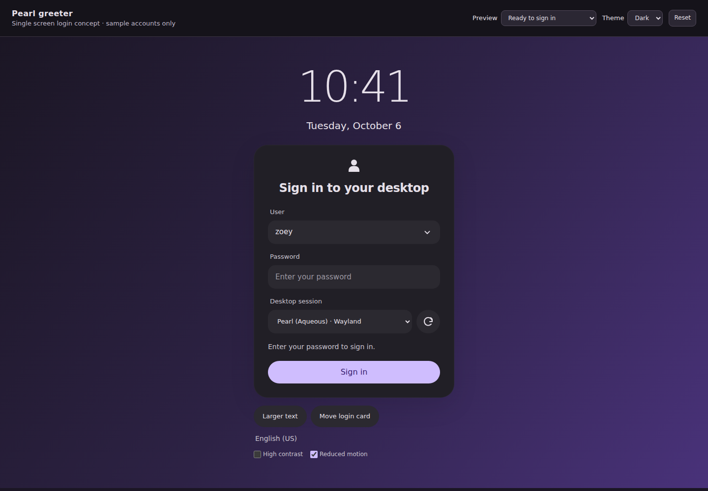

# Pearl greeter user selection and password entry plan

Status: implemented in the local native greeter. The default form now accepts passwords before authentication, updates selection and readiness immediately, and starts a standard password session with one submission. Real greetd/PAM login and password-first policy acceptance remain deployment checks. See the [current native login results](../artifacts/greeter-single-submit/login/report.json).

Show a user dropdown, password entry, desktop chooser and **Sign in** button together when pearl-greeter opens. For a password-first PAM configuration, selecting a user and entering a password should require one Sign in action. Keep authentication instructions, errors and additional challenges inside the same card.

## Mockup

[Open the interactive mockup](mockups/greeter-login/index.html). It follows the current Material dark greeter, with a light variant and keyboard navigation. Sample usernames are `zoey` and `alex`; the preview performs no authentication.



[Open user dropdown](mockups/greeter-login/user-menu.png) · [Other user](mockups/greeter-login/other-user.png) · [Inline error](mockups/greeter-login/error.png) · [Narrow layout](mockups/greeter-login/narrow.png).

The controls above the simulated login screen select review states and theme. They are not part of the native greeter. Refresh, larger text, contrast and card movement are interactive approximations; the prototype does not enumerate system accounts, contact greetd or launch a desktop.

## Native implementation

The account dropdown already exists in [screen.zig](../src/greeter/screen.zig). `applyAccount` copies the chosen username into the internal username entry; known users do not need to type it. “Other user…” exposes manual entry. `refreshDone` preserves a selected user when discovery refreshes. The configuration enables `accounts` by default.

[accounts.zig](../src/greeter/accounts.zig) uses AccountsService and falls back to a local account parser. Empty discovery or disabled account discovery leaves manual username entry available. Preserve this behavior and the current first-discovered default user; adding persistent last-user selection is outside this change.

The password field now stays visible above the desktop chooser. With the default `password_first: true`, it accepts input immediately and submits once when the first secret prompt arrives. With an explicit false, it displays **Available when requested** until PAM requests a response. `Screen.changed` clears displayed input separately from the bounded pending response in [pending_password.zig](../src/greeter/pending_password.zig).

The missing local account parser was restored from repository history. The greeter build and unit checks pass with local fallback account discovery available.

## Form behavior

| Situation | Implemented behavior |
| --- | --- |
| Initial display with discovered users | Select the first discovered user. Display **User**, **Password**, **Desktop session**, then **Sign in**. Focus Password once the catalog is ready. |
| Select another listed user | Update the selected username, erase any entered password and focus Password. |
| Choose “Other user…” | Keep the dropdown and reveal Username above Password. Focus Username; do not inherit the previous user's password. |
| No listed users or `accounts: false` | Show Username and Password together, with the dropdown hidden. |
| Submit a valid user and desktop | Start one attempt. Lock user and desktop selection while authenticating; show inline status and Cancel authentication. |
| Password-first authentication | Submit the queued password once when the matching hidden PAM question arrives. No second button press is required. |
| Passive fingerprint or status message | Retain instructions in the card and acknowledge through the existing client. Never answer passive messages with a password. |
| Additional secret or visible challenge | Show the actual PAM prompt, an empty response field and **Continue** in the same card. Never reuse the initial password. |
| Incorrect credentials or timeout | Clear all secret input, retain the user and valid desktop, show the error inline and return focus to Password when idle is restored. |
| Cancel or Escape | Erase secrets and cancel through the existing client. Unlock selection only after cancellation is resolved. Preserve the existing restart behavior for an uncertain daemon conversation. |
| Desktop change before submission | Preserve the unsubmitted password and bind the final displayed session only when submitting. |
| Refresh before submission | Erase the password and preserve explicit account/session selections where available. |

Blank password submission must remain possible: some accounts use empty passwords, and fingerprint-only login must still be able to start. A blank field means **no queued password**, rather than an unsolicited empty response. If PAM requests a secret, the same field becomes an explicit response entry; Continue may submit an empty answer when permitted by the existing protocol validation. The mockup requires sample input for its simulated password completion; native authentication remains controlled by PAM.

Use the existing theme tokens, secure GTK entry and accessibility footer. Add visible field labels, preserve masking, private input hints and the Caps Lock indicator, and keep the entire card scrollable on small or highly scaled outputs. The native order should be User → optional Username → Password → Desktop → Refresh → Sign in. Do not regrab focus during every status update or accessibility toggle.

## Authentication design

### Bind a submitted password to one attempt

The greeter-local pending response object uses bounded, explicitly wiped storage. Secrets are not stored in a general allocator-owned string. Its maximum is the existing protocol limit of 4096 UTF-8 bytes; the full value is validated and oversize input is rejected without truncation.

Before the asynchronous `.begin` catalog revalidation, capture the validated username, selected desktop ID, desktop fingerprint and submitted secret. Clear the visible entry immediately. Include the catalog job generation, then bind the pending response to the new controller attempt and connection when `Client.begin` succeeds. Disable editing throughout this interval.

On the first eligible `.secret` prompt, require all captured identity and generation values to match and require no pending answer. Use `Client.answer(c.prompt_generation, response)` so the existing controller remains responsible for prompt freshness and authentication authority. Mark the response consumed before sending to prevent callback reentrancy from resubmitting it. Wipe storage immediately after the send returns, including its failure path.

### Respect the configured PAM conversation

greetd distinguishes hidden input from visible input, information and errors; a hidden input prompt does not identify whether it asks for a password, PIN or one-time code. Do not infer password identity from English prompt text or automatically replay a password against every secret question.

The root-owned greeter setting `password_first` declares that the first input question in this installation's PAM conversation is a password. It defaults to `true` for the standard password-first login stack. Custom stacks that ask for another credential first must explicitly set it to `false`. With `true`, a nonempty password submitted in the initial form can answer the first secret question once; preceding passive messages may be acknowledged normally. A visible question arriving first invalidates and erases that pending password and starts the explicit prompt flow. All later input questions require fresh input.

With `password_first: false`, keep the password field visible from startup but disabled with a short **Available when requested** hint. Start authentication through Sign in, enable the response field when PAM requests input, and use Continue. This mode still keeps selection and password entry on one screen. The packaged configuration enables `password_first`. Verify the supported stack, including fingerprint fallback, during deployment acceptance. Configurations that require a code or another secret before a password must use the explicit prompt mode.

When PAM authenticates without requesting a password, erase the pending value before post-authentication desktop revalidation. Never synthesize a password challenge or bypass passive-message acknowledgement. Keep the existing absolute attempt timeout and inactivity policy.

### Make secret cleanup explicit

Replace the unconditional `Screen.changed → clear` behavior with separate operations for clearing the displayed response and invalidating a pending submitted password. Connecting, authenticating and permitted passive-message transitions must not erase a still-valid pending password. They must also never restore it into the visible widget.

Invalidate both on cancellation, attempt expiry, failed validation, transport loss, account change, explicit refresh, power actions and shutdown. A desktop change preserves only unsubmitted widget input; once submitted, the password remains bound to the exact desktop fingerprint and attempt. Invalidate before handoff on either authenticated success or failure. User-facing text, test hooks, logs and selection persistence must never contain the queued response. Preserve `GtkPasswordEntryBuffer` and the existing wiping of protocol frames.

Moving the same card between monitors preserves a still-valid attempt; it does not restart authentication or create another response owner. Retain exactly one controller and one pending response across output changes.

## Completed implementation sequence

1. **Restored the baseline.** Recovered the missing local account parser from history and verified the build, unit checks and existing private UI suite.
2. **Updated the form.** Added persistent labels, moved the secure entry above the desktop chooser, changed idle visibility and keyboard focus, and added input clearing on account and username changes. The shared secure entry and locker authentication behavior are preserved. Compact spacing accommodates 720p displays.
3. **Added live form state.** Account and username changes apply the remembered session before submission. Username and response validity update Sign in readiness immediately. Session selection preserves an unsubmitted password. Failed attempts return focus to Password, including manual usernames.
4. **Added the pending response lifecycle.** `src/greeter/pending_password.zig` binds bounded storage to the user, desktop, catalog job, attempt and connection. Capture precedes `.begin` refresh; delivery is one-use and storage is wiped before client callbacks. The existing controller, client and authenticated launcher retain authority.
5. **Added the policy setting.** `password_first` now defaults to true in both code and the packaged configuration; explicit false remains available for custom prompt-first stacks. Configuration tests reject non-booleans, and the usage documentation explains the explicit prompt fallback. Existing explicit false settings can be migrated as described in [GREETER.md](GREETER.md); package upgrades preserve administrator policy.
6. **Added native coverage.** `test-greeter-login` exercises the new flow against fake greetd, including user switching, additional questions, cancellation, invalid input, policy changes and timeout cleanup. The login suite uses the default policy and also covers button submission, repeated Enter, immediate remembered sessions, password preservation across desktop changes and retry after failure. The theme suite explicitly covers compatibility mode, while output tests use the default.

## Acceptance checks

| Coverage | Required result |
| --- | --- |
| Initial form | User selection and password field occupy the same card. By default Password is editable immediately. With false, the visible field explains when it becomes available. |
| One action login | Select `another-user`, enter a fixture password and press Enter once. Fake greetd observes exactly one `create_session` with that username, one matching secret answer and one authorized start. |
| Selection and fallback | Changing users erases input; Other user, no discovery and disabled discovery accept manual entry on the same screen. Refresh keeps the selected account and clears secret input. |
| Prompt order | Info/error messages receive only null acknowledgements. First visible input invalidates the queued password. Later secret prompts receive no automatic replay. Explicit mode never sends queued input. |
| Fingerprint and empty input | Fingerprint success without a secret prompt wipes the queued password; password fallback can consume it once under validated policy. Starting with no entered password still supports fingerprint or explicit empty-password handling. |
| Stale state | Cancel, timeout, refresh failure, changed desktop metadata, old callbacks and repeated Enter cannot reuse a response, start a second attempt or authorize a stale handoff. |
| Cleanup | Unit checks cover pending storage wiping after consumption and every invalidation path. Existing IPC bounds and one-start rules remain green. |
| Presentation | Dark, light, GTK theme, large text, high contrast, small outputs and monitor removal preserve readable fields, reachable actions and one active card. Screen reader labels and announcements do not expose secret values. |

Run the existing native checks after implementation:

```sh
ZIG_GLOBAL_CACHE_DIR="$PWD/.cache/zig" zig build build-greeter test-greeter-unit -Doptimize=ReleaseSafe
ZIG_GLOBAL_CACHE_DIR="$PWD/.cache/zig" zig build test-greeter-ipc test-greeter-ui test-greeter-login test-greeter-catalog test-greeter-outputs -Doptimize=ReleaseSafe
```

The private suites verify Pearl against a fake daemon. A separate real greetd/PAM login and desktop handoff must validate the password-first policy on the supported deployment; reviewing this mockup does not require changes to the running system's PAM or display manager.
