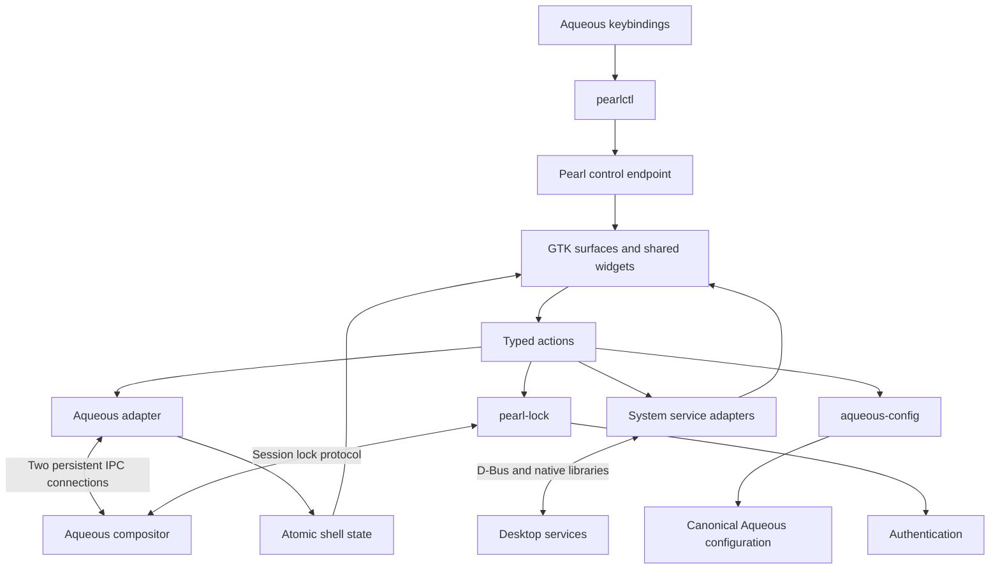

# Pearl implementation plan

Status: implementation specification, September 13, 2026. T00–T06 are complete;
see [PROGRESS.md](PROGRESS.md) and [COMPATIBILITY.md](COMPATIBILITY.md) for its
verified stack and evidence. “Pearl” is a working name taken from this workspace.

## 1. Product brief

Build a cohesive desktop shell in **Zig 0.16 and GTK4**, using **Ghostty's `zig-gobject` bindings**, exclusively for **Aqueous**. Zig 0.16 is a user requirement, not a toolchain candidate; pin an exact 0.16.x release in T00 and keep dependency choices compatible with it. Preserve the qualities that make Dank Material Shell appealing: a compact configurable bar, rounded Material surfaces, wallpaper-derived colors, a fast launcher, a unified control center, notifications, media controls, and consistent motion.

Aqueous owns window placement, workspaces, focus policy, overview rendering, and compositor effects. Pearl owns desktop surfaces and interaction with system services. Every compositor-specific feature targets Aqueous directly. There is one compositor backend and no runtime dependency on DMS, Quickshell, Qt, or Ghostty's terminal engine.

The intended result is a daily-use DMS equivalent for an Aqueous desktop. Deliver it incrementally, with visual fidelity established early rather than deferred until functionality is finished. DMS's broad feature set is the reference, while its multi-compositor adapters and plugin ecosystem are outside the initial product scope. [DMS project overview](https://github.com/AvengeMedia/DankMaterialShell/blob/master/README.md)

### Delivery boundaries

| Release | User-visible outcome | Required contents |
| --- | --- | --- |
| Preview | A convincing Aqueous desktop that can be evaluated safely | Theme/component gallery, multi-output bar, workspaces, focused window, keyboard layout, application launcher, control-center layout, shell CLI; real Aqueous state and actions |
| Daily-driver beta | Replaces the everyday shell on a development machine | Real audio/network/Bluetooth/power controls, tray, notifications/history, media, calendar, OSD, wallpaper/theme generation, shell settings, lock/idle integration and polkit agent; configuration entry points into Aqueous |
| 1.0 | A complete, tested Aqueous shell | Native GTK lock UI, clipboard, screenshots, dock/taskbar, desktop frame option, integrated GTK Aqueous settings, display preview/revert, accessibility, migration, packaging and performance gates |
| Later | Optional DMS-adjacent conveniences | File indexing, weather, online calendar accounts, emoji/calculator providers, richer system monitoring, third-party extensions, greeter integration |

Beta may use an established external locker as an explicitly configured interim dependency. It is not complete lock-screen parity. Advanced desktop settings may initially open the existing `aqueous-settings`; 1.0 exposes those controls in GTK through the existing configuration backend.

Exclude a login greeter, compositor/window manager, portal backend, package manager, network daemon, and calendar sync service from the shell implementation. Retain Aqueous's portal integration. Do not promise DMS plugin or configuration compatibility: provide a small documented importer for supported appearance and bar preferences.

## 2. Evidence and baseline

The local workspace was empty apart from protected metadata. Reference repositories already exist on this machine:

| Reference | Inspected revision | Important findings |
| --- | --- | --- |
| `/home/zoey/RiderProjects/Aqueous` | `1b1e215285a764cb7e5b605515b784721d68a0a4` | Native Zig compositor; dedicated shell state; persistent socket IPC; standard layer shell; configuration helper and standalone settings app |
| `/home/zoey/DankMaterialShell` | `72ca8a6876b014f5722a00f69301a5766653764e` | QML frontend/Go backend; common theme tokens, bar, launcher, control center and notification components available as references |
| Ghostty upstream `build.zig.zon` | Moving upstream inspected on the planning date; pin during T00 | Zig minimum `0.16.0`; Ghostty-specific GObject artifact `gobject-2026-07-28-36-1.tar.zst`; separate gtk4-layer-shell dependency |

The Aqueous checkout has unrelated local commit-timing work. Read reference trees without resetting, cleaning, or editing that work. Record relevant reference file hashes in T00; a commit alone does not identify a dirty checkout.

Local Aqueous source is more recent than some public documentation. For example, the public README retrieved during research described Noctalia startup, while the local README describes DMS. Older handoff documentation mentions retired settings plugins; the current `settingsApplication/README.md` describes the standalone application and retained helper. Implement against the pinned source, validated schemas, fixtures, and running test compositor, in that order when old prose disagrees.

Important source anchors, relative to the Aqueous root:

- `compositor/protocol/aqueous-ipc-v1.md`, `aqueous-ipc-v1.schema.json`: socket framing, handshake, commands and recovery.
- `compositor/protocol/aqueous-shell-v1.md`, `aqueous-shell-v1.schema.json`: authoritative entity model.
- `compositor/aqueous/IpcProtocol.zig`, `IpcServer.zig`, `ShellCommand.zig`: implemented operations. These already include `session.reload` and `config_reload`, even where older prose omits them.
- `compositor/aqueousctl/main.zig`, `compositor/protocol/aqueous-window-info-v1.xml`: runtime layout query/change, which is separate from the shell socket action vocabulary.
- `settingsApplication/README.md`, `src/config_main.zig`, `src/backend/`: current settings/configuration ownership.
- `compositor/scripts/fixtures/ipc/`, `test-ipc-integration.py`, `test-shell-integration.py`: reusable reference cases and isolated compositor harnesses.
- `compositor/aqueous/BackgroundEffectManager.zig`, `fx.zig`, `scripts/test-background-effect.py`, `docs/rules.md` and `docs/dms-integration-testing.md`: implemented native `ext-background-effect-v1` support, Vulkan-effects build gating, capability updates, region/rule semantics and existing DMS integration tests. A stale link in `docs/missing-protocols.md` does not imply absent blur support.
- `packaging/aqueous-init`, `packaging/tests/test-aqueous-init.sh`: session environment and nested-session isolation.

Upstream confirms that Ghostty maintains customized GObject bindings and consumes them as a distinct dependency. Use that package, not an extraction of Ghostty's application runtime. T00 records the tested Zig patch version, generated artifact hash, GTK floor and linker configuration in [COMPATIBILITY.md](COMPATIBILITY.md). [Ghostty dependency manifest](https://raw.githubusercontent.com/ghostty-org/ghostty/main/build.zig.zon), [Ghostty binding repository](https://github.com/ghostty-org/zig-gobject)

## 3. Visual and interaction specification

### Reference method

Freeze screenshots from the inspected DMS version in a private nested session using a reproducible test configuration. Capture bar, launcher, control center, notification center, calendar/media, dock, lock and settings, in dark and light modes. Record viewport, scale, fonts, wallpaper, DMS settings and revision. Use source layouts when a reference surface cannot run; mark that reference unverified.

Recreate composition, density, hierarchy, icon treatment, grouping, hover/pressed states and transitions. Prefer DMS's purple stock theme for deterministic comparisons, then verify wallpaper-derived themes. New assets should use Pearl/Aqueous branding. Keep copyright/license attribution for reused code, assets or theme data; inspect bundled fonts/icons independently.

### Initial tokens

These values come from local DMS `quickshell/Common/Theme.qml`, `StockThemes.js`, and the common-QML theme. They are a starting baseline; recorded screenshots resolve application-specific variations.

| Token | Initial value / rule |
| --- | --- |
| Spacing | 2, 4, 8, 12, 16, 24 logical px |
| Type | 12 / 14 / 16 / 20 logical px; Inter Variable preferred, installed sans fallback; Fira Code for monospace content |
| Bar | 48 logical px reference height, adjustable compact mode |
| Icons | 16 / 24 / 32 logical px; one consistent symbolic icon family |
| Rounding | 12 logical px base; pills/circles sized from geometry; component-specific derived radii |
| Popup gap | 4 logical px minimum, coordinated with bar spacing |
| Dark purple | Primary `#D0BCFF`, on-primary `#381E72`, primary container `#4F378B`, surface `#141218`, text `#E6E0E9` |
| Tonal surfaces | Distinct lowest/low/container/high/highest roles; no component-local palette literals |
| State layers | Hover 0.08; focus/pressed 0.12; drag 0.16 |
| Motion | 150 ms initial popout/modal duration; tune per reference, support zero-duration reduced motion |
| Transparency | Separate background alpha from foreground opacity; an opaque fallback for every translucent surface |

Implement a typed `Theme` and generated application-scoped GTK CSS. Every component reads semantic tokens. GTK supports its own CSS model, which differs from browser CSS; validate actual supported properties and use GSK snapshot drawing only where ordinary widgets/CSS cannot express the design. Backdrop blur is an Aqueous effect, not a browser `backdrop-filter` declaration. [GTK CSS documentation](https://docs.gtk.org/gtk4/css-overview.html)

### Surface behavior

| Surface | Layout and interaction |
| --- | --- |
| Bar | Configurable left/center/right groups. Default: launcher + workspaces on left, clock at center, media/tray/audio/network/battery on right. Ellipsize long titles; overflow optional items before shrinking primary controls. |
| Launcher | Centered rounded panel, prominent search field, application results with icons and subtitles, running-window results, keyboard selection. Empty query shows pinned/recent apps. Enter launches/activates; Escape closes. |
| Control center | Anchored rounded panel with connectivity tiles, volume/brightness sliders, media and power actions. Drill-downs retain context and selection. Pending/error/unavailable states occupy the affected control. |
| Notifications | Transient cards and separate grouped history. Clear/action controls appear predictably on hover and keyboard focus. DND suppresses presentation according to policy while retaining eligible history. |
| Calendar/media | Clock opens month grid and media card. Calendar initially means local date navigation, not account synchronization. |
| Dock/taskbar | Pinned/running apps, active indicators and context actions. Honor Aqueous visibility/skip flags; optional intelligent hiding based on committed geometry. |
| OSD | Compact non-focusable volume, brightness and microphone feedback; repeated updates replace the active OSD. |
| Settings | DMS-style sidebar, search, rounded section cards and descriptive rows; responsive page selector on narrow windows. Preserve drafts and scroll position on theme changes. |
| Lock | Matching wallpaper/tonal treatment, time, identity and authentication controls. All outputs covered; notification bodies hidden by default. |

Centralize popup arbitration: one principal interactive popup at a time; OSD and notifications can coexist. Opening another panel dismisses the previous one without losing unsaved settings drafts. Define Escape, outside click, focus loss and output removal explicitly. A click outside a modal should dismiss it without unintentionally activating the desktop underneath.

Use GTK focus navigation, accessible names/roles, visible focus indicators and translated strings from the first component. At enlarged fonts, reflow controls rather than clipping them. Test 100%, 125%, 150% and 200% output scale, plus enlarged text and reduced motion. Normal text should meet a 4.5:1 contrast target; important non-text indicators 3:1. Dynamic palettes must be checked against these product targets.

## 4. Technical architecture

### Processes and ownership

- `pearl`: GTK application, shared models, system-service clients, shell surfaces and public control endpoint. Start as one process; do not create one daemon per widget.
- `pearlctl`: lightweight Zig CLI for compositor keybindings and diagnostics; does not initialize GTK. Proposed commands include `launcher toggle`, `control-center toggle`, `notifications toggle`, `lock`, `theme reload`, and `status --json`.
- `pearl-lock`: separate on-demand Zig/GTK process. Owns the session lock and authentication lifetime so restarting the normal shell cannot unlock the session.

The shell's control endpoint is distinct from Aqueous IPC. Place it in a private per-Aqueous-instance runtime directory, with a versioned, bounded command protocol and same-UID peer checks. Derive instance identity from the verified Aqueous handshake, not a global `/tmp` filename. Scope GTK application uniqueness to the instance so a nested session cannot activate the host shell. `pearlctl` should address only the instance identified by its inherited environment.



Use GLib's main context for GTK, GIO socket integration, D-Bus clients, timers and completion delivery. All GTK calls stay on the main thread. A bounded worker pool handles image decoding, filesystem scans and other blocking work; authentication has a dedicated controlled worker/helper path. Do not add another general-purpose event loop unless a specific library requires a bridge.

Each service exposes a typed state, availability, pending action and error. Views dispatch actions and subscribe to derived models; they do not spawn commands or create their own Aqueous subscriptions. Own GObject references explicitly, disconnect signals on destruction, and cancel async work on teardown. Tag callbacks with session/generation to discard stale completions. Keep transient parse arenas separate from retained state and GTK string lifetimes.

### Dependencies and bindings

| Dependency | Purpose and decision |
| --- | --- |
| Zig 0.16.x | Required toolchain; pin exact release in T00 and CI. Resolve binding/dependency compatibility within 0.16; do not silently downgrade or move to another minor version. |
| Ghostty `zig-gobject` artifact | Primary GTK/GDK/GLib/GIO/GObject/Pango binding source; pin URL and Zig package hash |
| GTK4 | All new visible UI; CSS/widgets first, limited custom GSK components |
| gtk4-layer-shell | Bar, wallpaper, overlays and lock surfaces. T00 pins 1.3.0 and generates both layer-shell/session-lock GIR namespaces. |
| Wayland protocol bindings | Generate from pinned XML for capabilities unavailable through GTK/layer-shell; do not handwrite wire marshalling |
| libpulse | Initial audio adapter over PipeWire's PulseAudio-compatible server or PulseAudio; prefer a proven GLib integration |
| GIO D-Bus | NetworkManager, BlueZ, UPower, logind, MPRIS, notifications, tray and optional power profiles |
| libpolkit-agent / PAM | Established authority/authentication mechanisms; Pearl implements presentation and conversations |
| matugen | Optional external palette generator for initial dynamic theming; bounded, on-change invocation with static fallback |
| aqueous-config | Existing persistent-settings backend; asynchronous, versioned subprocess boundary |

Do not assume Ghostty's generated artifact contains every library Pearl needs. T00 inventories exported modules and proves generated layer-shell/lock bindings. Per the user's implementation requirement, generate missing GIR bindings reproducibly; do not introduce a custom C bridge. Libraries without GIR may use generated direct Zig ABI declarations from pinned headers. Never hand-edit generated bindings or mix independently generated GTK object types across APIs. Libadwaita is optional, not a requirement for Pearl's visual system. See [COMPATIBILITY.md](COMPATIBILITY.md) for the implemented T00 matrix.

Link gtk4-layer-shell before libwayland-client; verify dynamic load order and actual layer mapping, not only compilation. GTK4 layer shell interposes Wayland calls and documents this requirement. [Linking documentation](https://github.com/wmww/gtk4-layer-shell/blob/main/linking.md)

### Proposed repository layout

```text
build.zig / build.zig.zon
src/main.zig                  GTK application lifecycle
src/cli/main.zig              pearlctl
src/lock/                    lock application and authentication
src/core/                    state, actions, lifecycle, logging
src/platform/gtk/            bindings facade, resources, GObject helpers
src/platform/wayland/        protocol integration and capability probes
src/aqueous/                 transport, codec, entities, reducer, commands
src/services/                audio, network, bluetooth, power, media, etc.
src/config/                  Pearl preferences and aqueous-config client
src/theme/                   tokens, palette validation, CSS generation
src/ui/components/           buttons, cards, sliders, lists, search
src/ui/surfaces/             bar, launcher, center, history, OSD, dock
resources/                   CSS templates, GtkBuilder XML, icons, locale
protocols/                   pinned XML/schema inputs with licenses
src/tests.zig                pure test root; cases beside the models
tests/integration/           fake services and nested Aqueous scenarios
tests/fixtures/              sanitized state, images, service transcripts
tests/visual/                reference metadata and comparison captures
packaging/                   desktop entries, user units, Arch package
docs/                        plan, tasks, decisions, compatibility, progress
```

Use GtkBuilder XML/resources where it makes widget composition easier to review. Keep behavior and state in Zig. A component gallery is a development target and deterministic visual-test fixture, not a second production application framework.

## 5. Exact Aqueous integration contract

### Socket state and actions

Use `AQUEOUS_SOCKET` from the session environment. It is an absolute AF_UNIX stream endpoint under `$XDG_RUNTIME_DIR/aqueous/<instance>/ipc.sock`. Do not scan other sessions, guess socket names, or shell out periodically to discover state. Absence produces a clear unavailable diagnostic; production mode requires a supported Aqueous session. A fixture-backed demo mode is explicitly separate.

Implement these invariants from the local IPC specification:

1. Open **two persistent connections**: request and event. Both perform `hello`; session tokens must match before enabling actions.
2. Frames are UTF-8 JSON followed by LF. Handle arbitrary byte splits, partial writes and multiple frames per read. Apply local hard limits as well as negotiated limits: requests at most 64 KiB, batches at most 4 MiB, server frame payloads at most 4 MiB + 64 KiB; honor the state/depth/client limits advertised by the pinned server.
3. Request IDs are monotonically increasing decimal strings of at most 20 digits per connection. Entity IDs, sequence IDs and delivery IDs remain strings and are session-scoped.
4. The event connection subscribes once and thereafter sends only acknowledgements. The request connection allows one outstanding request. Bound the local action queue to 32 and return busy when full.
5. Build and validate a candidate snapshot/delta atomically, then publish it and acknowledge its exact delivery ID. Full replacement upserts clear absent optional values. Verify delta `base_sequence`; never patch across gaps or sessions.
6. Invalidate actionable state on disconnect or malformed state. Replace it from a new subscription snapshot. Show reconnecting state without retaining stale-ID actions.
7. Use five-second handshake/query/command deadlines and eight seconds for the initial subscription. Healthy idle subscriptions have no heartbeat or idle timeout. Reconnect to the inherited endpoint with capped exponential backoff/jitter. A new endpoint needs a newly launched shell environment.
8. Fail pending requests on disconnect. A sent mutation without a reply has an unknown outcome; do not replay it automatically. Drop queued old-session work.
9. `applied` reports committed completion; `accepted` for close/exit does not prove destruction. Await authoritative state rather than optimistically rewriting the model.
10. Check both global and per-object capabilities, locked state and seat ambiguity before offering actions. Recheck response errors even after local validation.

Keep outputs, workspaces, windows, seats, keyboard groups/devices and session state in one store. Key entities by `(session, kind, id)`. Workspace numbers/names are display values, not unique identity: two outputs can both have workspace “1”. Preserve skip flags, minimized/hidden states, committed logical geometry and focus kind. Layer focus is not an active application window.

Route workspace activation/rename, window activation/close/move/state, keyboard set/next, overview show/hide/toggle, session exit and capability-gated reload through the implemented socket actions. Use Aqueous's own overview; Pearl does not recreate its window thumbnails or placement logic.

Optional window icon fetches use `window.icon` on the request connection. Cache by session/window/revision/size/scale; reject stale completions and bound decoded images. Application icon lookup is the fallback. Give user actions priority over queued icon requests so fetching icons cannot occupy the command queue indefinitely.

### Surface placement and capabilities

Use **standard `zwlr_layer_shell_v1` through gtk4-layer-shell**. The similarly named `aqueous-layer-shell-v1.xml` belongs to the retained external window-manager interface and is not Pearl's panel protocol.

| Surface | Layer / reservation / keyboard policy |
| --- | --- |
| Wallpaper | Background; no exclusive reservation; empty input region; no keyboard |
| Bar | Top; one measured exclusive reservation per occupied edge; no keyboard until an explicit interactive flow requires it |
| Dock | Top; normally zero reservation when auto-hiding, fixed reservation only in configured fixed mode |
| Interactive popups | Overlay; zero exclusive zone; keyboard on demand or exclusive only for the deliberately modal launcher flow |
| Notifications / OSD | Overlay; zero exclusive zone; no keyboard focus stealing |
| Frame exclusions | Invisible edge surfaces, positive reservations, no blur/input; never reserve an edge twice |
| Lock | Session-lock role, separate process; never simulated using an overlay window |

Map `GdkMonitor` connector identities to the corresponding current Aqueous output record; reject ambiguous matches and invalidate mapping on hotplug. Do not correlate by list position. IPC runtime IDs are never saved as persistent monitor preferences. Use established Aqueous output identity policy for persistence and explicit fallbacks for missing metadata.

Clamp popup positions to output usable bounds, account for negative origins and rotation, and operate in logical coordinates. Let GTK handle normal scaling; avoid multiplying widget dimensions by output scale twice. Invisible corners/frame interiors must not intercept clicks. Verify input regions on real surfaces.

Use application namespaces such as `pearl:bar`, `pearl:popup`, `pearl:dock`, `pearl:wallpaper` and `pearl:frame-exclusion`. Treat compositor blur, global opacity, and client background alpha separately to avoid compounded translucency. Use Aqueous's native `ext-background-effect-v1` as the intended blur path: generate Zig bindings from pinned XML, bind on GTK's existing Wayland display, and prove requests on its actual surfaces before shipping. Track runtime blur capability changes and per-surface regions through resize, hide/remap and destruction. Preserve Aqueous's user-authored rules and honor their veto/popup policy; do not require helper-generated layer rules for native main-layer blur. Optional rule-driven fallback examples must exclude invisible frame surfaces before broader matches. Builds without effects, or sessions with blur disabled, use an opaque design. T00's `-Dvulkan-effects=false` run did not test this integration. T05 now verifies the GTK-native path in a private Vulkan-effects build; see [SURFACES.md](SURFACES.md) for the implemented policies, CLI and evidence.

The GTK connection belongs to GTK. Do not dispatch it using a competing reader thread. Pure observation/control protocols may use a separately owned Wayland connection integrated into GLib. Protocols referencing a GTK `wl_surface` must use that surface's connection through a verified integration path; objects cannot cross Wayland connections.

### Gaps to handle explicitly

- **Runtime layout:** the inspected socket actions do not include layout selection. Implement the existing `aqueous-window-info-v1` query/set interface used by `aqueousctl layout`, on GTK’s verified Wayland connection (implemented in T06 with generated version-3 bindings). Refresh on popup open and relevant workspace/output changes; do not invent a socket action or poll from each widget. If continuous external layout-change observation is unavailable, document this and add a small capability-negotiated Aqueous extension in a separate task before claiming live layout parity.
- **Display configuration:** shell state is not a full display-edit API. Use wlr output management for test/apply previews and `aqueous-config` for persistence.
- **Persistent configuration:** never send arbitrary TOML writes over shell IPC. Reuse the helper described below.
- **Missing installed capabilities:** disable only the dependent feature with an explanation. Set a minimum Aqueous revision/capability contract at release; no compatibility adapters for other compositors.

## 6. Desktop services

All adapters are asynchronous, shared by every output, and recover when their service owner disappears. Separate “off” from “unavailable”, “permission denied” and “operation pending”. Use native APIs for ongoing state; bounded helper invocations are acceptable for occasional operations such as palette generation/configuration.

| Service | Implementation and completion criteria |
| --- | --- |
| Applications | GIO/XDG desktop discovery and launch semantics, including hidden entries, desktop actions, localized labels, `TryExec`, launch context and terminal applications. Cache/search off-thread; file monitoring triggers refresh. Never interpolate desktop `Exec` into a shell command. |
| Audio | libpulse adapter with GLib integration; default sink/source, mute, volume, devices and streams. Handle server restart and changed defaults during slider drag; coalesce writes and preserve final value. |
| Network | NetworkManager D-Bus; device state, scans, saved connections, connect/disconnect and secret-agent conversations. Support cancellation and secure networks; never retain credentials in logs/preferences. Enterprise flows may delegate to an installed editor until supported and must be labeled. |
| Bluetooth | BlueZ ObjectManager and Agent1; power, discovery, pairing, confirmation/passkey, trust and connect/disconnect. Bound scan lifetime to active UI/user request. |
| Power/brightness | UPower for battery; logind for session/power operations and inhibitors; optional power-profiles-daemon. Validate a backlight interface in T00. External-monitor DDC is an optional adapter with unavailable feedback. |
| Media | MPRIS name-owner/property tracking; player selection, controls, capability-aware seeking. Only animate progress when displayed; bound/cancel artwork fetches. |
| Tray | StatusNotifierWatcher/Host plus items and DBusMenu. Support registration, disappearance, pixmaps, tooltips, left/right activation and nested menus; do not stop at a row of icons. |
| Notifications | Implement the Freedesktop notification service, actions, replacement IDs, expiration, urgency, close reasons and truthful capabilities. Sanitize markup/image inputs, bound history, support DND and lock privacy. |
| Polkit | Register a real session authentication agent using libpolkit-agent; handle identities, cancellation and authority restart. No privileged shell daemon or password forwarding to arbitrary commands. |
| Idle | ext-idle-notify plus logind preparation/inhibitor handling; explicit AC/battery policy. Suspend integration waits for successful lock acknowledgement before releasing a delay inhibitor; failures follow a documented recovery path. |
| Clipboard | ext-data-control where available; bounded MIME-aware text/image history, ownership/lifetime handling, no fake paste via synthesized global typing. Default history in memory, exclude sensitive hints and suspend collection/display while locked. |
| Capture | Capability-gated output/region/toplevel capture using verified Aqueous-supported protocols. Keep portal screensharing in the existing portal. Label an output crop distinctly from isolated-window capture; transformed/fractional coordinates and committed-vs-animated geometry require tests. |

Notification implementation must advertise only implemented capabilities, and conform to the protocol even when visual history is customized. [Freedesktop notification specification](https://specifications.freedesktop.org/notification/latest/)

Acquire service names without forcibly replacing another shell's services. If notifications/tray/polkit ownership conflicts, report which component is unavailable. Development harnesses use a private D-Bus session to prevent nested Pearl from registering on the real desktop's bus. Packaging switches complete shell service ownership deliberately.

Night light needs an explicit capability/ownership check and coordination with any existing gamma/color service. Do not claim it works on every HDR/color-managed output merely because gamma control is advertised. Show unavailable until the selected Aqueous renderer/output path is validated.

## 7. Configuration, settings and themes

### Ownership

- Pearl preferences: `$XDG_CONFIG_HOME/pearl/config.json`, a versioned typed schema with defaults, migrations, validation, atomic replacement and a last-known-good copy. JSON avoids introducing a second TOML implementation merely for shell preferences.
- Pearl state: `$XDG_STATE_HOME/pearl/` for explicitly persisted history/usage; caches under `$XDG_CACHE_HOME/pearl/` with size limits. Honor standard XDG home fallbacks.
- Aqueous compositor policy: existing canonical TOML files, exclusively through the established `aqueous-config` backend. Do not duplicate the settings application's parser/serializer.

Use `aqueous-config version` and `snapshot` to discover protocol/capabilities. Explicitly select the neutral shell mode (`--shell none`, present in the inspected `toolkit_sync.Shell` enum; verify the installed helper in T00), since the current CLI has a shell-specific default. No accidental DMS/Noctalia synchronization. Send bounded JSON requests over stdin for validate/apply, retaining `expected_generation` from the original draft.

Preserve unknown fields and offline display entries according to the helper contract. Report validation, canonical save, compositor reload and optional toolkit synchronization separately. Request capability-gated `session.reload` after save; file watching alone is not an acknowledgement. A timeout after a write requires inspecting state, not repeating the operation blindly. A stale generation retains the draft for reconciliation.

Initially offer “Aqueous settings” links that launch the existing settings app with explicit neutral mode and supported `--page`. Later build GTK pages over the same helper schema: overview, appearance, layouts, input, displays, rules, keybindings and advanced/raw editing. Stage edits with Apply/Discard; preserve drafts on live updates. Shortcut recording requires a tested shortcut-inhibition integration and must release inhibition on every exit path.

### Display preview

Capture live output configuration, test the proposed configuration, apply it asynchronously, then display a **15-second proposed Keep/Revert countdown**. Persist through the helper only after Keep. Hotplug, service loss and competing changes invalidate the draft/preview. Revert only if current state still matches Pearl's candidate; never restore an obsolete configuration over another tool's changes.

An in-process timer alone cannot recover after Pearl crashes during a bad display preview. Before shipping this feature, implement a bounded separate watchdog or a compositor-owned rollback lease, with explicit conflict semantics and crash tests. If that gate is not met, retain the established settings entry point and do not advertise safe preview/revert.

### Theme pipeline

`wallpaper/seed/mode change → bounded palette job → validate roles → atomic Theme swap → regenerate scoped CSS → repaint affected surfaces`.

Coalesce requests, cancel obsolete work, key caches by input/mode/generator version, and retain the last valid theme on failure. Changing wallpaper must not run a subprocess per monitor/widget. Start with `matugen` behind an adapter; an internal Material color implementation is optional future work.

Wallpaper rendering uses per-output background surfaces with cover/contain/solid modes and bounded decoding. Stop animations when hidden and make crossfades optional. External GTK/Qt/terminal theme exports are explicit opt-in templates with backups and ownership rules; opening Settings never rewrites other applications.

Add a Pearl palette export/consumer adapter to Aqueous Settings as a separate cross-repository integration task. It is proposed work, not an existing `--shell pearl` capability. Until it exists, use neutral mode and built-in appearance rather than pretending the DMS adapter understands Pearl.

## 8. Locking and session lifecycle

Use gtk4-layer-shell's session-lock support with `ext-session-lock-v1`. It supplies GTK surface integration, not authentication. Its `locked` event is the success boundary; a successful request return only means acquisition began. The documented monitor signal supports adding a lock window for each newly detected monitor. [GTK4 session-lock API](https://wmww.github.io/gtk4-layer-shell/gtk4-layer-shell-GTK4-Session-Lock.html)

`pearl-lock` connects failure/locked/monitor handlers before requesting the lock, covers every output immediately, and authenticates using the distribution's PAM policy. Handle complete PAM conversations, failure, cancellation and retry without exposing secrets. Keep sensitive buffers short-lived and clear them where possible. Do not log credentials or include them in diagnostics.

Only successful authentication can request unlock. Killing/restarting `pearl` must not affect the locker. Test locker crashes as well: the compositor must remain locked, and document what recovery the pinned Aqueous build actually supports. Do not assume a replacement locker can take over an abandoned lock. Keep an established external locker option until lock failure and recovery gates pass.

Install a session-scoped user service that starts after Aqueous has exported `WAYLAND_DISPLAY`, `AQUEOUS_SOCKET` and the live desktop environment. Follow the existing Aqueous/UWSM startup conventions and shutdown semantics; do not change the user's current session during development. On exit, cancel workers, release D-Bus names and layer surfaces, and leave `pearl-lock` independent until it ends correctly.

## 9. Quality and release gates

### Functional gates

1. Every advertised button has a real action or an explicit unsupported explanation; fixtures never silently stand in for production services.
2. Two-output workspaces/focus, output removal, shell restart, compositor disconnect, service restart and lock transitions preserve correct ownership and state.
3. No periodic compositor polling, per-widget subscriptions, stale command replay or unbounded queues.
4. All preferences/configuration changes have validated results; display preview, authentication and suspend sequencing meet their dedicated failure tests.
5. Aqueous session still works after Pearl exits; exclusive zones disappear and compositor input remains usable.

### Visual gates

Capture real GTK output under nested Aqueous with fixed data/fonts/theme/time. Compare to recorded DMS surfaces side by side, then maintain Pearl's own regression baselines. Compare layout boxes, spacing, radii, color samples and typography in addition to image differences; font rasterization prevents a meaningful universal pixel-perfect cross-toolkit threshold.

Require review of bar, launcher, control center, notifications, lock and settings at dark/light, compact/default, mixed scale and enlarged text. Aim for primary layout dimensions within 2 logical px of the selected reference where practical. Store approved deviations and reasons. A generic Adwaita-looking form with Material colors does not pass the intended visual gate.

### Performance budgets

These are proposed targets to validate, not measured claims. T00 records a named machine, resolution, scaling, GTK renderer, Aqueous build, GPU/driver and refresh rate. Report release-mode p50/p95 and all Pearl processes; shared-library accounting must be explicit.

| Measure | Initial target |
| --- | --- |
| Idle CPU | Less than 0.5% of one core over 60 seconds after warmup with static wallpaper and no active media |
| Memory | At most 150 MiB PSS for idle shell/control infrastructure on two outputs; report lock and transient workers separately and also as a total |
| Ready bar | Under 500 ms warm start to first useful bar with state on the reference machine; cold start measured separately |
| Launcher | Under 100 ms warm keybinding-to-visible; search p95 under 50 ms over 2,000 fixture applications |
| Motion | Meet 16.7 ms at 60 Hz and investigate missed 8.3 ms frames at 120 Hz; disable effects/reduce work when necessary |
| Long run | No unbounded growth after 1,000 popup cycles, service restarts and output reconnects; explain retained caches |

Use event-driven updates; schedule the clock at the next required boundary. Media timers run only while relevant; system-monitor sampling is slow or suspended when hidden. Pause frame callbacks after animations finish. Bound artwork/icon caches and notification/clipboard storage.

### Test layers

- Pure Zig tests: framing/reducer, command queue, ID/sequence invariants, config migration, search ranking and policy transitions.
- Fake socket/D-Bus services: malformed/fragmented messages, backpressure, disconnects, replaced service owners, secret/pairing cancellation and timeout outcomes.
- Nested/headless Aqueous: real layer surfaces, exclusive zones, multi-output identity/focus, request completion, lock protocol and capture geometry. Use private runtime/config/cache/state and D-Bus environments.
- Physical session checks: mixed DPI/rotation, NVIDIA and Intel/AMD where available, blur/no-effects, VRR/HDR interactions, real DPMS, lid/suspend/resume, output hotplug while locked, accessibility and screen reader.

Headless tests do not prove physical display recovery, PAM policy correctness, suspend behavior, blur quality or GPU performance. Run relevant tests per task; broaden at release gates rather than repeatedly running everything after documentation/UI-only changes.

## 10. Implementation sequence and handoff

The executable work breakdown is [TASKS.md](TASKS.md). Each task has an ID, dependencies, scope and completion checks. Build one end-to-end slice at a time: working GTK surfaces → correct Aqueous state → polished bar/launcher → desktop services → settings/lock/capture → release validation.

The first demonstrable milestone is **a DMS-like bar and launcher on two nested Aqueous outputs, with real workspace/focus actions and no polling**. The highest-risk early spikes are Ghostty bindings plus layer-shell linking, popup focus/input regions, monitor identity mapping and exact IPC behavior. Resolve those before building a large widget catalog or service suite.

### Risk register

| Risk | Mitigation / decision boundary |
| --- | --- |
| Ghostty binding artifact lacks required APIs or drifts with Zig | T00 pins a proven matrix and generates missing bindings; dependency upgrades remain separate changes. |
| GTK reproduction loses DMS's density and interaction quality | T03 establishes reference comparisons before expanding feature count; custom drawing stays limited to proven gaps. |
| Aqueous documentation and installed compositor differ | Handshake/schema/registry checks and source-derived fixtures; release specifies exact tested capabilities. |
| Layer focus, input regions or monitor mapping fails at mixed scale | T00/T05 real-surface experiments precede launcher/popout proliferation; physical validation supplements headless tests. |
| Service breadth delays the usable desktop | Deliver the preview first, then service adapters independently; defer account integrations/plugins rather than hiding incomplete core controls. |
| Authentication or display recovery works only on the happy path | Separate locker and crash-surviving preview rollback; explicit failure gates block those features from being advertised complete. |
| Persistent settings become competing implementations | Use `aqueous-config` and generation checks; any missing backend capability is a separate Aqueous change. |

Maintain `docs/PROGRESS.md` during implementation with task status, files changed, checks/evidence, known limits and next task. Any required Aqueous changes belong in separate bounded changes in that repository, with their own tests and compatibility notes. Re-read its applicable instructions before writing there. Do not replace existing Aqueous subsystems to make Pearl easier to implement.

Release packaging starts with Arch-style packaging matching the local Aqueous workflow; add Nix/other formats after a validated dependency matrix exists. Include `pearl`, `pearlctl`, `pearl-lock`, resources, desktop entry, session service and reviewed PAM policy integration. Treat runtime GTK/layer-shell ABI floors as package dependencies. Do not ship undocumented `LD_PRELOAD` fixes, auto-enable a second shell, kill the current shell, or rewrite user keybindings during installation.

Before 1.0, record exact tested Aqueous/Ghostty/GTK revisions and run a migration/revert rehearsal from the existing DMS session. Preserve old settings and provide an explicit switch-back path. Final scope is the 1.0 row in section 1; later conveniences are not hidden prerequisites.
