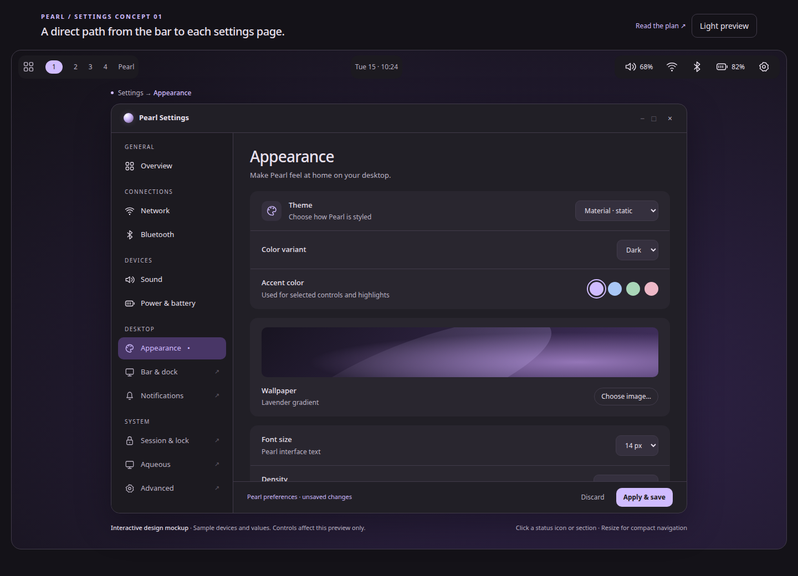

# Standalone Pearl Settings application

Status: S1–S5 approved; S6 implementation and automated acceptance passed,
September 15, 2026. The standalone GTK4 application and backend adapters are Zig.
Physical-desktop and Orca checks remain pending, recorded separately from automated
evidence. Final user review is pending.

- [S1 frontend API and complete editor inventory](SETTINGS_FRONTEND_API.md)
- [S1 implementation, validation and review checkpoint](../artifacts/settings-app/s1/REVIEW.md)
- [S2 executable, window, validation and screenshots](../artifacts/settings-app/s2/REVIEW.md)
- [S3 real editors, shared drafts, validation and screenshots](../artifacts/settings-app/s3/REVIEW.md)
- [S4 sidebar, service flows, Aqueous editors and validation](../artifacts/settings-app/s4/REVIEW.md)
- [S5 packaging, CLI integration, flyout handoff and validation](../artifacts/settings-app/s5/REVIEW.md)
- [S6 acceptance, visual comparison and manual validation](../artifacts/settings-app/s6/REVIEW.md)

## Goal and scope

Build **Pearl Settings**, a separately launchable GTK4 application matching the
window in the supplied Appearance mockup. Install it as `pearl-settings`, with
its own process, application identity, desktop entry and normal resizable window.
Users can open it from the application launcher without interacting with the bar.

This is a separate deliverable from the
[settings-flyout navigation plan](SETTINGS_NAVIGATION_PLAN.md). That plan owns
which compact page a bar icon opens. This plan owns the full application. Both
use the same destination IDs and service behavior, and can be released separately.

**Architecture decision:** standalone means an independent frontend process.
The running Pearl session remains the authority for live services, preferences
and compositor transactions. The frontend must not start a second shell or
register duplicate session agents. It can launch while Pearl is unavailable and
show a connection/retry state; editing requires a verified running Pearl session.
Offline preference editing and extracting a shell-independent service daemon are
outside this first release.

## Visual reference



Use the application window inside the image as the design reference. The sample
desktop bar, mockup heading, route annotation and preview disclaimer belong to
the design presentation and are not part of the installed application.

- [Interactive reference](mockups/settings-navigation/index.html?draft=1#appearance)
- [Sound](mockups/settings-navigation/sound.png),
  [Network](mockups/settings-navigation/network.png),
  [Bluetooth](mockups/settings-navigation/bluetooth.png),
  [Power & battery](mockups/settings-navigation/power.png)
- [Light appearance](mockups/settings-navigation/light.png) and
  [narrow navigation](mockups/settings-navigation/narrow.png)

The HTML prototype establishes layout and navigation. Its sample devices and
values are illustrative; all production controls must reflect real service state.

## Relationship to the flyout work

| Responsibility | Flyout navigation plan | Standalone application plan |
| --- | --- | --- |
| Audio/network/Bluetooth/battery bar click | Select the corresponding compact page | No change to primary bar actions |
| Full Settings window and sidebar | Link to the app when installed | Own the window, complete pages and navigation |
| Route IDs and validation | Shared prerequisite | Reuse the same registry |
| Service models and mutation guards | Existing in-process services | Access them through an explicit frontend API |
| Page composition | Compact controls for one category | Full editor for one category |
| App launch and desktop packaging | Optional integration point | Own executable, desktop entry and activation |
| Validation | Correct flyout destination and lifecycle | App identity, process isolation, editing and visual parity |

Neither plan should create a second copy of preference validation, connectivity
policy or compositor transaction handling. Extract reusable presentation helpers
and controller interfaces where they help both hosts. The application must not
depend on the flyout migration being finished.

## User-facing behavior

### Launch and activation

Direct executable commands and S5 CLI launch integration:

```sh
pearl-settings
pearl-settings --page appearance
pearl-settings --page sound
pearl-settings --page aqueous --section EXISTING_SECTION_ID
pearlctl settings show --page network
```

- A generic launch opens Overview. An explicit page always wins over previous
  selection. The pictured Appearance view is reachable directly with
  `--page appearance` and by its sidebar row.
- One visible window per verified Aqueous session. Subsequent launches select
  the requested page and activate that window; they do not toggle it closed.
- The desktop entry, dock/task switcher identity and window app ID agree on
  `org.aqueous.Pearl.Settings`. Scope instance routing separately by verified
  session identity so parent and nested sessions cannot activate each other.
- Normal minimize, maximize, drag, resize, close and workspace behavior belong
  to the compositor. Do not use layer-shell or an exclusive keyboard grab for
  this window. Clicking outside leaves it open. Escape closes the current
  transient dialog or compact navigation panel; Ctrl+W closes the app window.
- A flyout's **Open full settings** link carries its current route and originating
  activation context. Dismiss that flyout after launch is accepted. If launching
  fails, retain the flyout and show the error.
- Preserve `pearlctl settings show` as a compatibility entry to this app at
  cutover. Preserve `pearlctl aqueous show` and its existing section selection
  through the Aqueous page. `control-center show/toggle` remains a flyout command.

### Window layout

- Initial size approximately 1040 × 760 logical pixels, clamped to the available
  workspace. Match the reference's title bar, 220-pixel sidebar, lavender selected
  row, rounded cards, spacing and typography through Pearl's existing theme tokens.
- Header, sidebar and save footer remain fixed. Only the selected page body
  scrolls. A long sidebar can scroll independently on short windows. Ordinary
  device lists should not add nested scroll areas inside the page.
- Below approximately 760 pixels, use a **Sections** navigation control as shown
  in the narrow mockup. Support 480-pixel content width, larger text, wrapped
  labels and stacked actions. Allow smaller usable areas to constrain the window.
- Keep GTK theme support, Material dark/light, dynamic palette, density and
  reduced-motion preferences. The app follows committed Pearl appearance; form
  edits become global only through the existing Apply operation.
- Sidebar selection and keyboard focus must be visually distinct. Use symbolic
  icons with accessible labels, selected-state announcements, sensible focus
  order and at least 44-pixel primary interaction targets. Translate labels;
  route IDs remain stable and untranslated.

## Page inventory

| Group | Page / route | Required contents |
| --- | --- | --- |
| General | Overview / `overview` | Category links and current status summaries; existing session actions with their confirmations |
| Connections | Network / `network` | Adapters, Wi-Fi state, connected/nearby/saved networks, connection prompts and network-editor action |
| Connections | Bluetooth / `bluetooth` | Adapters, power state, paired devices, explicit discovery, pairing and trust controls |
| Devices | Sound / `sound` | Output and input selection, default devices, mute/volume and application streams |
| Devices | Power & battery / `power` | Battery state, available power modes, brightness and link to Session & lock |
| Desktop | Appearance / `appearance` | Theme mode/variant/source, GTK theme name, seed color, wallpaper picker/fit/background, font, size, density and reduced motion |
| Desktop | Bar & dock / `bar` | Existing widget groups, bar edge/size/islands, dock enable/edge/visibility/size/margin and popup behavior |
| Desktop | Notifications / `notifications` | Existing DND control and notification-history entry point |
| System | Session & lock / `session` | Existing AC/battery automatic lock and suspend policies |
| System | Aqueous / `aqueous` | Full current schema-driven compositor coverage, structured collections, displays, shortcut recording and workspace layout |
| System | Advanced / `advanced` | Complete Pearl preferences JSON, including output overrides and exports; conflict resolution |

Aqueous uses a second-level section selector and breadcrumb backed by its existing
section registry. Do not flatten its entire schema into one scrolling page or
lose access to existing fields. Advanced retains fields without dedicated forms.
The mockup's accent swatches are shortcuts to a seed-color value, not a replacement
for arbitrary color entry. Wallpaper must use real file selection and preview.
No new per-app notification policy, device service or compositor capability is
implied by this inventory.

## Editing, drafts and transient state

### Three existing classes of change

1. **Immediate controls:** sound, network, Bluetooth, brightness, profile and DND
   issue their existing guarded operations. Show pending/failure feedback inline;
   disable conflicting actions while pending. Do not show an Apply footer.
2. **Pearl preferences:** Appearance, Bar & dock, Session and Advanced edit the
   same draft. The footer explicitly says **Pearl preferences · unsaved changes**.
   Apply & save and Discard cover the entire Pearl draft, including other pages.
   Keep a dirty badge and Review action visible while visiting immediate pages.
3. **Aqueous configuration:** preserve separate validation, rebase, apply/reload,
   structured receipts and display-preview operations. Never offer one combined
   save claiming that Pearl and Aqueous update atomically.

### Lifecycle rules

- Sidebar navigation retains draft contents and restores page-local scroll/focus.
  An explicit external page link goes to that page's heading. Neither applies
  nor discards edits.
- Keep acknowledged preference drafts in the existing session backend. The app
  sends bounded, coalesced draft updates with revisions; navigation and close
  flush pending edits. A normal close exits the frontend after acknowledgment,
  and reopening restores those drafts while the backend session remains alive.
- If the backend cannot acknowledge pending edits on close, offer **Keep open**
  or **Discard untransferred changes and close**. Do not silently lose an edit or
  imply it was saved. Already acknowledged drafts survive frontend failure;
  recovery of edits never sent before a crash is not guaranteed. Pearl preference
  drafts remain in-memory and do not survive backend/session exit in this release.
- On backend restart, preserve any local draft as a candidate, fetch fresh state
  and require normal merge/rebase before applying. Never automatically replay a
  mutation whose completion is unknown. Retain Aqueous's existing durable receipts.
- External file edits continue through revision checks, three-way merge and atomic
  persistence. Invalid Advanced JSON disables dependent forms while retaining
  access to the raw editor and its validation message.
- Page-scoped service interest has an owner token. Leaving a page or disconnecting
  its frontend releases that interest. Stop that owner's discovery and cancel its
  credential/pairing prompt; clear secrets. Keep established connections intact.
- During display preview, keep a window-wide countdown and Keep/Revert controls
  available across pages. Graceful close requests Revert; transport loss triggers
  backend cleanup and the existing compositor lease timeout remains authoritative.
  Audit the current editor's destroy-time revert before reusing it.
- Session lock hides the window, clears prompts and releases interactive interest.
  The backend rejects mutations while locked. Unlock does not present Settings
  unexpectedly. Removing an output invalidates its selection without destroying
  the app's unrelated draft state.

## Architecture and existing code

Current views depend directly on shell-owned services and popup windows. Creating
an executable around those views requires a deliberate process boundary.

| Area | Current implementation | Planned responsibility |
| --- | --- | --- |
| Startup | `src/main.zig`, `src/core/application.zig` initialize shell/gallery lifecycle | New `src/settings_main.zig` and `src/settings/application.zig` initialize only the Settings frontend |
| Window composition | `src/ui/surfaces/manager.zig` creates Settings as a popup | New `src/settings/window.zig` owns the ordinary application window and page stack |
| Destinations | Bar pane enum and Aqueous section selection | Shared `src/desktop/settings_navigation.zig` validates route/section targets for both hosts |
| Preferences | `src/config/service.zig`, `src/desktop/settings.zig` | Existing backend keeps draft/validation/save authority; extract page builders and frontend controller interface |
| Live controls | `src/desktop/services.zig`, `connectivity.zig`, `lifecycle.zig` | Split presentation by category; pass controller interfaces instead of service pointers into frontend views |
| Aqueous | `src/config/aqueous_client.zig`, `src/desktop/aqueous_settings.zig` and structured editors | Preserve backend transactions; adapt editors to serialized snapshots and guarded requests |
| Styling | `src/theme`, `resources/style.css`, `resources/gtk-theme.css` | Shared appearance loading and widget styling without initializing wallpaper/bar surfaces |
| Launch | Desktop file executes `pearlctl settings show` | Install `pearl-settings`; launch it directly from the existing desktop file |

### Frontend service API

The flyout's F3 implementation provides the in-process
[service-view ownership contract](SETTINGS_SERVICE_OWNERSHIP.md). Bind those
leases to authenticated frontend connections in the endpoint below; reuse the
existing backend operations and prompt checks.

Add a versioned Settings frontend endpoint in the existing private session runtime
directory, alongside the control endpoint. Reuse the session/display verification,
same-UID checks, owned sockets, bounded decoding and async transport patterns in
`src/cli/server.zig`, `src/cli/protocol.zig` and `src/aqueous/transport.zig`.

The existing control protocol has an 8192-byte frame limit and one request/reply
per connection. Its status/mutation commands are useful reference behavior, but
they do not constitute a complete editor API for drafts, schemas, notifications
and authentication prompts. Keep that CLI protocol backward compatible; implement
the frontend API explicitly rather than repeatedly invoking `pearlctl` subprocesses.

The contract must cover:

- Capability/version handshake and authenticated session identity; explicit
  incompatible-version and disconnected states before exposing editable controls.
- Initial snapshots plus coalesced revisioned updates for active pages, with
  pagination for device/history lists and bounded transfer of schemas/drafts.
  Specify frame, document, page-count, queue and time limits against the existing
  model bounds before implementation. Reject oversize documents without truncation.
- Typed mutations reusing existing validation, expected revisions, device IDs and
  generations. Track request IDs and completion; reconcile unknown completion
  before enabling a repeat action. No shell-string command transport.
- Draft get/update/discard/merge, validation and save status; Aqueous transaction
  state, display leases and receipts. Serialize backend work so the flyout,
  frontend and CLI cannot bypass one another's conflict checks.
- Owner-scoped page interest and authentication prompts with bounded responses,
  prompt IDs and expiry. Route each prompt to the initiating frontend; reject
  stale answers and cancel on disconnect. Keep the existing backend registrations
  for NetworkManager, BlueZ, notifications, polkit and session lifecycle.
- Separate frontend UI status/probes from `status.popup`. Never derive app state
  from a popup pointer or expose credential contents through diagnostic status.

### Instance routing and activation

Use a per-session frontend instance endpoint/lock, distinct from the shell's
instance lock. Derive its location from verified identity, and use the repository's
owned-directory/stale-socket pattern. Concurrent app launches race for that lock;
the winner owns the window and the others send validated page activation requests.
Keep the GTK application identity stable for desktop matching; avoid global
D-Bus single-instance forwarding across nested sessions.

Forward activation context from a launcher/bar event through the supported
GTK/Aqueous activation path. Verify this against pinned bindings and a private
session before committing to a token mechanism. The compositor decides final
placement and workspace activation. An explicit output argument, if retained for
CLI compatibility, is validated context, not a guarantee of moving an existing
window to an arbitrary monitor.

When Pearl is absent, show a useful **Pearl session unavailable** state with Retry.
Do not start the desktop shell from the Settings app or attempt direct file/service
writes as a fallback. Once identity is verified and the backend returns, reload
capabilities and reconcile drafts before re-enabling controls.

## Delivery sequence

### S1 — Define the application and backend boundary

- Inventory every current page, operation, prompt, draft and display-preview path.
- Establish the shared route registry with the flyout work; add no competing enum.
- Write the frontend API schema and explicit resource bounds. Identify which
  existing backend methods need extraction from `SurfaceManager`.
- Prove two-process handshake and session isolation with private fixtures.

**Exit:** each page's data and mutation needs are covered by a reviewable contract.

### S2 — Build the executable and reference window

- Add production and instrumented test build targets for `pearl-settings`.
- Implement startup, one-instance routing, normal window lifecycle and page shell.
- Match the reference's sidebar/header/cards/footer; implement compact navigation,
  accessible focus and Material/native GTK theming.
- Use synthetic data only in the explicit test build; production shows loading
  or unavailable states until real backend data arrives.

**Exit:** direct launch and second-launch routing work; closing the app leaves
Pearl running and creating the window never creates shell surfaces.

### S3 — Deliver the Appearance editing slice

- Connect Appearance and Advanced to the existing preference draft authority.
- Implement actual wallpaper selection/preview and the full current Appearance
  controls, including the fields omitted from the illustrative screenshot.
- Use normal transient dialogs, replacing the current wallpaper picker's
  layer-shell/exclusive-keyboard handling in the application host.
- Implement fixed save footer, cross-page draft badge, validation and conflict
  recovery; update the app theme after a confirmed commit.

**Exit:** the pictured Appearance page can edit and save real preferences, and
navigation/close/reopen preserve acknowledged drafts without implicit saves.

### S4 — Complete the sidebar and service flows

- Add Network, Bluetooth, Sound, Power, Bar & dock, Notifications, Session and
  Overview, preserving existing controls and service capability checks.
- Adapt Aqueous editors, shortcut recording, structured collections, display
  preview and receipts to the frontend API; retain all current schema coverage.
- Add owner-scoped service interest, transient prompts and safe reconnect/lock
  behavior. Audit normal-window focus for network editor and authentication flows.

**Exit:** every sidebar destination is functional with real data or a truthful
unavailable state, and no existing editor capability is lost.

### S5 — Package and integrate

- Add executable/resource installation to `build.zig` and the install/release
  paths in `packaging/install.sh`, `packaging/arch/PKGBUILD`,
  `packaging/arch-git/PKGBUILD` and release manifests/checks as applicable.
- Update `org.aqueous.Pearl.Settings.desktop` to `Exec=pearl-settings`, retaining
  its desktop ID and categories; include a matching installed icon and verified
  window identity. Keep it discoverable and pinnable in launcher/dock.
- Route `pearlctl settings show` and Aqueous show commands to the new frontend
  once the complete editors are available. Avoid a shell → CLI → shell launch
  loop; dispatch a fixed executable plus validated arguments.
- Integrate optional **Open full settings** links with flyout destinations.
  Keep bar primary-click migration owned by the flyout plan.
- Document launch, scope of Apply, backend availability and process/session draft
  retention in README, Preferences, Aqueous Settings and desktop documentation.

**Exit:** a staged install launches correctly from the desktop menu and CLI,
including restart, second-launch and application-not-installed failure cases.

### S6 — Acceptance and visual comparison

`test-settings-app` and the complete `test-settings-acceptance` private-session
integration target are implemented, with focused
unit tests for routes, frontend protocol and lifecycle state transitions. Adapt
existing editor tests to find the app's window/probes where the old popup is
replaced, retaining the original behavioral assertions.

| Acceptance case | Required result |
| --- | --- |
| Launcher, direct executable, CLI and full-settings link | Correct page in a normal Settings window; stable desktop identity |
| Concurrent/repeated launches and two Aqueous sessions | One app window per session; no parent/nested activation crossover |
| Minimize/maximize/move/resize/close | Ordinary application behavior; shell survives app closure or crash |
| Appearance edit → Sound → close → reopen | Acknowledged draft retained; Apply/Discard scope is clear |
| Invalid JSON, external edits, save failure | Draft remains recoverable; existing validation and conflict rules hold |
| API disconnect/restart/oversize/stale response | Bounded handling, useful error state and no automatic mutation replay |
| Page leave/app crash during discovery or authentication | Interests released, prompts canceled, secrets cleared; established connections remain |
| Display preview during navigation, close, lock or app crash | Reachable Keep/Revert, safe rollback and durable receipt behavior |
| Shell absent, wrong session or protocol version | Window can explain the issue; unsafe or unsupported edits unavailable |
| Full sidebar and Aqueous inventory | Every existing editor/control remains accessible without category-spanning scrolling |
| Light/dark/native GTK, large text and narrow windows | Readable focus/states, fixed chrome, no inaccessible controls |
| 100/125/150/200% scale, short displays and monitor removal | Usable geometry and output selections; no draft loss |

Run `zig build test -Doptimize=ReleaseSafe`, the new target, and the existing
preferences, services, connectivity, session-services, Aqueous settings/preview,
desktop, surfaces and packaging checks affected by the extraction. Use private
services/compositor sessions. Record real-assistive-technology and physical
activation checks separately from fixture evidence.

Capture actual Appearance, Network, Bluetooth, Sound and Power pages in dark/light
and narrow layouts. Compare them with the reference images, especially sidebar
selection, spacing, wallpaper preview, page-local scrolling and save-footer
placement. Store results in a dedicated `artifacts/settings-app/` evidence folder.

## Completion criteria and main risks

The work is complete when the separately installed application matches the
reference layout, exposes the complete existing settings inventory, preserves
editing/preview guarantees, and passes process/launch/session-isolation tests.
Shipping a window containing placeholder pages is an intermediate milestone.

The major risks are the new frontend API, implicit service-view ownership,
popup-specific focus code, and compositor preview lifetimes. Deliver the full
Appearance slice early to test the process boundary before migrating all pages.
Keep backend policy shared throughout; do not redesign service behavior as part
of this application work.
