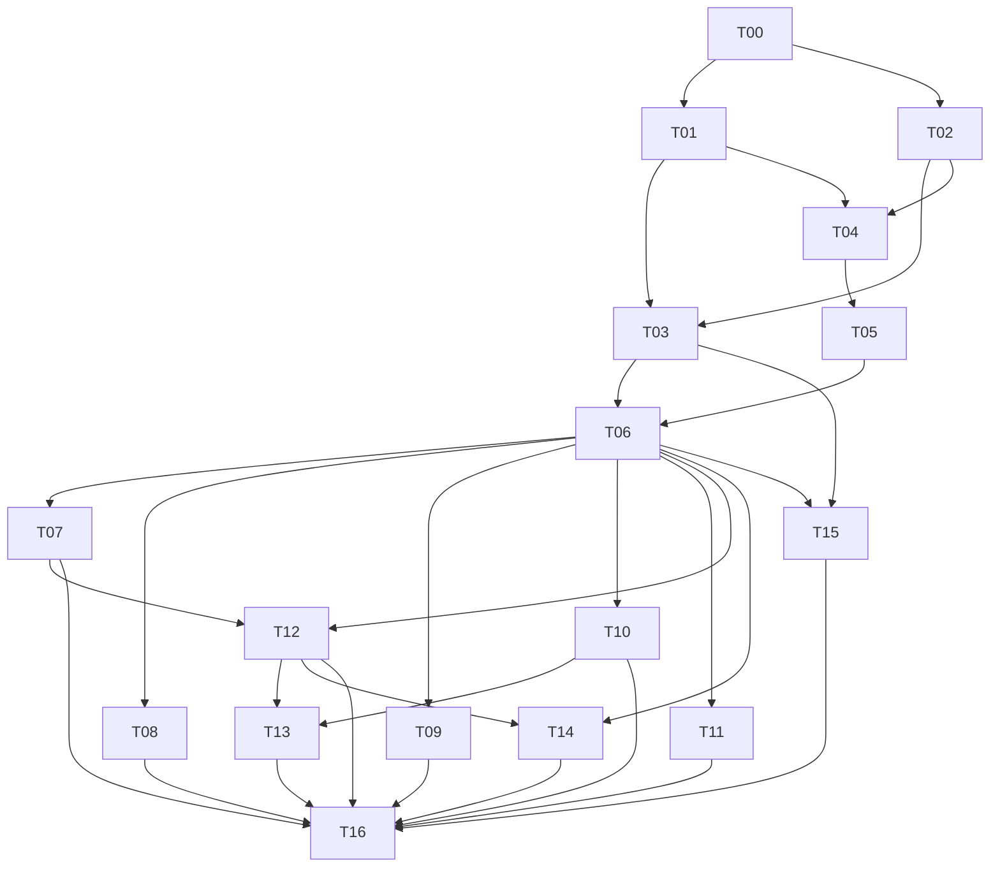

# Pearl AI implementation tasks

Read [IMPLEMENTATION_PLAN.md](IMPLEMENTATION_PLAN.md) first. **T00–T07 are complete**;
T08 is implemented with physical scan acceptance pending; T09–T10 are complete; T11 is implemented with explicit gates; T12 is implemented with physical acceptance pending. T13 native-lock implementation was brought forward into T12; its remaining acceptance is listed below. T14–T16 are not started. Follow their dependency order and record evidence in
[PROGRESS.md](PROGRESS.md). Task IDs are stable and may be split into smaller
changes without changing their acceptance criteria.

## Execution rules

1. Inspect current repository instructions and source before changing it. The plan's source inventory is a starting point, not permission to assume APIs still match.
2. Implement one bounded task or subtask per reviewable change. Finish with a working behavior and relevant checks; do not fill future modules with pretend implementations.
3. Keep pure models separate from GTK. Production adapters never return fixture data as successful live state.
4. Add tests for behavior and failure boundaries, not tests that merely inspect source text or reproduce an implementation.
5. Use the existing Aqueous state/configuration contracts. Document any missing capability and the smallest required upstream change; do not invent commands.
6. Keep generated bindings reproducible, and preserve licenses for copied protocol/schema/theme inputs.
7. Run tests in isolated sessions. Do not enable Pearl on the user's current desktop, change real display configuration, claim D-Bus service names on the host bus, or exercise host suspend/lock as an incidental test.
8. Record commands actually run, observed results, and untested physical checks. A task with missing required evidence is incomplete.

## Dependency map

Dependencies express technical prerequisites, not a requirement to use parallel agents. Work sequentially unless the user or applicable repository instructions authorize delegation.

## T00 — Freeze references and prove the stack

**Status:** complete; see [COMPATIBILITY.md](COMPATIBILITY.md). **Depends on:** nothing. **Output:** reproducible dependency matrix, capability inventory and minimal GTK spike.

- Record exact local Aqueous/DMS revisions and relevant file hashes; inspect upstream Ghostty binding artifact contents and licenses.
- Pin an exact Zig 0.16.x release (required by the user), compatible binding URL/hash, GTK version floor and gtk4-layer-shell version. Keep local builds and CI on that toolchain; resolve dependency incompatibilities without silently changing the Zig minor version. Inventory GTK/GIO/GLib/GDK/Pango and layer/lock bindings; generate missing bindings without a custom C bridge.
- Build a minimal GTK window, then a real layer-shell bar and interactive popup inside nested Aqueous. Verify link/load order and map/unmap behavior.
- Probe a private Aqueous socket handshake, registry capabilities, monitor mapping, config helper neutral mode and service availability. Record IPC reload support and separate layout API.
- Capture DMS reference surfaces and theme settings. Establish reference hardware and baseline measurements.

**Done when:** exact dependency set builds; layer surfaces reserve/release space; popup keyboard/outside-click behavior works; missing APIs are enumerated with a chosen implementation path. Save `docs/COMPATIBILITY.md`, reference metadata and spike evidence. Do not claim production readiness from this spike.

## T01 — Application lifecycle and development harness

**Status:** complete; see [DEVELOPMENT.md](DEVELOPMENT.md) and [PROGRESS.md](PROGRESS.md).

**Depends on:** T00. **Primary files:** build files, `src/main.zig`, `src/core/`, `tests/integration/`.

- Implement application startup/shutdown, compiled resources, scoped CSS, logging and explicit demo mode.
- Build a launcher for nested/headless Aqueous with temporary runtime/config/state/cache and a private D-Bus session. Prevent host environment/service-manager import.
- Add proposed build targets for normal build, pure tests, integration tests and component gallery; document actual commands once implemented.
- Define allocator/GObject ownership, cancellation and GLib worker completion conventions.

**Done when:** repeated start/stop cleans workers/signals/resources; simultaneous host/nested instances cannot activate or control one another; unsupported desktop reports a useful error. A pure-model test target runs without a live compositor.

## T02 — Aqueous codec and atomic state model

**Status:** complete; see [AQUEOUS_MODEL.md](AQUEOUS_MODEL.md) and [PROGRESS.md](PROGRESS.md).

**Depends on:** T00. **Primary files:** `src/aqueous/{codec,entities,reducer}.zig`, `tests/fixtures/aqueous/`.

- Implement bounded NDJSON framing, envelope validation, typed entities and candidate batch validation.
- Copy or derive sanitized fixtures from Aqueous's real IPC fixtures with provenance and license records.
- Implement snapshot replacement, full-entity upserts/removals, base-sequence checks, session changes and derived workspace/window/focus views.

**Done when:** tests cover every byte split of representative frames, combined frames, malformed UTF-8, size/depth limits, unsupported schema, omitted optionals, duplicate identities, large decimal IDs, delta gaps, output removal and same-number workspaces on two outputs. A rejected batch leaves no partially changed live state.

## T03 — DMS-style component system

**Status:** complete; see [COMPONENTS.md](COMPONENTS.md), [visual comparison](../artifacts/t03/comparison.html) and [PROGRESS.md](PROGRESS.md).

**Depends on:** T01, T02. **Primary files:** `src/theme/`, `src/ui/components/`, gallery resources.

- Implement semantic theme tokens and built-in dark/light palettes; scope CSS to Pearl.
- Build cards, icon buttons, pills, toggles, sliders, searchable/virtualized lists, section rows, tooltips and empty/error/pending states.
- Add consistent focus, hover/pressed states, disabled behavior, translated labels and reduced motion.
- Demonstrate all components in a deterministic gallery with fixture data.

**Done when:** gallery resembles the frozen DMS reference at default/compact density; text reflows at enlarged size; controls work using keyboard; no CSS warnings, foreground-opacity mistakes or perpetual frame callbacks. Save side-by-side captures and deviations.

## T04 — Persistent Aqueous adapter and command completion

**Status:** Complete. See [adapter contract](AQUEOUS_ADAPTER.md), [protocol/nested evidence](../artifacts/t04/adapter/results.json) and [lifecycle regression](../artifacts/t04/lifecycle/results.json).

**Depends on:** T01, T02. **Primary files:** `src/aqueous/{transport,client,commands}.zig`.

- Integrate two persistent nonblocking socket connections with GLib; implement hello, subscribe, acknowledgements and readiness only after matching session and initial state.
- Implement bounded action queue, one outstanding request, exact deadlines, backoff, stale callback rejection and command-result semantics.
- Expose availability and capability-gated commands; add icon metadata/fetch caching with user-action priority.

**Done when:** fake-server and real nested tests cover backpressure, partial writes, invalid ack/sequence, request timeout, server restart, locked/restricted policy, target disappearance and ambiguous seat. No command is replayed after unknown completion, and idle state generates no periodic socket traffic.

## T05 — Output surfaces and shell control CLI

**Complete:** see [surface/control contract](SURFACES.md) and
[T05 acceptance results](../artifacts/t05/latest/results.json).

**Depends on:** T04. **Primary files:** `src/platform/wayland/`, `src/ui/surfaces/`, `src/cli/`.

- Add surface manager, GDK/Aqueous output mapping, reservations, popup arbitration and focus/input-region policies.
- Implement per-instance control endpoint and `pearlctl` command/error schema. Version it separately from Aqueous IPC.
- Add wallpaper/bar/popup/OSD/frame surface primitives with namespaces and opaque fallback.
- Generate `ext-background-effect-v1` Zig bindings and prove native blur requests on GTK's existing Wayland display/surfaces in a Vulkan-effects Aqueous test build. Cover capability changes, region updates and hide/remap, preserving user rules and popup policy. T00's no-effects registry is not evidence that Aqueous lacks blur.

**Done when:** mixed-scale two-output tests show correct target placement, exactly one reservation per edge, Escape/outside-click dismissal, click-through empty regions and no focus theft by OSD. Killing the shell restores usable bounds. Stale/nested CLI environments cannot address the host instance.

## T06 — First complete desktop slice

**Complete:** see [desktop contract](DESKTOP.md), [preview results](../artifacts/t06/latest/results.json)
and [DMS/Pearl comparison](../artifacts/t06/comparison.html).

**Depends on:** T03, T05. **Primary files:** bar, launcher, shared app index and control-center surface.

- Implement configurable bar groups, real workspace/focus/title/keyboard state, launcher toggle and clock/calendar popup.
- Discover and launch applications through GIO; rank app and authoritative running-window results. Honor desktop-file semantics and Aqueous visibility/skip flags.
- Bind workspace/window activation and overview controls to real actions. Implement control-center composition with explicit unavailable states for services that are not built yet.
- Add runtime layout query/set through the verified Aqueous Wayland API; document any remaining live-observation limitation.

**Done when:** the preview gate passes: real bar/launcher on two outputs; duplicate titles/workspace numbers do not break activation; long text and many apps remain usable; keyboard layout follows effective state. Show real DMS/Pearl comparisons and measure launcher latency.

## T07 — Audio, power and OSD

**Complete:** see [service contract](SERVICES.md), [private-service results](../artifacts/t07/latest/results.json)
and [visual evidence](../artifacts/t07/comparison.html). Physical checks remain on the explicit release checklist.

**Depends on:** T06. **Primary files:** audio/power/brightness services and control-center detail views.

- Implement libpulse integration, devices/streams, sink/source defaults, mute and volume.
- Implement battery/logind/power-profile state and validated brightness control. Add bounded OSD replacement/coalescing.
- Define action availability and permission-denied behavior; keep power actions deliberate and reflect actual service replies.

**Done when:** mocked service restart/default-device changes and rapid slider updates retain the final intended value; no missing device crashes a panel; OSD never grabs focus. Physical brightness/power checks remain an explicit release checklist rather than incidental CI operations.

## T08 — Network and Bluetooth

**Status:** implemented; physical scan acceptance pending. See [CONNECTIVITY.md](CONNECTIVITY.md), [PROGRESS.md](PROGRESS.md) and [T08 evidence](../artifacts/t08/verification/README.md).

**Depends on:** T06. **Primary files:** network/Bluetooth services and connection/pairing panels.

- Implement NetworkManager object state, bounded scans, saved networks and connect/disconnect, including secret-agent handling.
- Implement BlueZ enumeration/discovery, pairing conversation, trust and connection state.
- Provide pending/cancel/error views and explicit handoff for unsupported advanced network authentication.

**Done when:** secure Wi-Fi, cancellation, rejected credentials, Bluetooth passkey confirmation, removed devices and daemon owner changes pass fake-service tests; at least one physical Wi-Fi and Bluetooth path is demonstrated. Secrets never enter persistent shell config or logs.

## T09 — Notifications, tray and media

**Status:** complete. See [SESSION_SERVICES.md](SESSION_SERVICES.md), [PROGRESS.md](PROGRESS.md) and [T09 verification](../artifacts/t09/verification/README.md). Artwork currently supports local PNG/JPEG files; remote URLs use a fallback.

**Depends on:** T06. **Primary files:** notification/tray/MPRIS services, notification center and media cards.

- Implement notification protocol, grouping/history, DND, actions/replacement/expiration and sanitized content.
- Implement tray watcher/host, item lifecycle, pixmaps, tooltips and DBusMenu rather than icon-only support.
- Implement MPRIS tracking/controls/player selection and bounded artwork.

**Done when:** protocol clients verify advertised features; notification closure reasons/actions are correct; tray registration/restart and nested menus work; media owner changes clean stale cards. Bursts/history/artwork stay bounded and hidden views stop unnecessary timers. Existing host service ownership is respected.

## T10 — Preferences, wallpaper and dynamic themes

**Status:** complete, including native GTK theme support requested in addition to Material themes. See [PREFERENCES.md](PREFERENCES.md), [PROGRESS.md](PROGRESS.md), and [T10 verification](../artifacts/t10/verification/README.md).

**Depends on:** T06. **Primary files:** `src/config/`, wallpaper/theme services, shell-settings pages.

- Implement versioned Pearl JSON preferences, migrations, validation, atomic save, external-change handling and last-known-good state.
- Add bar widget ordering/output preferences, popup policies, fonts/density, wallpaper modes and theme controls.
- Add cancellable/coalesced matugen adapter, palette cache/validation and atomic theme swap. Keep static themes functional without matugen. Also support the system GTK theme and installed GTK4 themes with their native control/surface styling.
- Add opt-in export templates with explicit ownership and backups.

**Done when:** corrupt config, failed generator, rapid wallpaper changes, missing font/image and external edits do not lose working settings or drafts. One theme change updates every surface without process restart; theme work is absent at idle.

## T11 — Aqueous settings backend and GTK frontend

**Status:** implemented with explicit capability gates and editor deferrals. See [AQUEOUS_SETTINGS.md](AQUEOUS_SETTINGS.md), the [221-field inventory](AQUEOUS_FIELD_INVENTORY.md), and [T11 verification](../artifacts/t11/verification/README.md). The old settings frontend is replaced; the canonical helper remains.

**Depends on:** T06. **Primary files:** `src/config/aqueous_client.zig`, GTK settings pages.

- Replace the existing settings frontend directly in Pearl GTK, using the canonical helper in neutral mode (user clarification; no handoff to the old application).
- Implement helper discovery/snapshot/validate/apply with bounded stdin/stdout, expected-generation retention and operation deadlines.
- Build GTK pages from current helper schema and Aqueous's field/editor inventory; include layouts, rules, input, keybindings, appearance, displays and advanced/raw edits.
- Implement capability-gated reload acknowledgement and separate toolkit-sync reporting. Shortcut recording must use tested inhibition and cleanup.
- Implement safe display preview with a crash-surviving watchdog/rollback mechanism before presenting Keep/Revert as protected behavior.

**Done when:** structured/raw conflicts, stale generation, invalid input, uncertain save, reload failure and concurrent editing retain drafts and report accurate outcomes. All intended Aqueous fields are mapped or explicitly deferred. Display apply/revert survives UI crash, hotplug and competing configuration changes without overwriting unrelated state.

**Cross-repository follow-up:** a neutral Pearl appearance adapter/export consumer in the canonical backend may be added separately. Do not send `--shell pearl` until that capability exists and is tested.

## T12 — Session actions, idle policy and polkit

**Status:** implemented. See [SESSION_SECURITY.md](SESSION_SECURITY.md) for native lock/PAM, polkit, idle/sleep contracts, private verification and pending physical acceptance.

**Depends on:** T06, T07. **Primary files:** session/idle/polkit services, power/authentication panels.

- Implement Aqueous/UWSM-aware logout and session-service lifecycle; capability-gate every action.
- Implement a real polkit agent with complete cancellation and identity handling.
- Add idle state machine, AC/battery policies, inhibitors and resume handling. Use Pearl's native Noctalia-like lock screen and propagate actual acquisition status (user clarification supersedes the external-locker plan).

**Done when:** private-bus tests cover authority restart, authentication cancellation, idle inhibitors, lock failure and suspend preparation sequencing. No automatic suspend proceeds on a falsely reported successful lock. Document explicit physical validation commands and expected outcomes.

## T13 — Native GTK lock screen

**Status:** native GTK surfaces, separate PAM conversation process, theme/wallpaper integration, failure/cancellation, monitor return and crash recovery implemented alongside T12 at the user’s request. Hardware resume/mixed-DPI, accessibility, production PAM distribution coverage and long-run performance remain acceptance work; see [SESSION_SECURITY.md](SESSION_SECURITY.md).

**Depends on:** T10, T12. **Primary files:** `src/lock/`, lock resources and PAM packaging.

- Build separate `pearl-lock` using verified GTK session-lock bindings and the shared theme components.
- Implement output lifecycle, acquisition acknowledgement, PAM conversation worker/helper, retry and secure unlock.
- Integrate acknowledgement with idle/logind orchestration and publish privacy-safe status to Pearl.

**Done when:** all outputs remain covered on hotplug; failed/cancelled authentication never unlocks; normal shell crash leaves lock intact; locker crash behavior is verified against Aqueous and documented; resume/input focus are validated physically. Per the user clarification, use the native Pearl locker; do not add a swaylock handoff.

## T14 — Clipboard and capture

**Depends on:** T06, T12. **Primary files:** clipboard/capture services and panels. These dependencies supply the real surface/state infrastructure and lock/privacy lifecycle.

- Implement data-control selection tracking, bounded text/image history, clear/delete and selection ownership.
- Add privacy defaults and lock-state behavior; sanitize/cap image decoding.
- Add output/region capture, then isolated-window capture only if the validated protocol path supports it. Keep screenshot crop semantics explicit.
- Provide save/copy feedback and failure recovery while preserving the existing portal backend.

**Done when:** selection owner disappears safely; large/invalid MIME payloads are rejected; sensitive/locked state is handled; capture output sizes/crops are correct under scale/rotation and target removal. Output cropping is not mislabeled isolated capture.

## T15 — Dock, frame and final visual coverage

**Depends on:** T03, T06. **Primary files:** dock/frame surfaces and per-output preferences.

- Add pinned/running app grouping, indicators, context actions and visibility-aware intelligent hiding.
- Add optional DMS-like connected/frame treatment with transparent input regions and one reservation owner per edge.
- Complete screenshot reference coverage, accessibility roles, keyboard flows and enlarged-text layouts across every shipped surface.

**Done when:** dock behavior follows Aqueous authoritative flags/geometry, frame reservations disappear on exit, empty desktop regions remain clickable, and dark/light/mixed-scale comparisons show the intended DMS-like density and hierarchy.

## T16 — Packaging, migration and release validation

**Depends on:** T07–T15 complete for their release scope. **Primary files:** packaging, compatibility/progress/release documentation.

- Produce reproducible release build and Arch-style package with exact runtime dependency floors, resources, CLI, locker, reviewed PAM integration and session-scoped user service.
- Validate direct and UWSM Aqueous startup/environment propagation; keep nested testing isolated.
- Add dry-run appearance/bar import with supported-field report, backups and switch-back instructions. Preserve unsupported DMS config untouched.
- Run functional, visual, performance, soak and physical gates from the plan; record machine/build/renderer and raw measurements.
- Audit idle work, caches, failure states, accessibility, licenses and truthful feature documentation.

**Done when:** a fresh installation and an existing DMS-to-Pearl migration both work in test environments; reverting restores the old shell; all required 1.0 surfaces/services pass their gates and known limits are documented. Do not auto-switch the user's running desktop as part of completing this task.

## Suggested first implementation prompt

> Implement T00 from docs/TASKS.md using docs/IMPLEMENTATION_PLAN.md as the specification. Inspect the referenced Aqueous and DMS sources without modifying them. Use Zig 0.16, pin an exact 0.16.x release, and prove the compatible Ghostty GTK binding/layer-shell stack in a private nested Aqueous session. Record actual APIs/capabilities and visual references, and add reproducible commands and evidence to docs/COMPATIBILITY.md and docs/PROGRESS.md. Keep all tests isolated from the host desktop. Stop at the T00 acceptance boundary and report unresolved build or capability gaps accurately.
