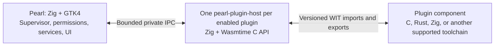

# WebAssembly plugins for Pearl

Status: initial experimental implementation delivered, September 18, 2026.
The repository now contains the optional Zig/Wasmtime helper, session supervisor,
package validation, native bar scenes, packaged sprites, managed overlays,
C/Zig/Rust examples, CLI controls, and the main-application-only Plugins settings
page. See [the implementation guide](PLUGINS.md) for the actual contract,
limits, build instructions and verification commands.

The implementation statically links the pinned runtime only into the helper.
The initial scene contract is flat (label/button/image); package changes require
rediscovery on Pearl restart. Settings edits restart instances, while sprite
playback stays in Pearl. The detailed stages below remain the acceptance roadmap;
their complete release gates have not all been certified.

**Input activity integrated:** Pearl consumes Aqueous's extension at revision
`88587243059d58d72dd0fe2146d0ebdb64f26474`, with authenticated launch, dynamic
availability, bounded guest delivery and authentication inhibitors. The
[input activity plan](PLUGIN_INPUT_ACTIVITY_IMPLEMENTATION_PLAN.md) supersedes
historical aggregate-count requirements below: the v0.1 guest receives `count=1`
per coalesced notification. See [acceptance evidence](PLUGIN_INPUT_ACTIVITY_VALIDATION.md).
Physical keyboard/VT acceptance, broader hardware/scale/rotation, soak,
performance and security-audit gates remain release work.

## Decision and feasibility

**Feasible. Use WebAssembly components with a versioned WIT interface, hosted by
a Zig `pearl-plugin-host` process through Wasmtime's C API.** Keep GTK widgets,
service adapters, configuration authority and session policy in Pearl. Start
with locally installed bar plugins, then add packaged graphics, host-driven
animation, permission-controlled input activity and optional desktop overlays.
A Bongo Cat-style plugin is the second reference implementation. The original probe did not validate these additions; production-path helper
and private-desktop tests now cover the implemented subset.
Plugin management is implemented in a dedicated **Plugins** section of the main Pearl
Settings application (`pearl-settings`), never in the compact settings flyout.

The investigation used Pearl's pinned Zig 0.16.0 and the official Wasmtime
48.0.2 x86_64 Linux C API archive. That released archive includes the component
compiler, linker, host callbacks, typed values, resource handles, WASI P2
registration, fuel and store limits. This conclusion does not depend on the
moving online documentation, which currently describes 50.0.0-dev.

The standalone [probe](../spikes/wasm-plugins/README.md) passed:

| Check | Observed result |
| --- | --- |
| Translate Wasmtime headers and link a native Zig 0.16 host | Passed without a handwritten C or Rust bridge |
| Compile C and Zig guest programs into core Wasm, wrap each as a component | Both loaded through the same host path |
| Guest imports a host function and exports a callable function | Both round trips returned the expected value, 42 |
| Omit the required host function | Instantiation rejected the missing import |
| Canonical ABI string result | Returned `hello`; host-owned result cleaned up |
| Grow guest memory above a configured 1 MiB limit | Growth rejected |
| Execute an infinite loop with finite fuel | Call trapped due to exhausted fuel |

These are small synthetic tests, not a production sandbox audit or performance
benchmark. The components use explicit canonical wrappers; **the original probe alone does not validate generated SDKs, resource handles,
WASI P2, GTK integration or supervision.** The implementation tests now cover
generated SDKs, complex values, real components, GTK integration and supervision;
resource handles and WASI are not exposed by the current contract. A returned component value must be
initialized before calling the 48.0.2 C API: an uninitialized result slot crashed
the probe; zero-initialized slots passed. Encapsulate allocation, initialization,
cleanup and ownership in the runtime wrapper rather than exposing raw C values.

### Alternatives considered

| Approach | Assessment |
| --- | --- |
| Zig + Wasmtime Component Model C API | Selected; actual host/guest calls work on the pinned compiler |
| Rust helper + Wasmtime Rust API | Reserve fallback if generated bindings or a required C API feature becomes a material blocker; preserve the same WIT and shell IPC |
| Core Wasm with a custom pointer/buffer ABI | Technically viable, but creates a second marshalling/versioning problem; do not ship a second public ABI in v1 |
| Runtime embedded in the GTK process | Avoid for v1: compilation, guest stalls and native embedding faults would affect the desktop process |

WIT describes the plugin contract. It does not itself generate a Zig host, supply
GTK bindings, enforce Pearl permissions, or turn arbitrary Wasm into a compatible
plugin. Wasmtime's dynamic component C API can implement the host without a Zig
WIT generator. Review generated guest bindings and keep the host's checked
conversion layer small.

## Repository integration points

| Existing location | Required integration |
| --- | --- |
| `build.zig`, `build.zig.zon`, `bindings/headers/` | Optional host executable, pinned runtime dependency and translated C headers; current build already uses `addTranslateC` |
| `src/core/application.zig` | Session-owned plugin supervisor, startup after verified session identity, lock/disconnect handling, shutdown before dependent UI/services disappear |
| `src/ui/surfaces/manager.zig` | Per-output bar views and managed desktop overlays, output creation/removal, theme and density updates; existing output identity is authoritative |
| `src/desktop/policy.zig` | Bar groups currently accept only `Item` enum names, require launcher and cap each group at 128 bytes; introduce validated plugin references |
| `src/desktop/bar.zig` | Widget storage is indexed by the built-in enum and rebuilds on configuration changes; add a separate dynamic registry and explicit view cleanup |
| `src/ui/components/widgets.zig` | Render the supported plugin view model with Pearl's existing GTK components |
| `src/aqueous/`, `src/platform/wayland/`, `bindings/protocols/` | Investigate a compositor-owned input-activity source; add only a verified, versioned adapter if supported, or document the required Aqueous extension |
| `src/config/preferences.zig`, `src/config/service.zig` | Bounded plugin settings and placements, strict validation, draft merge and atomic persistence |
| `src/settings/backend.zig`, `server.zig`, `editor_protocol.zig`, `preference_pages.zig` | Backend-owned plugin management, status and settings; frontend sends typed requests |
| `src/settings/window.zig`, `application.zig`, `src/desktop/settings_navigation.zig` | Dedicated Plugins sidebar page in the main Settings application; application-only route excluded from compact navigation and flyout dispatch |
| `src/aqueous/transport.zig` | Reference for nonblocking bounded framing and generation tracking; factor reusable pieces rather than exposing the privileged Settings socket |
| `src/pearlctl.zig`, `src/cli/` | List, inspect, enable, disable and reload local plugins using a versioned control extension |
| `tests/integration/`, `scripts/dev-session.py` | Isolated HOME, bus and Aqueous sessions for acceptance; never exercise the live desktop |
| `packaging/install.sh`, release scripts, Arch variants | Install the helper/runtime deliberately, account for renamed Git variants and staged package tests |

No existing generic plugin loader was found. Configuration, UI lifecycle and
service boundaries are the substantive work; loading Wasm is the smaller part.

## Architecture

Use one process and one store per enabled plugin in v1. One plugin instance
serves its views on all outputs. This makes crash attribution, cancellation and
hard termination straightforward. Measure the extra memory and startup cost
before setting the default plugin count. If it is too costly, evaluate a shared
host with separate stores as a later tradeoff, without changing the public API.

Only the helper links Wasmtime. Ordinary Pearl builds and installations without
plugin support must work without the runtime. Proposed build switch:
`-Dwasm-plugins=true`, default false during development. A plugin-disabled build
retains persisted plugin preferences and displays an unavailable status.

### Process and message ownership

1. Pearl validates the selected package, effective grants and session state,
   then starts the installed helper with an explicit executable path, minimal
   environment and a dedicated inherited IPC endpoint. A connected socketpair
   avoids a publicly discoverable helper listener. Close unrelated inherited FDs.
2. The supervisor assigns plugin identity, generation and session identity.
   Never trust a plugin-supplied identity for authorizing a request. Only the
   supervisor supplies package bytes; load bounded, validated Wasm, never a
   plugin-provided Wasmtime serialized native artifact.
3. The helper compiles and instantiates outside GTK. A synchronous guest callback
   runs serially in that helper. Component Model async/WASI 0.3 is unnecessary
   for the first release.
4. Cached reads and bounded command enqueue operations are synchronous imports.
   Disk, network and service work, if supported, return a request ID and finish
   through a later event. An import must never wait for a GTK callback or invoke
   the guest recursively.
5. Stage UI mutations during a guest callback. Send one bounded update on success;
   discard it on a trap. Pearl validates the update again and applies it on its
   creating GLib thread. Never send GTK pointers or runtime value pointers.
6. Every message carries protocol version, generation and sequence/request IDs.
   Reject stale responses after disable, reload, output removal or session change.
   Bound frames and queues before parsing or enqueueing. Coalesce superseded
   state/view updates; preserve accepted request completions or cancel them once.

The helper protocol and the WIT contract are separate, versioned interfaces.
Use a dedicated bounded JSON protocol initially, following the repository's
existing framing conventions. Benchmark before introducing another encoding.

### Lifecycle and failure behavior

Model `disabled -> starting -> active -> stopping -> disabled`, with explicit
`failed` and `suspended` states. Startup failure must leave the native bar usable.
Stopping revokes capabilities first, cancels requests and timers, discards queued
messages, destroys all plugin views, then requests bounded guest deactivation
and terminates/reaps the helper. Cleanup must succeed without guest cooperation.
Also stop animation tick callbacks, release asset/texture references, remove
overlay surfaces and unsubscribe from input activity before releasing owners.

Disable/reload changes the generation. A failed plugin remains disabled for the
session with a visible diagnostic and an explicit retry action; do not create
an automatic restart loop. Pearl shutdown owns/reaps all helpers; use parent
death handling plus EOF detection to prevent orphan execution after a crash.

On lock preparation, deny actions immediately, remove plugin views and terminate
helpers. After verified unlock, start fresh instances with fresh snapshots.
Sensitive cached state does not survive in a suspended guest. Keep plugins out
of the locker, greeter, PAM and polkit paths. Treat compositor identity loss as
suspension; do not replay queued actions into a reconnected session.

## Public interface and v1 scope

Define `pearl:plugin@0.1.0` in a future `plugins/wit/` package, initially
experimental. Freeze 1.0 only after at least two generated language SDKs pass
the same conformance suite. Pin exact experimental versions; do not assume
arbitrary WIT version compatibility. Reject unsupported worlds/imports before
activation, with a useful missing-interface diagnostic.

| Interface direction | Initial responsibilities |
| --- | --- |
| Guest exports | `activate(context)`, `handle-event(event)`, `deactivate(reason)` |
| Host imports: diagnostics | Bounded, rate-limited structured logs |
| Host imports: settings | Read a snapshot of this plugin's typed settings; persistent user changes remain backend-owned |
| Host imports: time | Read host-provided clock data; register/cancel bounded timers |
| Host imports: views | Submit a complete view with labels, theme icon names, buttons, bounded tooltips and packaged image/sprite nodes; remove a view |
| Host imports: animation | Select a named pose or play/stop a validated animation clip; Pearl schedules its frames |
| Host imports: input activity | Subscribe/unsubscribe to permitted, aggregated keyboard/mouse activity; query availability and grant state |
| Host imports: overlays | Request/remove an approved desktop contribution on an output, using Pearl-owned placement and interaction rules |
| Host events | Click, timer, settings/theme change, output added/removed, capability availability/revocation, aggregated input activity and lifecycle events |

Use typed records/variants/results instead of an arbitrary command string or
generic JSON passthrough. Use a flat list of UI nodes with local IDs and validated
parent references; reject cycles, duplicates, invalid types and excessive depth.
Start with integer IDs scoped to the plugin generation, checked by Pearl on every
request. Add WIT resources only when their ownership semantics are tested.

The first useful plugin is a configurable countdown/timer bar widget. Ship the
same small behavior in C and Rust using generated bindings, and a Zig example
through the validated C bindings or another explicitly pinned generator. The
current manual C/Zig arithmetic probe proves host feasibility, not that SDK.
The second reference plugin is a Bongo Cat-style companion with idle and paw
poses, optional animation clips, and bar or desktop placement. It exercises
graphics, input activity and overlays through the public API, with no private
host shortcuts. Existing DMS/QML plugins would require a port to this interface.

Pearl chooses GTK classes, text escaping, fonts, density, accessibility roles,
focus handling, orientation and size constraints. No arbitrary CSS, HTML,
GtkBuilder XML or arbitrary image paths in v1; packaged images use manifest IDs.
Buttons produce plugin events; plugins do not replace Pearl's launcher or lock
controls. Opening menus/popovers, launcher
search providers, read-only service data and custom actions are later interfaces.

Do not expose raw D-Bus, Aqueous IPC, `pearlctl`, arbitrary subprocess execution,
the Settings backend, file paths, clipboard contents, screenshots or credentials
through a generic escape hatch. Add individual capabilities only for concrete
plugin use cases. For example, an eventual weather plugin would need a bounded
HTTP broker with destination grants, response limits, redirect policy and
cancellation; simply exposing unrestricted WASI sockets would bypass that policy.

### Packaged graphics and host-driven animation

Add image and sprite nodes backed by assets declared in the package manifest.
For the first implementation, accept bounded PNG images or PNG sprite sheets,
with named frames and clips defined in validated metadata. Frame rectangles must
fit the decoded image, durations must be positive and bounded, and references
must resolve within the approved package. Reject unsupported formats explicitly;
SVG, animated image decoders and arbitrary drawing/shader APIs are later work.

The guest refers to asset, frame and clip IDs, never host paths or texture
pointers. Pearl loads and decodes assets off the GTK main thread through a bounded
worker, validates decoded dimensions/byte counts and applies textures on the
creating thread. Late decode results carry package identity and generation and
are discarded after disable/update. Deduplicate immutable textures across views
where practical, while accounting for decoded CPU and GPU memory separately.
Check encoded size and declared dimensions before allocation; bound decoder
concurrency and transient memory as well as retained pixels. Asset bytes use a
separate bounded loading path, not a base64 payload in the 64 KiB control frames.

Define clip operations with explicit loop/one-shot behavior, restart/continue
semantics, and a final pose. A new pose/clip command replaces the prior animation
on that node atomically. Pearl uses its frame clock to advance visible animations;
it does not call the Wasm guest or send IPC for each frame. Guest scene updates
retain their lower rate limit; host animation has a separate bounded frame rate.
Do not replay accumulated frames after hiding or suspending a view.

Stop scheduling when a view is hidden, its output is gone, the clip finishes,
the plugin is disabled or the session locks. Honor reduced motion using a static
pose or discrete activity-triggered changes. Decorative images should have an
appropriate accessible description without announcing each animation frame.

### Permission-controlled input activity

Add an explicit `input.activity` capability. Its purpose is to animate companions
or show aggregate activity, not to identify pressed keys. Expose coarse,
rate-limited activity buckets containing a bounded press count and a category
such as keyboard or pointer button; do not expose keycodes, characters, modifier
state, exact event timestamps, device identifiers, pointer coordinates or focused
application data. Bongo Cat can alternate paws on keyboard activity without
knowing which key was pressed. No pointer-motion stream is needed initially.

Pearl owns acquisition, aggregation and permission checks. A subscription
requires both a declared capability and an effective user grant. Deliver at
most one aggregate event per 100 ms bucket, with bounded counts; merge/drop excess
activity without blocking normal input. Define repeat handling explicitly in the
adapter and tests. Do not persist or log activity buckets, and clear all pending
activity on revocation, lock preparation, reload and session identity loss.

**Aqueous input support is an unresolved dependency.** P0 must inspect the pinned
compositor's protocols/IPC and verify a source that reports activity while other
applications have focus. If unavailable, specify and implement a compositor-owned,
authorized, aggregate activity interface with lock suppression, subscription
cleanup and version negotiation. Record it as an upstream dependency before
claiming real global-input support. The plugin host must not open `/dev/input`,
receive raw events or gain input-group/root access as a workaround.

Model availability separately from grants: `available`, `permission-denied`,
`unsupported`, and `suspended`. The WIT capability query/subscription API remains
present on unsupported systems and returns a typed status; do not make loading
a decorative plugin depend on compositor support. The reference cat stays idle
or responds to direct widget clicks when global activity is unavailable, with a
clear status in Settings. Synthetic activity is limited to explicit previews
and private tests and never presented as real desktop activity.

### Managed desktop overlays

Add a separate `surface.overlay` capability and manifest contribution type.
Pearl creates and owns the actual Wayland/GTK surface. Requests name a contribution
ID, output, bounded logical size and an anchor/offset; Pearl determines the layer,
clamps placement to the supported work area, and keeps native shell controls and
authentication surfaces authoritative. Verify these rules against Aqueous's
actual layer/surface behavior before enabling the capability.

Decorative overlays default to click-through, have no exclusive zone, and never
take keyboard focus or grab input. An explicitly enabled interactive mode may
receive pointer events only within its bounded widget region. Repositioning and
position locking use a Pearl-owned edit mode; a plugin cannot arbitrarily change
global input regions or intercept shortcuts. Define hide-on-fullscreen behavior
per output (default enabled) and pause animation when hidden. If required surface
features are unavailable, report that status and retain the bar placement option.

Persist user-selected output connector, anchor, offset, size, interaction mode
and position-lock choice through the Settings backend. On output removal, hide
and destroy the view while retaining its desired placement; recreate and clamp
it when that connector returns. Reconcile scale, rotation and geometry changes
without restarting the plugin. Lock preparation removes overlays before any
authentication UI is shown; unlock creates fresh views under a fresh generation.

### WASI and language support

Component Model and WASI are distinct. A custom component need not import WASI,
but language runtimes/standard libraries may do so. v1 should prefer components
with only Pearl imports. Inspect each SDK's actual imports. If WASI P2 is needed,
validate a restricted runtime profile explicitly: no inherited environment,
arguments, stdin, network or preopened host directories; bounded output logs.
Provide only the facilities required by that SDK and make unsupported imports
fail clearly. The released C header exposes WASI P2 registration, but its policy
behavior was not exercised in the probe.

| Guest language | Evidence and implementation policy |
| --- | --- |
| C | Local component probe passed; official WIT C tooling exists. First generated SDK candidate. |
| Rust | Official WIT tooling and `wasm32-wasip2` path documented. First generated SDK candidate; not run in this investigation. |
| Zig | Local core compilation and component wrapper passed. Validate generated C glue with Zig 0.16; no assumption of a supported native Zig WIT generator. |
| C++ | Documented C-family route; validate runtime, exception and standard-library needs separately from C. |
| Go | Official guide uses `componentize-go`; evaluate its exact version, imports and runtime footprint before support. |
| JavaScript/TypeScript | Evaluate `jco`/ComponentizeJS; TypeScript requires JS output and the component includes a JS runtime. No assumption that browser or Node packages work. |
| Python | Evaluate `componentize-py`; interpreter/package footprint and native-extension compatibility need separate limits and tests. |

Keep the runtime language-neutral. SDK support means a pinned recipe, working
example and conformance tests, not a promise to execute every `.wasm` file.

## Bounds and isolation

The following are **initial engineering targets**, not measurements or final
product guarantees. Tune them with real plugins before release; do not silently
raise them to accommodate one language runtime.

| Resource | Initial target / enforcement |
| --- | --- |
| Enabled plugins | 8 per session, plus a measured aggregate process-memory budget |
| Manifest / component bytes | 16 KiB manifest; 16 MiB component; validate before compilation |
| Guest linear memory | 32 MiB per memory, at most 2 memories; cap tables/instances too |
| Helper resident memory | Investigate 128 MiB ceiling per helper including native runtime, compilation and lifted values; OS enforcement and aggregate budget are a release gate |
| Guest execution | Fuel per callback, initially 1 million units; measure because fuel is not milliseconds |
| Hard deadlines | Initial activation/compile deadline 5 s; steady callback deadline 100 ms; deactivation grace 250 ms, then termination |
| IPC | 64 KiB/frame, 16 queued frames/plugin, bounded outbound writes and parsing depth |
| UI | 32 nodes/view, depth 4, 4 KiB/text, 64 KiB total view payload; at most one bar view and one overlay/output/plugin initially |
| Packaged graphics | 32 assets, 2 MiB/file, 8 MiB total encoded assets/package; 2048 px maximum image dimension; 16 MiB total decoded pixels/plugin; account for texture copies in aggregate host/GPU budgets |
| Sprite metadata | 128 frames and 16 clips/plugin; at most 128 frame references/clip; frame durations 17–10,000 ms |
| Overlay geometry | At most 512 × 512 logical px/view, further clamped to output work area; include physical pixel cost at output scale in renderer budgets |
| Update rate | Coalesce to at most 10 guest UI updates/s/plugin; timers no faster than 100 ms; visible host animation at most 60 frames/s and display refresh rate |
| Input activity | At most 10 aggregate events/s/plugin, counts saturated at 255/category/bucket; no raw event backlog |
| Logs | 4 KiB/entry and 16 KiB/s/plugin; truncation and bounded retention |

Wasmtime's store memory bound applies to individual Wasm memories; it is not a
total RSS limit. Compilation, canonical value lifting, language runtimes, native
callbacks and output queues consume other memory. Apply process-level protection
before compilation and test oversized strings/lists that allocate before Pearl's
callback validates them. Evaluate cgroup v2 or a compatible platform mechanism;
do not assume a low `RLIMIT_AS` works with Wasmtime's virtual memory reservations.

Fuel/epochs interrupt guest instructions, not blocked native host calls or the
compiler. Keep imports bounded and use the supervisor's independent wall-clock
deadline and process termination. Resource destructors must be bounded too.

A separate same-user process is a crash boundary, not an OS permission sandbox.
The Wasm runtime and exposed host functions are the initial capability boundary.
For third-party release, investigate Linux process confinement (for example a
tested Landlock/seccomp or namespace setup compatible with JIT) and record the
supported threat model. Never describe process separation alone as preventing
filesystem/network access after a native-runtime escape. Runtime security updates
and dependency licensing belong in the release process.

## Packages, preferences and management

Start with unpacked local package directories under
`$XDG_DATA_HOME/pearl/plugins/<id>/<version>/` and explicit system data roots.
Discovery never executes code. A bounded manifest names the package ID/version,
entry component, exact interface version, declared bar contributions, requested
capabilities and typed settings schema. Extend it with optional overlay
contributions, asset IDs and paths, sprite frames/clips and asset license notices.
Assets use the same confined package path rules as the component. Do not run
package installation scripts.

Validate relative entry paths and open beneath the selected package root without
following escaping symlinks. Bound file counts/sizes; reject duplicate IDs and
ambiguous user/system precedence with a visible diagnostic. Hash and copy the
validated component and declared assets to owned memory or immutable
supervisor-controlled inputs before use, avoiding path validation/load races.
The approved package content hash covers the manifest, component and all declared
assets/animation metadata. Hashes identify content; they do not establish
publisher trust.

Installing/discovering a plugin leaves it disabled. The management UI presents
declared capabilities on enable. Persist grants against package identity and
approved content hash; changed code/capabilities requires an explicit update
decision. Rollback restores the previous package and its corresponding grants.
An online marketplace, remote update service and package signing are later work.

Add an optional bounded `plugins` object to preferences v1 for desired enabled
state, selected package version, grants, overlay placements and per-plugin
settings. Preserve the existing default when absent. Track observed runtime
status separately. Use
existing draft/conflict handling; process startup failure must not corrupt the
saved desired state. Extend validation, merge paths, schema snapshots and CLI
protocol limits together. Existing 64 KiB preference size remains the outer cap.

Extend group syntax with `plugin:<package-id>/<contribution-id>` while preserving
all built-in names and the required native launcher. Raise the group byte limit
to a documented bound (initially 1024), add a token-count bound, and validate
identifier syntax independently from package availability. Missing/disabled
plugins retain their placement but do not invalidate the whole bar. Replace the
enum-only duplicate check with a mixed built-in/plugin reference check; the
built-in widget array may remain alongside a dynamic plugin map.

Apply these rules to default and per-output groups. View IDs include output and
generation so a removed monitor cannot receive a stale update. Rebuilding a bar
must recreate views from the retained validated model without restarting the
plugin or retaining old GTK references.
Changing between bar and overlay placement should reuse the plugin instance and
replace its view atomically. Granting input activity does not grant overlay
placement, or vice versa. Permission revocation immediately detaches the affected
subscription/surface and discards queued activity or creation requests; later
messages from the same generation cannot restore the revoked capability.

Older Pearl versions strictly reject new preference fields and plugin group
tokens. Document downgrade/export that removes plugin settings/references while
retaining native controls. Uninstall must not silently erase unrelated settings.

### Plugins section in the main Settings application

Add a top-level **Plugins** sidebar section to the normal `pearl-settings`
window. This is the single graphical management surface for plugins. The compact
settings flyout must have no Plugins page, plugin list, enable/disable controls,
permission prompts, configuration forms or plugin-management shortcut. Existing
general navigation to the full Settings application can remain unchanged.

The section provides:

- Installed/discovered plugins with name, version, desired enabled state and
  observed status: starting, active, disabled, suspended, failed or unavailable.
- Enable/disable controls, explicit reload/retry actions, bounded diagnostics and
  a clear reason when the runtime or a required compositor feature is unavailable.
- Package details and separate controls for requested capabilities, including
  input activity and desktop overlays; show effective grants and pending changes.
- Typed per-plugin settings, bar/desktop placement, output selection, overlay
  position/size/interaction controls, animation preferences and labeled previews.

Select a plugin to show its detail/configuration panel within the same application.
Provide a useful empty state and runtime-unavailable state. Distinguish a pending
configuration edit from what the plugin is currently doing. Persist configuration,
desired enablement and grants through the existing backend draft/Apply workflow;
do not start a plugin with uncommitted grants. Reload/retry are explicit runtime
commands against committed state. Backend loss retains editable drafts while
runtime commands become unavailable, following the application's recovery rules.

Add the stable route `plugins` to the shared route definitions with
`isCompact() == false`. The proposed `pearlctl settings show --page plugins`
opens or selects this page in the main application. Compact route parsing and
flyout transitions must reject it. Audit consumers that enumerate all routes so
adding the sidebar page cannot accidentally add a compact entry. The page uses
the Settings backend for all mutations and never contacts plugin helpers directly.

## Implementation sequence and acceptance

### P0 — Finish the contract and tooling spike

The retained C/Zig host probe is complete. Next pin `wit-bindgen`, guest compilers
and any adapters; define an experimental WIT world and generate C/Rust bindings.
Verify strings, records, variants, lists, result errors and cleanup over repeated
calls, including traps and invalid arguments. Prove a Zig guest using generated
C glue. Inspect imports and validate at least one restricted WASI P2 component
if any selected SDK requires it. Measure cold/warm loading and process RSS.
Specify the graphics, animation, activity and overlay WIT interfaces alongside
the core world, with availability queries and typed errors. Inspect pinned Aqueous
for global activity and required overlay behavior; record a verified source or
an explicit upstream dependency with protocol and test requirements. Separate
this gate from runtime interoperability: the existing probe proves neither input
acquisition nor overlay behavior.

**Exit:** two generated SDKs use the same WIT contract with no language-specific
host behavior; C API ownership is covered; a documented Zig SDK route works or
is explicitly deferred. If the C API blocks necessary features, compare a Rust
helper using the same contract before committing production code.
Global-input support remains pending until its compositor source is verified;
graphics and bar integration can proceed with explicitly synthetic test events.

### P1 — Runtime wrapper and supervised helper

Add `bindings/headers/wasmtime.h`, `src/plugins/{runtime,protocol,limits}.zig`,
`src/plugin_host_main.zig`, optional build/install targets and dependency pins.
Add runtime value wrappers, import/export type checks, store ownership, fuel,
process deadline handling and bounded logs. Create a fake supervisor harness.
Do not accept serialized native compilation artifacts from packages.

**Exit:** malformed components, unknown imports, wrong export types, infinite
loops, memory growth, callback floods, compilation timeout and helper crashes
produce bounded failures; host cleanup succeeds after every failure. Confirm
runtime/store handles never cross stores. Build without plugins needs no Wasmtime.

### P2 — Session supervisor and package registry

Add `src/plugins/{manager,manifest,registry,permissions}.zig` and wire the verified
session lifecycle. Implement discovery, content identity, enable/disable/reload,
generation invalidation, request cancellation, lock handling and child reaping.
Add read-only status and local management CLI operations.

**Exit:** no execution on discovery; disabled plugins allocate no runtime; two
sessions cannot exchange requests; disable/reload, parent death, lock and
compositor disconnect leave no helper, timer, pending request or stale capability.
Asset identity and loading reject escaping paths, changed bytes, undeclared IDs,
oversized images and stale decode completions without affecting other plugins.

### P3a — Native bar contributions

Add `src/plugins/{view_model,renderer}.zig`; extend mixed bar policy and dynamic
view ownership. Render the countdown example with label/button/icon/tooltip and
route input back to its helper. Apply complete validated view updates atomically.

**Exit:** default/per-output placements, horizontal/vertical bars, output hotplug,
bar rebuilds, density/theme changes, keyboard access and accessible labels work.
A failed or removed plugin cannot freeze the bar or remove the native launcher.

### P3b — Packaged graphics and animation

Add `src/plugins/{assets,animation}.zig` and extend the view model/renderer with
image/sprite nodes. Validate manifest assets and clips, add bounded asynchronous
decoding, generation-aware texture ownership and frame-clock playback. Implement
pose selection, one-shot/loop clips and reduced-motion behavior.

**Exit:** malformed PNGs, oversized decoded images, invalid sprite rectangles,
missing frames, invalid durations and cross-plugin asset references fail cleanly.
Theme/scale changes and rapid pose replacement preserve correct rendering.
Trace a running clip to prove there is no guest callback or IPC per frame; hiding
or removing its view stops animation scheduling and releases owned resources.

### P3c — Input-activity broker

Add `src/plugins/input_activity.zig` and the verified Aqueous adapter. Implement
capability negotiation, explicit grants, bounded aggregation, status changes,
repeat policy and immediate revocation/lock handling. Use a shared broker so
enabling several plugins does not create several raw input subscriptions.
If an Aqueous extension is required, deliver and pin that contract before marking
this stage complete; a mock is sufficient only for development tests.

**Exit:** a private session with a different application focused produces the
expected aggregate activity; denied/unsupported/suspended states remain usable.
Verify both compositor-side suppression and broker-side rejection at lock
preparation. Inspect the wire payloads/logs to establish that key identity, text,
coordinates and exact event timestamps are absent. Burst input remains bounded,
and no stale activity reaches a plugin after revocation or unlock.

### P3d — Desktop overlays and Bongo Cat reference plugin

Add `src/plugins/overlay.zig`, integrate Pearl's surface manager, and implement
bounded placement, click-through and interactive modes, host-owned dragging,
position locking, fullscreen hiding and output reconciliation. Add a Bongo
Cat-style example under the future `plugins/examples/` using only public WIT
interfaces. Use original or appropriately licensed art with packaged attribution.

**Exit:** the cat works in a bar and as an overlay, switches poses on granted
activity, and falls back to idle/direct clicks with an explanatory status when
activity is unavailable. Validate click-through, bounded pointer regions, no
keyboard focus stealing or exclusive reservation, and no interference with
native panels/popups or lock/authentication surfaces. Test hotplug, fractional
scale, rotation, fullscreen, drag/position lock, permission revocation and restart.
Compare event-to-visible-pose latency on recorded hardware; initial target is
under 200 ms p95 including aggregation and guest-update limits. Record separate
results for synthetic events and real compositor activity. The real-input feature
cannot pass acceptance using only preview or fixture events.

### P4 — Settings, SDKs and developer workflow

Implement the dedicated Plugins sidebar section in the main Settings application
through its backend, following the application-only requirements above. Add
`src/settings/plugins_view.zig`, wire the `plugins` route and typed backend
requests, and add plugin configuration, capability review and clear error/retry
states. Do not add plugin management to the compact flyout.
Add generated SDK examples, a package inspector, offline validation and an
explicit development reload command. Document API compatibility and downgrade.
Include separate input-activity and overlay grants, capability availability,
bar/desktop placement, size/position controls and animation/reduced-motion
settings. Provide an explicitly labeled synthetic preview that requires no
global-input grant. Publish the timer and Bongo Cat examples as SDK use cases.

**Exit:** C and Rust examples give the same behavior; Zig's published support
level matches its tests; settings survive restart and merge conflicts; unknown
settings keys and limits fail clearly. No compiler is needed on an end user's
machine to load a prebuilt compatible component.
The Bongo Cat example exercises the same interfaces across at least two generated
SDKs. Permission denial and missing compositor support have clear UI states;
changing placement/settings preserves backend draft/conflict semantics.
The main application's sidebar and `--page plugins` activation select the same
page, including when the application is already open. Private UI acceptance
covers list/detail navigation, enable/disable, committed permission changes,
reload/retry, empty/error states, keyboard access and backend recovery. Verify
that the flyout contains no plugin-management entry or controls and that compact
route parsing/dispatch rejects `plugins` without opening a compact page.

### P5 — Release, isolation and performance gates

Add focused targets such as `test-plugin-unit`, `test-plugin-host`,
`test-plugins`, `test-plugin-graphics`, `test-plugin-activity`,
`test-plugin-overlays`, `test-settings-plugins` and `test-plugin-performance` to
the existing private harness. Include the plugin Settings suite in full Settings
acceptance when plugin support is enabled, and test the unavailable page state
in plugin-disabled builds.
Update source/install/release tooling and both regular/Git package paths. Pin
matching runtime headers/library and record licenses, architecture/CPU baseline,
supported guest feature set and update policy. No network downloads during a
normal offline build; dependency preparation is an explicit reproducible step.

**Exit:** package tests load plugins using staged installation paths; existing
desktop/preferences/Settings/session-security regressions pass; malformed IPC,
oversized canonical values, forbidden access, stale replies and worker deaths
are contained. Complete 1,000 enable/disable cycles without monotonically growing
FDs, child count or retained GTK objects. Measure memory after warm-up rather
than assuming allocator caches return to zero.
Include asset decode cancellation, texture/animation cleanup, overlay removal
and activity unsubscription in the soak. Release evidence must distinguish
verified compositor input support from unsupported environments and test fixtures.

Benchmark zero, one and eight plugins: shell idle CPU/RSS, helper RSS separately,
startup/compile time, callback latency, IPC bytes and GTK frame responsiveness.
Run timer, idle cat and actively animated cat workloads in both bar and overlay
modes, including several outputs and mixed scales. Record decoded asset/GPU
memory, input aggregation delay, event-to-pose latency and main-thread rendering
cost separately from helper execution. Hidden or reduced-motion companions must
not retain a continuous animation tick; input acquisition must stop when the last
eligible subscriber leaves. Idle/hidden views must not generate periodic guest
updates solely to repaint unchanged images.
Disabled support should add no helper or periodic wakeup. Proposed steady-state
target: no shell main-thread wait on guest work and less than 2 ms p95 main-thread
application time for a maximum valid view on recorded reference hardware.
Publish measured limits before increasing default counts or admitting interpreter
SDKs. A production release remains gated if aggregate memory control or required
isolation cannot be enforced on the supported desktop setup.

## Sources and reproducibility

Local repository inspection and probe results are the evidence for Pearl-specific
claims. External documentation was consulted September 18, 2026:

- [Wasmtime 48.0.2 release](https://github.com/bytecodealliance/wasmtime/releases/tag/v48.0.2): pinned runtime used by the probe.
- [Wasmtime C API](https://docs.wasmtime.dev/c-api/): embedding and linking; online pages track development, so use the release archive's headers for implementation.
- [WIT reference](https://component-model.bytecodealliance.org/design/wit.html): language-neutral interface types and worlds.
- [C/C++ component tooling](https://component-model.bytecodealliance.org/language-support/building-a-simple-component/c.html): generated bindings and component construction.
- [Rust component tooling](https://component-model.bytecodealliance.org/language-support/building-a-simple-component/rust.html): native component target and WIT bindings.
- [Go component tooling](https://component-model.bytecodealliance.org/language-support/building-a-simple-component/go.html), [JavaScript tooling](https://component-model.bytecodealliance.org/language-support/building-a-simple-component/javascript.html), [Python tooling](https://component-model.bytecodealliance.org/language-support/building-a-simple-component/python.html): candidate SDK paths, not local conformance results.
- [Wasmtime interruption](https://docs.wasmtime.dev/examples-interrupting-wasm.html) and [security model](https://docs.wasmtime.dev/security.html): runtime limits and embedding responsibilities.

See the [probe README](../spikes/wasm-plugins/README.md) for exact tool versions,
download hashes, reproduction command, results and limitations.
