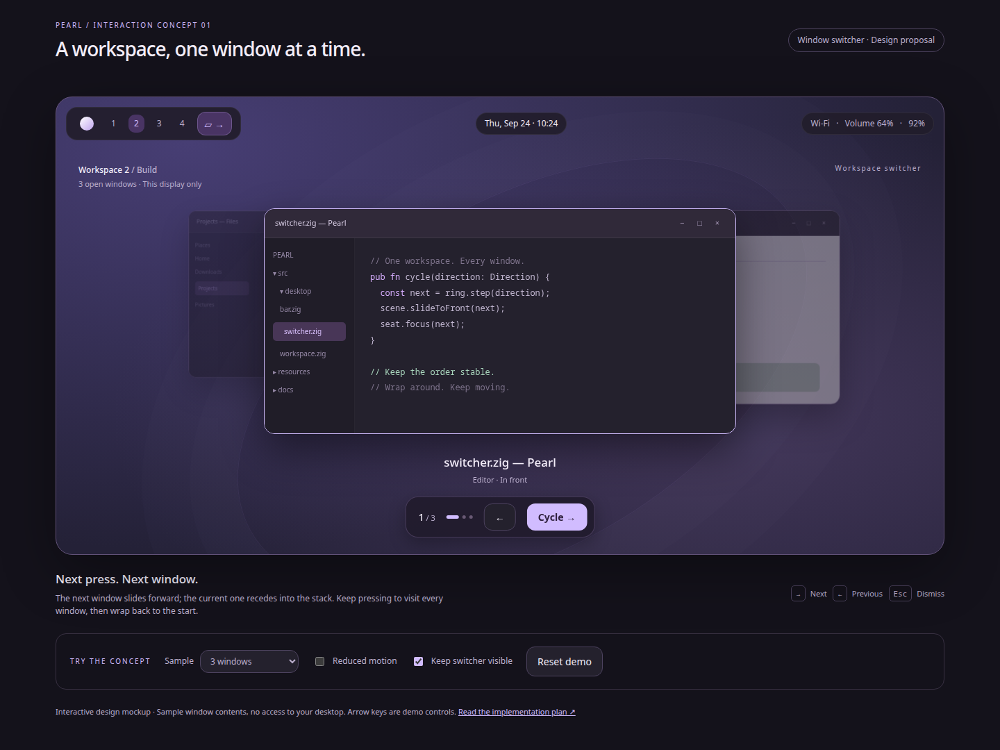

# Workspace window switcher

Status: implemented in the coordinated local Pearl/Aqueous changes. Native
validation and remaining acceptance limits are recorded in
[the evidence directory](../artifacts/window-switcher/README.md). The design and
implementation sequence below are retained as the original specification.

Add a **Cycle windows** button to Pearl's bar. Each press selects the next open
window on that bar's current workspace and slides it to the front of a temporary
window stack. Repeated presses visit every eligible window before wrapping.
Selection takes effect on each press; there is no separate confirmation step.

## Mockup

[Open the interactive mockup](mockups/window-switcher/index.html).
Use **Cycle →**, the bar's stack button, or the demo's right arrow key; use the
left arrow to reverse. Try the one-window, empty-workspace and reduced-motion
controls. **Keep switcher visible** is a review-only control enabled by default;
turn it off to see the proposed 1.5-second dismissal.

The mockup uses simulated application contents. Its overlapping cards represent
live compositor-rendered windows in the intended implementation. Its decorative
titlebar controls and application contents are not interactive.

## Interaction contract

“Active windows” means open, non-minimized, activatable windows belonging to the
current workspace and output. Include obscured windows; do not filter solely on
the model's `visible` flag. Honor `skip_switcher`, independently of `skip_taskbar`.
Each window is a separate stop, including multiple windows from one application.
Exclude shell surfaces and windows whose workspace cannot be established.
Minimized windows remain accessible through Running applications and the dock.

| Input or state | Result |
| --- | --- |
| Cycle button | Immediately advance one window, focus it and animate it to the front |
| Previous action | Advance one window in reverse with mirrored motion |
| Last window → next | Wrap to the first window without a special end state |
| First window → previous | Wrap to the last window |
| One eligible window | Keep focus; show “Only window on this workspace”; disable the cycle button |
| No eligible windows | Disable the button with “No open windows on this workspace” |
| 1.5 seconds without cycling | Dismiss the stack, retaining selected focus; restore presentation transforms |
| Escape while stack is shown | Dismiss immediately; keep the already selected window focused |
| Click an actual application / begin typing | Dismiss presentation before passing input to the focused application |
| Workspace change, unrelated external focus change or seat/output change | Dismiss and resolve the new scope on the next press |

The button's output determines scope. A keyboard action uses the initiating
seat's selected output. Neither action moves windows between workspaces or
displays. A scope change never carries queued presses onto the new workspace.
Fullscreen windows participate, but compositor policy retains fullscreen state
and controls the final stacking; the bar may be unavailable above fullscreen,
so the keyboard action must remain available. Respect always-above/below policy.

### Stable order

Maintain a ring of opaque window IDs per workspace/output for the verified
compositor session. Seed it deterministically from the initial eligible IDs,
then append newly eligible windows in first-observed order with an ID tie-break.
Use the current focused ID as the cursor. With no eligible window focused,
forward selects the first entry and reverse selects the last.

Focus changes, title changes, animation completion and the idle dismissal do
**not** reorder the ring. For `[Editor, Browser, Files]` with Editor focused,
three presses produce `Browser → Files → Editor`, including when presses are
separated by more than 1.5 seconds. Do not rebuild the ring from most-recently
focused order on each press: that can oscillate between two windows.

Remove closed, moved, minimized or newly excluded IDs. If the selected window
vanishes, dismiss the presentation and let normal compositor focus recovery
choose a survivor; subsequent cycling resumes from that survivor. Newly opened
windows append, so they cannot displace the next existing stop. Clear rings on
session reset and delete them with their workspace. Keep all IDs reachable even
when the visual stack draws only the selected window and two neighbors.

### Motion and presentation

- Use Pearl's current Material palette, 14–18 px rounding, soft shadows, a
  selected outline, window title, application name and `position / total`.
- Center the temporary stack within the initiating output's usable area. Scale
  windows proportionally with letterboxing when needed; never resize clients or
  mutate their saved geometry, tiling layout, minimized/maximized/fullscreen state.
- Forward: the next card slides from the right into the central front position;
  the outgoing card recedes left into the stack. Reverse mirrors the motion.
  Target 240 ms ease-out (`cubic-bezier(.2,.8,.2,1)`); no bounce or rotation.
- Live textures and final focus belong to Aqueous. The stack is a temporary scene
  presentation; dismissal returns the selected window to its normal geometry.
  In a tiled layout, “front” describes selection and the stack presentation,
  followed by normal tiled placement. Floating windows are raised through the
  existing compositor policy. Do not convert tiled windows into floating windows.
- Every accepted press advances the logical cursor once. Rapid presses retarget
  the current animation from its interpolated position without waiting for a
  backlog of 240 ms animations. Repeated key-down events count as presses.
- Reduced motion skips translation/scaling and updates focus, outline and labels
  immediately. Respect the existing desktop animation preference where available.
- After cycling stops, restore scene transforms within 120 ms, or immediately
  with reduced motion. The 1.5-second timer controls presentation only, never focus.
- Labels and controls must fit large text, mixed scale and portrait outputs.
  Truncate visual titles with a full accessible name. A large collection uses a
  numeric position instead of an unbounded strip of dots.

## Repository basis and required compositor work

The following contracts were inspected locally for this proposal:

| Existing component | Reuse / limitation |
| --- | --- |
| `src/aqueous/reducer.zig`: `activeWorkspace`, `windows` | Workspace/output filtering and `purpose = .switcher` already exist; returned window pointers are borrowed |
| `src/aqueous/entities.zig`: `Window`, `Seat` | IDs, titles, focus, geometry, minimized state, `skip_switcher`, activation capability and seat/output identity are available |
| `src/aqueous/commands.zig`: `window_activate` | Validated ordinary activation exists; it does not expose a window-stack animation contract |
| `src/desktop/bar.zig`, `policy.zig`; `src/settings/bar_model.zig`, `bar_view.zig` | Existing optional widgets, placement and Apply/Discard flow |
| `src/ui/surfaces/manager.zig`, `src/pearlctl.zig` | Output surface ownership and CLI entry points |
| Aqueous `compositor/aqueous/wm/Aqueous.zig`: `cycleFocus` | Existing workspace focus cycling and focus history; inspect compatibility before reuse, preserve existing behavior for users who do not opt in |
| Same file: `activateShellWindow`, `activateClientWindow` | Existing seat-aware activation and focus/raise requests |
| Same file: overview creation / `showOverview` | Existing compositor window-card presentation; investigate scene reuse without changing Overview's selection/commit semantics |

**Real windows cannot be animated by a Pearl GTK overlay alone.** This feature
requires an Aqueous scene/command extension, with capability negotiation and
native verification. Existing `window_activate` is enough for ordinary switching,
but not sufficient evidence that the sliding effect is supported. Do not use
desktop screenshots as pretend live windows or move actual client geometry to
simulate a slide. Ordinary activation may be offered as an explicitly named
fallback on older Aqueous versions; it does not complete the animated feature.

## Implementation sequence

### 1. Define and prove the compositor contract

In Aqueous, prototype a temporary stack using the existing overview scene
infrastructure. Establish rendering, focus, stacking and input ownership before
building the settings UI. The compositor owns the ring and animation state so
button and keyboard entry points share exactly one cursor and order.

Propose capability `workspace_switcher_v1` and a typed command equivalent to
`switcher.step { seat, output, workspace, direction }`. These are proposed names,
not existing API. Require the target workspace to still be active on the output
at dispatch; perform eligibility checks and selection atomically. Echo request
identity and report selected window ID, position, total and presentation state.
Provide a dismiss command and change events so Pearl never infers success from
an animation or a command write. Give lock, output removal, workspace changes,
session loss and compositor teardown explicit cleanup paths.

Use one ordered command stream per seat. Do not replay stale requests after
reconnect or collapse several presses into a single logical step. Compositor
rendering may coalesce frames while preserving the final cursor. Native
keybindings call the same operation directly. Reject an unavailable target
without falsely updating focus. A command failure leaves the previous confirmed
selection and shows brief feedback; resnapshot when needed.

Checkpoint: three real windows cycle and wrap in stable order, including rapid
presses and presses separated by dismissal. Saved client geometry is identical
before and after. Verify XDG and XWayland, floating and tiled layouts, fullscreen,
always-above windows, popups/transients and reduced motion.

### 2. Integrate Pearl's adapter and controller

- Extend capability decoding, typed actions, response/events and protocol fixtures
  for the agreed Aqueous contract. Keep unsupported capabilities explicit.
- Add `src/desktop/window_switcher.zig` for button state, command dispatch and
  feedback; expose one manager-owned controller with seat/output-scoped state.
- Resolve output/workspace from the invoking bar or seat, never an arbitrary
  first monitor. Revalidate at enqueue and dispatch, including session generation.
- Retain owned IDs and presentation metadata only; do not keep borrowed reducer
  pointers across updates. Deduplicate results by request/session identity.
- Let compositor focus and selection events drive the label, count and selected
  state. Keep unconfirmed requests distinct from confirmed focus.

### 3. Add the button, HUD and keyboard entry points

- Add optional singleton bar token `window_switcher`, labeled **Cycle windows**,
  with description “Step through windows on this workspace.” Existing bar layouts
  stay as saved. Effective per-output layouts determine which bars contain it.
- Keep bar keyboard mode `none`. The primary click sends one forward step.
  Tooltip and accessible name include current workspace and eligible count.
- Provide proposed CLI commands `pearlctl window-switcher next|previous|dismiss
  [--output ID]` through the existing session control routing. Final syntax should
  follow the current CLI conventions; these commands do not exist yet.
- Offer next/previous shortcut actions in Aqueous settings. `Super+Tab` is already
  the default for Aqueous `cycle_focus`; provide an explicit reassignment choice
  rather than silently installing a conflicting binding. Avoid claiming browser
  mockup arrow keys are production global shortcuts.
- Render the small title/count HUD using Pearl's theme and compositor-confirmed
  state. Use a separate output-anchored surface with **no keyboard grab**, and
  pointer input regions only around its previous/cycle controls. Do not reuse the
  exclusive-keyboard principal popup, which would steal focus from the window.
- Coordinate with existing popup ownership: close a shell chooser before starting;
  a new principal popup dismisses the switcher. The compositor owns Escape and
  input handoff while the temporary scene is active. Typing or pointer interaction
  must first restore normal presentation, then target the actual window correctly.
- Announce application, title, position and workspace after confirmed focus;
  coalesce announcements during fast cycling. Keep the shortcut usable without
  the bar and avoid a focusable overlay blocking application input.

### 4. Settings and lifecycle

Add the widget to the existing **Settings → Bar & dock → Add widget** picker and
reuse move/remove, shared draft preview, Apply/Discard and output overrides. The
settings preview uses sample data. No new settings page is needed. Read the
agreed animation preference; only add a persisted motion override if the existing
preference cannot serve this feature. The browser's sample and “Keep visible”
controls are not production settings.

On lock, IPC loss, output power-off/removal or controller destruction, immediately
clear HUD/input ownership and cancel presentation resources. Reconnect obtains a
fresh snapshot and does not replay cycle commands. Teardown must remove scene
transforms, frame callbacks, pointer suppression and keyboard handling, even when
a selected client dies mid-animation. Showing the switcher must not require
continuous thumbnail capture, shell polling or idle animation timers.

### 5. Verification and delivery

| Area | Required evidence |
| --- | --- |
| Cycle policy | 0/1/2/many windows; forward/reverse wrap; three windows never ping-pong; external focus; append/remove/move/minimize; duplicate titles and multiple windows per app |
| Scope | Two outputs with different active workspaces; identical workspace numbers on different outputs; seat origin; stale workspace request rejection; no cross-workspace movement |
| Protocol | Capability absent; unavailable/closed target; delayed/duplicate replies; disconnect during a burst; ordered request handling; no replay after reconnect |
| Motion | Frame capture of forward/reverse slides and rapid retargeting; no geometry/layout changes; aspect ratios, scaling and reduced motion |
| Input | Bar stays unfocusable; app focus changes each press; typing, pointer interaction, Escape and idle dismissal; conflicting shortcut is not overwritten |
| Churn | Close selected window mid-animation; open another window; output removal; lock/suspend; shell/compositor restart; transforms and grabs always released |
| Settings/accessibility | Add/move/remove, Apply/Discard, output overrides, restart persistence, translated/long titles, large text, accessible status and keyboard-only use |

Add pure tests for ring selection and protocol state, plus a private Aqueous
integration target such as `test-window-switcher` with real clients. Run Pearl's
ReleaseSafe build and unit suite, relevant bar-layout/settings/preferences
regressions, and Aqueous focus/overview regressions. Capture the native forward
and reverse motion as video or frame sequences, plus horizontal/vertical-bar
screenshots. HTML mockup validation cannot prove native focus or animation.

Deliver in dependency order: **Aqueous scene/contract → Pearl adapter/controller
→ widget and keyboard wiring → settings/lifecycle → native acceptance**. Finish
documentation in `DESKTOP.md`, `SURFACES.md` and the capability inventory, recording
the required Aqueous version and the limitation of any non-animated fallback.

Acceptance: from any eligible window on a workspace containing N windows, N
forward presses visit each window once and return to the start. Every press
changes confirmed focus and slides the next window forward when motion is
enabled; no window migrates or changes saved layout. Reverse, reduced motion,
rapid input and all dismissal paths preserve the same cycle semantics.

## Delivered contract

The implementation uses explicit `switcher.next`, `switcher.previous` and
`switcher.dismiss` commands instead of a direction field on `switcher.step`.
Aqueous owns the ring in `WindowSwitcher.zig` and shares the overview renderer's
texture machinery through a separate deck mode. IPC capability
`workspace_switcher_v1` gates Pearl's `window_switcher` bar token and
`pearlctl window-switcher next|previous|dismiss [--output ID]`.

Cards animate for 240 ms with cubic ease-out, retarget from their current
interpolated rectangles, and restore normal geometry immediately on dismissal.
The existing compositor renderer supplies borders and client corners; the HTML
mockup is an interaction reference rather than a pixel-exact native skin. The
HUD uses Pearl's theme. Pearl's Reduced motion setting accompanies its requests;
native Aqueous bindings use compositor animation support. Shortcut actions ship
unbound so the user's current `cycle_focus` binding remains intact.

The GTK HUD never grabs the keyboard. Its control row receives pointer input,
and its status announcements coalesce rapid selections. The selected title and
position follow authoritative compositor events. IPC connection ownership
ensures a shell disconnect releases presentation immediately.
