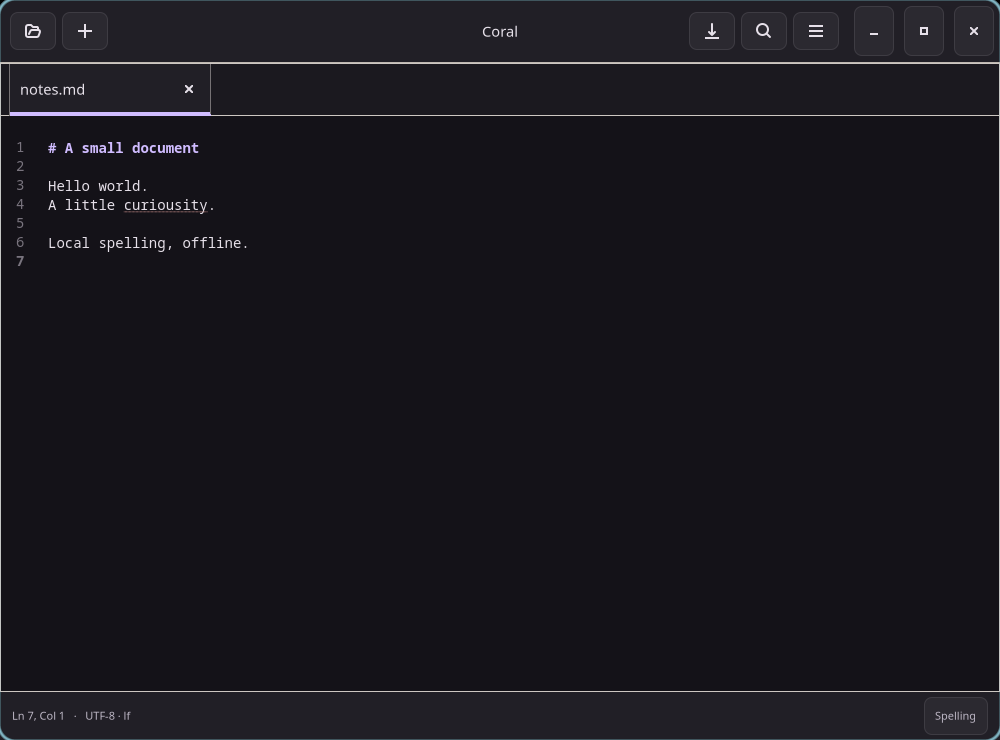

# Coral

A standalone Linux text editor written in **Zig 0.16.0 and GTK4**, with
GtkSourceView editing and offline Enchant spell checking. Its compact tabbed
interface follows Pearl's design and the everyday workflow of COSMIC Text Editor.



## Build and run

Use Zig 0.16.0, `pkg-config`, a C toolchain, GTK **4.12+**, GtkSourceView **5**,
Enchant **2**, and their development headers. GTK 4.22.5, GtkSourceView 5.20.0,
and Enchant 2.8.21 are the tested versions. Older supported API baselines have
not been tested in a separate distribution image.

```sh
cd subprojects/coral
zig build -Doptimize=ReleaseSafe
zig build run -- /path/to/notes.txt
zig build test
```

The executable is `zig-out/bin/coral`. The build stages its desktop entry, icon,
AppStream metadata, and two editor color schemes under `zig-out/share/`.
Use `zig build --prefix PATH` to stage elsewhere. `zig build run` can find styles
in the source checkout; an installed application reads them relative to its
executable. Coral does not require a running Pearl shell or Aqueous compositor.

Pearl's `pearl`, `pearl-git`, and `pearl-intel-git` PKGBUILDs build, test, and
bundle Coral. The release package supplies `coral`; both Git packages supply
`coral-git` (**Coral Git**, application ID `org.aqueous.Coral.Git`). Build that
variant directly with `zig build -Dgit-variant=true`. Each variant has its own
launcher, metadata, icon, and installed styles (`share/coral/styles` or
`share/coral-git/styles`), allowing stable and Git packages to coexist.
Preferences and personal dictionaries are shared between the variants.

Spell checking requires an installed Enchant provider and language dictionary.
On this CachyOS/Arch environment the English package is `hunspell-en_us` (with
`hunspell` as the provider). `enchant-lsmod-2 -list-dicts` lists available
languages. No dictionaries were installed on the development host; verification
uses an isolated test dictionary. Missing dictionaries leave editing usable and
show **Dictionary unavailable**. Choose an available language in Preferences.

Options: `--light`, `--dark`, `--native-theme`, `--width=N`, `--height=N`,
`--help`, `--version`, followed by local filenames or local file URIs.

## Implemented

- Editable, reorderable document tabs; new/open/save/Save As; file arguments;
  canonical-path duplicate detection; dirty indicators and save/discard/cancel
  prompts for individual tabs and quitting.
- Asynchronous GIO loads and replacement saves. Etag conflicts and deleted files
  require a decision. Failed/cancelled saves retain edits. Edits made during a
  save stay dirty after the older revision finishes saving.
- UTF-8 validation, BOM preservation, LF/CRLF and final-newline preservation,
  explicit mixed-line normalization, and rejection of binary/unsupported input.
- GtkSourceView syntax highlighting; Unicode editing; undo/redo; clipboard;
  literal case-insensitive find, match navigation, replace and replace-all;
  go to line; wrapping, line numbers, text size, indentation and spaces/tabs.
- Offline spelling on a dedicated worker: Unicode/Pango word boundaries,
  underlines, up to five suggestions, undoable correction, document-local ignore,
  personal dictionary additions, and installed-language selection. Source code
  defaults to spelling off; Preferences can override the current document.
- Pearl dark/light and native GTK appearance, narrow-window adaptation, keyboard
  operation, accessible control labels, and persisted preferences.
- Explicit large-file mode above 10 MiB disables automatic spelling and syntax
  highlighting. Reads stop at a 128 MiB safety limit.

Settings are stored in `$XDG_CONFIG_HOME/coral/preferences.ini` (default
`~/.config/coral/preferences.ini`). Personal words use Enchant's configuration
and may be shared with other Enchant applications.

| Shortcut | Action |
| --- | --- |
| Ctrl+N / Ctrl+O | New document / open |
| Ctrl+S / Ctrl+Shift+S | Save / Save As |
| Ctrl+W / Ctrl+Q | Close tab / quit |
| Ctrl+Tab / Ctrl+Shift+Tab | Next / previous tab |
| Ctrl+Z / Ctrl+Shift+Z | Undo / redo |
| Ctrl+F / Ctrl+H | Find / replace |
| F3 / Shift+F3 | Next / previous match |
| Ctrl+G | Go to line |
| Ctrl+plus / Ctrl+minus / Ctrl+0 | Increase / decrease / reset text size |
| Ctrl+comma | Preferences |
| Shift+F10 | Spelling suggestions |
| Escape | Dismiss spelling/search and notices |

Right-click a flagged word for suggestions with Cut/Copy/Paste retained.
Right-click elsewhere for GtkSourceView's normal editing menu.

## Verification and design

Read the [implementation report](docs/IMPLEMENTATION_STATUS.md) and
[native screenshot gallery](artifacts/native/README.md). Native integration
uses Pearl's existing private Wayland harness, temporary XDG directories and
files, and a small pinned Hunspell fixture:

```sh
zig build integration -Doptimize=ReleaseSafe
```

The harness needs the prepared `.cache/aqueous-activity-production` prefix,
Python, D-Bus, `wtype`, `wlr-randr`, and `grim`. Pass
`-- --aqueous-prefix PATH` for an alternate prefix. These are test dependencies,
not application dependencies. Integration builds a separate instrumented binary;
normal builds omit its test controls.

The [original plan](docs/IMPLEMENTATION_PLAN.md), [interactive mockup](docs/mockups/index.html),
and [mockup gallery](docs/mockups/README.md) remain design references. They do
not replace the native test evidence.

Session/crash recovery, remote files, legacy encodings, grammar checking,
project tooling and plugins are outside this release. Markdown code fragments
are checked as text. Physical IME and screen-reader qualification remain manual
follow-up work; see the implementation report for precise limits.
