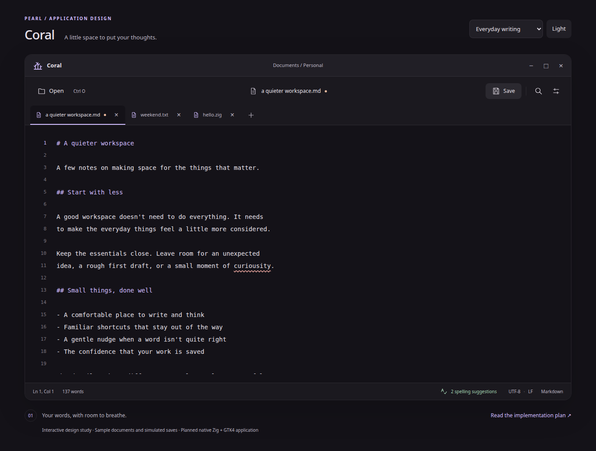

# Coral design review

Open [index.html](index.html) directly in a browser. The mockup works offline
with its adjacent CSS and JavaScript, following Dome and Phyto's review format.
It illustrates the planned **Zig 0.16.0 / GTK4** editor; it is not the native app.



## Screen gallery

| Screen | Capture | Interactive scenario |
| --- | --- | --- |
| Tabbed writing, line numbers, spelling status | [Dark](editor-dark.png), [light](editor-light.png) | [Editor](index.html) |
| Inline correction, ignore, dictionary actions | [Spelling](spelling.png) | [Suggestions](index.html?view=spelling) |
| Find counts, highlighted matches, replace controls | [Search](search.png) | [Find and replace](index.html?view=search) |
| A fresh untitled document | [Empty](empty.png) | [New document](index.html?view=empty) |
| Writing without an installed dictionary | [Unavailable](missing-dictionary.png) | [No dictionary](index.html?view=missing) |
| External file change with explicit choices | [Conflict](file-conflict.png) | [File conflict](index.html?view=conflict) |
| Save, discard, or cancel closing a tab | [Unsaved changes](unsaved.png) | [Close prompt](index.html?view=unsaved) |
| Appearance, text size, line numbers, spelling | [Preferences](preferences.png) | [Preferences](index.html?view=preferences) |
| 480 px layouts | [Editor](narrow.png), [light spelling](spelling-narrow.png), [search](search-narrow.png) | Resize the browser |

## Try the mockup

- Type in the editor, switch tabs, create a document with **+**, and close tabs.
  Each tab retains its text. Dirty tabs prompt before closing.
- Open chooses between sample documents. Save clears the sample's dirty state;
  saving an untitled document asks for a name. No disk files are read or written.
- Click the spelling status, right-click the editor, or press Shift+F10 to see
  suggestions. Correct a word, ignore it for that document, or add it to the
  preview dictionary. The menu uses the issue at the caret, or the first issue.
- Open Find and replace. Search is literal and case-insensitive; the count and
  highlights update. Arrow buttons navigate matches. Replace and Replace all
  update the sample text.
- Open Preferences to change dark/light appearance, text size, line numbers,
  spelling, or the displayed English dictionary choice.
- Use the scenario selector above the window to explore error and dialog states.
  In the conflict scenario, Review changes offers saving a copy, overwriting,
  or reloading after a second discard confirmation.

Keyboard: Ctrl+N creates a document, Ctrl+O opens samples, Ctrl+S saves the
preview, Ctrl+W closes a tab, Ctrl+Tab / Ctrl+Shift+Tab switch tabs, Ctrl+F or
Ctrl+H opens search, F3 / Shift+F3 navigates matches, Shift+F10 opens spelling,
and Escape dismisses dialogs, spelling, or search. Browsers may reserve some
shortcuts. Native textarea typing supplies normal selection and clipboard
behavior. Window controls are decorative compositor placeholders.

URL parameters: `view=` accepts the scenarios in the table; `theme=light`
starts in the light palette. State is held in memory and resets on reload.
Changing the review scenario resets documents and spelling fixtures.

## Design and boundaries

The mockup uses Pearl's semantic surface and lavender colors, restrained borders,
rounded chrome, and the same external review controls as sibling mockups. The
editor has no sidebar: the text, tabs, search, and small status bar are the focus.
It uses installed Inter/Noto Sans and JetBrains Mono/DejaVu Sans Mono fonts with
system fallbacks. SVG icons and sample documents are original local assets.

Spelling uses a small fixed list of sample misspellings, not Enchant. Language
selection changes the displayed choice; it does not load a real dictionary.
Personal dictionary additions last only until reload. Search highlights are
single-line; production search semantics remain governed by the plan. Browser
undo may not retain programmatic corrections or replacements. The native app
must implement the plan's undo guarantees, Unicode tokenization, asynchronous
spelling, and safe file saving.

No real filesystem dialogs, persistence, native GTK widgets, syntax engine,
external-change detection, or package installation is implemented. The mockup
illustrates those workflows using fixtures. Closing the final tab creates a
fresh preview document; the native app will close its window. Browser testing
does not establish GTK accessibility, IME, native theme support, or performance.

## Verification

[verification.json](verification.json) records Chromium's version, layout and
interaction checks, network requests, and the twelve captures. Regenerate with
Python Playwright and system Chromium:

```sh
python3 subprojects/coral/docs/mockups/verify.py
```

Override `CHROMIUM` to use a different browser executable. The script writes only
capture PNGs and the report in this folder. It blocks HTTP/HTTPS requests and
checks that none are attempted. It exercises all eight scenarios in both themes
at 390, 480, 760, 980, and 1360 px, plus typing, tab retention, spelling actions,
search/replace, preferences, simulated saving, and conflict decisions.

The [implementation plan](../IMPLEMENTATION_PLAN.md) remains the native
application contract.
