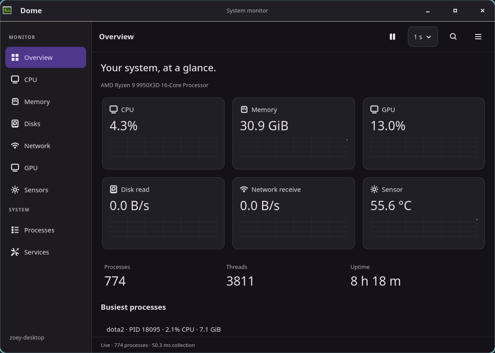

# Native Dome evidence

These are captures of the Zig/GTK4 application running in a private Aqueous
Wayland session, using live Linux collectors. `processes-10000.png` is deliberately
synthetic and labeled accordingly; `service-fixture.png` and `service-denied.png`
use an isolated mock systemd manager. The earlier browser mockup has separate
[evidence](../../docs/mockups/README.md).



| Native screen | Capture |
| --- | --- |
| CPU / logical processors | [Overall](cpu.png) · [Logical](cpu-cores.png) |
| Memory / disks / network | [Memory](memory.png) · [Disks](disks.png) · [Network](network.png) |
| GPU / sensors | [GPU](gpu.png) · [Sensors](sensors.png) |
| Process table and selection | [Processes](processes.png) · [Details](process-selected.png) |
| Safe action | [Disposable process confirmation](process-confirmation.png) |
| Optional service manager | [Unavailable](services.png) · [Fixture](service-fixture.png) · [Denied](service-denied.png) |
| Appearance | [Light](overview-light.png) · [Native GTK](native-theme.png) · [High contrast](high-contrast.png) |
| Size and text | [480 pixels](narrow.png) · [Narrow details](details-narrow.png) · [200% GTK font](text-200-percent.png) |
| Preferences / summary | [Preferences](preferences.png) · [Summary](summary.png) |
| Table stress | [10,000 rows](processes-10000.png) |

## Reproduction

From `subprojects/dome`, run:

```sh
zig build test -Doptimize=ReleaseSafe
zig build integration -Doptimize=ReleaseSafe
zig build benchmark -Doptimize=ReleaseSafe
python3 tests/soak.py --binary zig-out/bin/dome --seconds 1800
```

The private integration suite treats GLib/GTK warnings as fatal and checks every
native page, search, selection, recycled rows, pause/manual/resume, keyboard
navigation, process-action cancellation and confirmed termination of its own
child, service start/stop/restart, denial and manager disappearance, clean close,
light/native/high-contrast themes, 480-pixel navigation and enlarged GTK fonts.
It also deliberately hangs a disposable GPU helper and verifies continued core
sampling and clean shutdown after the timeout. No host services are changed.

The JSON [results](results.json) record the instrumented executable hash,
per-capture dimensions/state, checks, sample application times and keyboard
acknowledgment round trips. `update_us` measures main-thread application of one
snapshot; it is not a frame-rendering or total collector-time measurement.
`key_ack_ms` includes the input tool and log acknowledgment. Eight samples are a
smoke measurement, not a statistical desktop-wide input-latency certification.

The software [Cairo benchmark](../graph-benchmark.json) draws two 1,202-point
series into a 900×220 image surface 500 times, including gaps and axes. It does
not demonstrate GPU-accelerated plotting. The native suite uses 1120×800 windows
except its explicitly recorded 480×800 case; scaled text is tested separately at
1120×800 with the GTK font doubled from 11 to 22 points.

See [hardware and library versions](../hardware.json) and
[production source/build hashes](../final-build.json). The reference machine has
an AMD Ryzen 9 9950X3D (32 logical processors), approximately 60.5 GiB usable RAM,
an AMD integrated adapter and an NVIDIA GeForce RTX 5090. Normal live tests saw
roughly 750 processes. Hardware capability evidence is narrower than a general
vendor-support claim:

| Adapter | Observed fields | Unverified / unavailable |
| --- | --- | --- |
| AMD, amdgpu, device 1002:13c0 | Busy, VRAM used/total, temperature, clock | Power and video engines |
| NVIDIA RTX 5090, NVML | Busy, memory used/total, temperature, power, encode/decode | Other driver/GPU families |
| Intel | No local hardware | Discovery/frequency code exists; device-wide utilization is unavailable |

## Measured checks

| Check | Result |
| --- | --- |
| Core/platform tests | 14 test invocations pass (the core suite is also imported into platform tests) |
| Native suite | 11 scenario groups pass with fatal GTK warnings enabled |
| 10,000-row table | 1,230 realized cells; 8.93–10.20 ms steady snapshot application across eight samples |
| Probe key acknowledgment | 6.48–7.24 ms including the input tool and log reply |
| Software graph render | 1.215 ms median; 1.239 ms p95, 500 iterations |
| 30-minute baseline | Clean exit; 1.70% mean of one core; 83.42 MiB peak RSS; 8–11 descriptors |
| Post-fix 10-minute run | Clean exit; 1.83% mean of one core; 83.11 MiB peak RSS; 8–11 descriptors |
| Metadata / package recipes | Desktop and AppStream validation pass; all three modified PKGBUILDs pass shell syntax validation |

The baseline's final five minutes ranged from 83.40 to 83.42 MiB RSS. The shorter
post-fix run still included cache warm-up and is not a replacement for exact-final
30-minute release qualification. Mapping a window was timed by the soak harness;
that measurement is not a cold-start-to-first-complete-snapshot certification.

## Lifecycle scope

`../soak/results.json` records the 30-minute development-baseline run;
`../soak-final/results.json` records a subsequent 10-minute run after the timer
shutdown fix and font/graph changes. Each identifies its exact executable hash.
The second run uses a frozen temporary executable so a rebuild cannot replace
its helper. The final service-job reporting and GPU detail additions were
verified separately by the native suite; these older soak binaries are not
presented as exact-final-build release qualification.

The runs measure process RSS, descriptors, thread count, CPU percentage of one
logical core and clean exit while cycling pages. They do not directly count all
GObject references or allocations. The earlier development run's executable was
replaced during development; its optional NVIDIA helper stopped launching after
that replacement. The helper now launches through `/proc/self/exe`, and the
native timeout test plus the frozen-binary run cover the corrected behavior.

The [implementation report](../../docs/IMPLEMENTATION_STATUS.md) lists remaining
Pearl appearance integration, Intel/hardware coverage, accessibility, translation,
portability and distribution-release gates. No complete parity or broad release
qualification is inferred from these local results.
