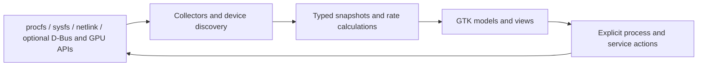

# Dome design and implementation plan

Status: native implementation delivered · September 20, 2026. See the
[implementation report](IMPLEMENTATION_STATUS.md) for delivered functionality,
measured evidence, deviations and remaining qualification gates. The milestone
criteria below remain the design baseline; they are not all certified complete.

Review the [interactive prototype](mockups/index.html) and its
[screen gallery, interactions and verification](mockups/README.md). The prototype
covers resource pages, processes, services, compact summary, responsive layouts
and unavailable/loading/permission states using fictional data. It provides a
visual reference for D1, not evidence that the native D1 milestone is complete.

## 1. Product direction

Build **Dome**, a standalone Linux system monitor in `subprojects/dome/`, using
**Zig 0.16.0 and GTK4**. Help users answer three questions quickly: what is busy,
which application is responsible, and what action can resolve it?

Mission Center is the functional reference for resource graphs, per-core CPU
views, application/process inspection, GPU monitoring, fans and a compact
summary. These capabilities are described on its [official website](https://missioncenter.io/).
Dome is a fresh implementation with Pearl styling. Record an upstream version
and a detailed comparison checklist in D0 before claiming feature parity.

Use the same generated GObject binding dependency pinned by
[Phyto](../../phyto/build.zig.zon), with GTK4/GLib/GIO and libc linkage. The local
toolchain inspected for this plan is Zig 0.16.0 and GTK 4.22.5. D0 must establish
the minimum supported GTK version from the actual APIs used; these observed
versions are not a portability guarantee. Keep a separate build manifest and
application lifecycle. No Pearl process, Aqueous connection or shell library
is required to start Dome. Use GTK4 directly; libadwaita is not required.

## 2. Feature scope

| Area | First usable release: D0–D3 | Broader release: D4–D6 |
| --- | --- | --- |
| Overview | CPU, RAM, swap, disk and network summaries with history | GPU and sensor cards; compact summary window |
| CPU | Total and logical-CPU utilization, uptime, process/thread counts | Topology, available frequency/cache metadata and temperature |
| Memory | Total, available, used and swap; clearly labeled breakdown | Selected-process proportional memory where readable |
| Storage | Per-device read/write rates and activity history | Device identity, capacity and mounted filesystem details |
| Network | Per-interface receive/send rates, totals and state | Addresses, link speed and optional Wi-Fi metadata |
| Processes | Search, sorting, details and end/force-stop for permitted targets | Best-effort application grouping and optional GPU columns |
| GPU | Architecture and capability states designed in D0 | AMD, Intel and NVIDIA adapters, multiple GPUs, available engine/memory/power metrics |
| Sensors | Explicit unavailable state | Read-only temperature and fan RPM where exposed |
| Services | Deferred | Optional systemd user/system service status and start/stop/restart |
| Preferences | Sampling interval, pause, units, theme and column choices | Compact mode, persisted graph duration and live Pearl appearance |

Services are a Dome roadmap item; the referenced Mission Center homepage does
not establish exact service-management parity. Hardware capabilities must be
reported per field and device, not as an unconditional GPU-support claim.

Defer remote monitoring, historical storage across launches, alerts, eBPF
per-process network accounting, fan control, overclocking, service enable/disable,
SMART diagnostics and Flatpak packaging. Ship a native host application first;
a sandboxed package needs a separate host-visibility design.

## 3. Interface and visual design

Use one ordinary `GtkApplicationWindow`, initially about 1120 × 760 logical
pixels, clamped to available space. A 216 px sidebar provides Overview, CPU,
Memory, Disks, Network, GPU, Sensors, Processes and Services. Device pages have
an in-page device selector rather than an ever-growing navigation tree.

```text
┌ Dome                         [Pause] [1 s ▾] [Search] [⋮] ┐
│ Overview  │ CPU                                      24% │
│ CPU       │ ┌─────────────────────────────────────────┐ │
│ Memory    │ │                 history                 │ │
│ Disks     │ └─────────────────────────────────────────┘ │
│ Network   │ Utilization   Speed    Processes    Uptime   │
│ GPU       │ [Overall ▾]       [Logical processors]       │
│ Sensors   │                                             │
│ Processes │                                             │
│ Services  │ Updated just now                            │
└───────────┴─────────────────────────────────────────────┘
```

The overview uses a responsive card grid with a value, unit and small graph per
resource, plus the busiest processes. Clicking a card opens its detail page;
clicking a process opens its details. Resource pages put the graph first, then
a compact metric grid and device information. Avoid large decorative headings.
Process and service pages use search above a sortable table and an optional
details pane. Default process columns: Name, PID, CPU, Memory, Read/s and Write/s.
The header Search action navigates to Processes and focuses its search field.

Follow [Pearl's component guidance](../../../docs/COMPONENTS.md),
[semantic palette](../../../src/theme/theme.zig) and
[Phyto's styling conventions](../../phyto/resources/style.css):

- Dark surface `#141218`, text `#e6e0e9`, primary `#d0bcff`; light surface
  `#fdf7ff`, text `#1d1b20`, primary `#6750a4`. Use semantic roles in code.
- Use 4/8/12/16/24 px spacing, 12 px card corners, 14 px body text with system
  scaling, 44 px primary targets and an optional compact table density.
- Scope styles under `.dome-root`. Provide light, dark and native GTK theme
  modes; native mode supplies layout without overriding system colors.
- Give graph series distinct labels and line styles as well as colors. Use a
  fixed 0–100% utilization scale and clearly labeled adaptive throughput axes.
- Keep numeric summaries accessible; screen readers must not need to interpret
  a graph. Name icon buttons, preserve visible focus and respect reduced motion.

Below approximately 760 px, navigation becomes a dismissible drawer. Below
980 px, details become a separate view with Back. At 480 px, retain Name and CPU
in the process list; remaining metrics are available in details and column
controls. Preserve selection, sort and scroll position through resizing.
Validate 200% text scaling, keyboard operation, high contrast and Orca.

Shortcuts: Ctrl+F searches the active table (or opens Processes), Ctrl+1 opens
Overview, Ctrl+2 opens Processes, Ctrl+P toggles sampling pause, F5 requests a
sample, Escape dismisses transient UI, and Alt+Enter opens selected details.
Destructive actions use labeled buttons/context menus and confirmation dialogs.

Every page distinguishes initial loading, a real zero, unsupported capability,
permission denied, stale data and a removed device. Use “—” with a reason for
unavailable values. Pause freezes collection and timestamps; resume establishes
fresh counter baselines and inserts a graph gap. A manual sample while paused
does not silently resume periodic collection.

## 4. Architecture and ownership



Separate pure parsing, rate calculation and identity logic from platform I/O
and GTK. Collectors publish immutable snapshots containing sequence number,
monotonic timestamp, collection duration, device/process identities, and typed
values with availability status and last-success time.

Run periodic collection on a worker with bounded work and a latest-snapshot
mailbox. Main-context delivery applies model changes and requests redraws;
workers never mutate widgets. This follows [GTK's threading guidance](https://docs.gtk.org/gtk4/section-threading.html).
Retain at most one pending snapshot, free superseded snapshots, and ensure
queued callbacks cannot access a destroyed window. Document ownership across
Zig allocations and GObject references. Shutdown cancels timers, disconnects
signals and joins workers without leaving a background monitor behind.

Default sampling is 1 second, selectable as 0.5/1/2/5 seconds. Keep 120 seconds
of timestamped history in bounded ring buffers; later allow up to 10 minutes.
Use actual elapsed time, never the configured interval, for rates. Maintain
summary history while switching pages; collect expensive per-process details
only when requested. Slow metadata discovery has a separate cadence. Optional
providers must not delay the core snapshot; isolate blocking vendor APIs in a
restartable helper if D0 cannot establish bounded behavior.

Implement tables with [GtkColumnView](https://docs.gtk.org/gtk4/class.ColumnView.html),
recycled factories and filter/sort list models. Key rows by stable identities;
update changed properties and retain selection through sorting. Throttle sorting
to the sample cadence and freeze reordering while an action menu is open.
Graph drawing starts with a native `GtkDrawingArea`/Cairo implementation, with
downsampling to visible pixel width and redraws only on new data or resize.
Benchmark this in D1; adopt a custom GTK snapshot/GSK widget if needed. Do not
claim hardware-accelerated plotting without validating the rendering path.

## 5. Data sources and metric contracts

| Collector | Planned source | Required behavior |
| --- | --- | --- |
| CPU | `/proc/stat`, `/proc/uptime`, CPU sysfs | Per-core and total deltas; handle hotplug and reset baselines |
| Memory | `/proc/meminfo` | Used = total − available; cache/reclaimable labels must not imply disjoint categories when they overlap |
| Processes | `/proc/<pid>/{stat,status,io,cmdline,cgroup}`, executable link | Identity includes PID and start time; partial visibility is valid |
| Disks | `/proc/diskstats`, block sysfs, mount information | Device-scoped rates; distinguish disks, partitions and stacked devices |
| Network | rtnetlink statistics/addresses; procfs fallback | Stable interface identity plus lifecycle generation; tolerate rename/removal |
| GPU | DRM/sysfs and driver-specific providers; optional NVML | Discover capabilities per adapter and field; do not infer device totals by summing visible clients |
| Sensors | `/sys/class/hwmon` | Read temperatures/RPM with documented units and sensor labels |
| Services | systemd D-Bus, when present | Subscribe to state changes and recover after bus-owner changes |

Process CPU defaults to percent of total machine capacity (0–100%); offer an
explicit “one core = 100%” mode. Derive it from process CPU-time deltas and
elapsed time, normalizing by the sampled online CPU count. Reset on topology
changes. Total CPU excludes idle and I/O wait from busy time, avoids counting
guest time twice, and treats invalid deltas as missing samples. Show I/O wait
separately. Memory defaults to RSS for processes: summed application RSS can
double-count shared pages and is labeled accordingly. PSS is an optional slow
detail measurement. See the [kernel procfs reference](https://docs.kernel.org/filesystems/proc.html).

For disk throughput, multiply sector deltas by 512 and divide by elapsed
seconds. Label busy time as activity rather than percent of maximum performance;
concurrency and device topology limit its interpretation. Do not sum a physical
disk and its partitions into an overview total. Reset on counter rollback or
device replacement. See [kernel I/O statistics](https://docs.kernel.org/admin-guide/iostats.html).

Network defaults to bytes/s, with an optional bits/s preference; memory uses IEC
units. Show each interface independently, identifying loopback and virtual
devices. Avoid presenting the sum of bridge/VPN/physical counters as unique
traffic. Link utilization is unavailable when speed is unknown. Rtnetlink is the
preferred statistics interface per the [kernel documentation](https://docs.kernel.org/networking/statistics.html).
NetworkManager enrichment is optional and must not gate basic monitoring.

GPU implementation begins with a capability spike on actual AMD, Intel and
NVIDIA systems. Use DRM client accounting only where the driver exposes it,
deduplicating shared client identities and handling engine-specific units;
missing privileged clients make aggregates incomplete. See
[DRM client statistics](https://docs.kernel.org/gpu/drm-usage-stats.html).
For NVIDIA, load [NVML](https://docs.nvidia.com/deploy/nvml-api/latest/index.html)
optionally at runtime. AMD/Intel device totals require their own supported
interfaces; client accounting alone is insufficient. GPU utilization, video
encode/decode, memory, power and temperature each have independent availability.
Fan and temperature reads follow the [hwmon ABI](https://docs.kernel.org/hwmon/sysfs-interface.html).

## 6. Processes, applications and actions

Always provide an accurate raw process view. Application grouping combines
desktop-entry identity, application scopes/cgroups and process ancestry where
available. Keep uncertain matches ungrouped; executable basename alone is not
an application identity. Each process contributes once to group aggregates.
Show group membership and the limitations of shared-memory totals.

End sends SIGTERM; Force Stop sends SIGKILL after a separate confirmation.
Capture selected identities when opening the dialog and show the process name,
PID and user. Acquire a pidfd, verify the recorded start time against the current
process, then signal through that pidfd so PID reuse cannot redirect an action.
If safe targeting is unavailable, disable the action with a reason. Restrict the
first release to permitted individual targets; later group actions must show
the explicit member set and report partial failures. Do not silently escalate
from graceful termination to force.

Run the app unprivileged. Permission errors remain visible and do not trigger
automatic elevation. Services use asynchronous, typed D-Bus calls and the
system's authorization flow for explicitly requested actions. No root GUI or
general command-execution helper. D4 must verify the chosen systemd API against
the installed interface before implementation. Distinguish user/system units,
pending jobs, cancellation, denial and final state. Without systemd, show an
explanation and keep every other page functional.

Store preferences under `$XDG_CONFIG_HOME/dome/` using atomic writes and a
versioned schema. Persist theme, interval, units, columns, page and window size;
do not persist process command lines or monitoring history by default. Optional
Pearl appearance integration follows its
[committed appearance contract](../../../docs/SETTINGS_FRONTEND_API.md), with
stock palettes as the standalone fallback.

## 7. Proposed project structure

README, this plan and the browser mockup exist. Create native implementation
files as their milestones begin, rather than adding nonfunctional placeholder
build targets.

```text
subprojects/dome/
  README.md
  docs/IMPLEMENTATION_PLAN.md
  docs/mockups/               # Offline browser study, captures and verification
  .zigversion                 # Pin 0.16.0
  build.zig / build.zig.zon    # Independent build; pinned GObject dependency
  src/main.zig                # Application lifecycle
  src/app.zig                 # Sampling, preferences and action coordination
  src/core/                   # Types, identities, parsers, rates, history
  src/collectors/              # CPU, memory, processes, disk, network, sensors
  src/platform/               # Linux I/O, discovery, pidfd and systemd adapters
  src/gpu/                    # Capability model and driver adapters
  src/ui/                     # Window, pages, tables, graphs, dialogs
  resources/                  # Scoped CSS, original icon, translations
  packaging/                  # org.aqueous.Dome desktop entry and metadata
  tests/fixtures/             # Deterministic procfs/sysfs/provider snapshots
  tests/native.py             # Private-session GTK integration checks
  artifacts/                  # Milestone captures and benchmark reports
```

Planned developer commands: `zig build`, `zig build run`, `zig build test` and
`zig build integration`. Validate them during implementation before documenting
them as working commands. Stage executable, desktop entry and icon under
`zig-out/`; add Pearl's Arch package integration only at D6. Follow Phyto's
release/Git naming separation when adding package variants.

## 8. Delivery milestones and exit criteria

| Milestone | Work | Exit criteria |
| --- | --- | --- |
| D0 — feasibility and reference | Pin functional baseline, build/binding spike, metric contracts, hardware/permission inventory, GPU/provider probes | Minimal GTK window builds with pinned Zig; supported API/version matrix and GPU feasibility report recorded |
| D1 — native design | Window/navigation, theme modes, responsive layouts, fixture-driven tables and graphs | Native dark/light/narrow captures; keyboard walkthrough; graph renderer benchmark; no fixture data presented as live |
| D2 — live resources | Worker lifecycle, CPU/memory/disk/network collectors, history, pause and preferences | Live graphs with tested formulas, hotplug recovery and bounded history; UI remains responsive during collection |
| D3 — processes and first release | Virtualized process view, details, search/sort, identity-safe termination | 10,000-row synthetic fixture remains usable; PID-reuse/exit/denial tests pass; only disposable child processes used for action tests |
| D4 — advanced providers | Application grouping, GPU adapters, sensors, optional systemd services | Vendor results and unsupported fields documented; no optional provider blocks core monitoring; authorized actions tested against isolated fixtures |
| D5 — polish and integration | Compact summary, metadata enrichment, appearance integration, accessibility and localization | 480 px/200% text, high contrast, Orca, theme changes and missing Pearl/systemd all exercised |
| D6 — release qualification | Performance, lifecycle soak, packaging, license inventory and support documentation | Reproducible build/install; native evidence and hardware matrix published; remaining gaps explicitly listed |

Dependencies: D0 → D1 → D2 → D3; D4 uses the stable D2 collector interfaces and
D3 identities; D5 integrates completed providers; D6 qualifies the resulting
feature set. The first release may stop at D3 with its smaller scope stated
clearly. A broader Mission Center-like release requires D4 GPU/sensor coverage.

## 9. Verification and performance targets

Test pure parsers and calculations using synthetic fixtures: truncated records,
unusual process names, missing fields, counter reset/overflow, elapsed-time
variation, CPU hotplug, PID reuse, vanished devices, permission errors and partial
GPU support. Use injected clock/filesystem/provider interfaces to replay samples
deterministically. Fuzz externally supplied text parsers with bounded allocations.

Use live smoke tests to compare like-for-like measurements against kernel
counters and established tools over the same sample windows. Document differences
in CPU normalization, memory accounting and GPU capability rather than requiring
unexplained numerical equality. Never terminate unrelated host processes or
change host services during tests. Integration fixtures use disposable children,
a mock D-Bus provider and a private desktop session, adapting Phyto's harness.

Record reference hardware, kernel, driver, process count, window size and build
mode before evaluating these provisional budgets:

- On a reference desktop with up to 1,000 processes at 1 Hz, average CPU below
  2% of one logical core and steady RSS below 120 MiB in ReleaseSafe.
- Input-to-feedback latency below 100 ms at the 95th percentile with 10,000
  synthetic process rows. Main-thread snapshot application below 16 ms at the
  95th percentile on the reference machine.
- Cold launch to usable window below 1 second on that machine; slower optional
  providers continue loading independently.
- A 30-minute soak shows no continuing growth in allocations, descriptors,
  GObject references or queued updates. Paused mode stops periodic collection;
  closed windows leave no timers, helpers or workers behind.

These are targets, not measured claims. Capture benchmark reports per milestone
and revise architecture when budgets fail. Validate Wayland first, including a
private Aqueous session, and smoke-test GTK's X11 backend where available.
Fixtures cannot establish real hardware support: release qualification needs
AMD, Intel and NVIDIA evidence or explicitly narrower published support.

## 10. Principal risks and decisions to resolve

| Risk | Planned response |
| --- | --- |
| Zig/binding/API drift | Pin the known project stack and compile the UI/worker spike in D0 |
| GPU driver differences and blocking APIs | Capability-based providers, independent sampling and real hardware evidence |
| Process scan overhead on large systems | Virtualized rows, bounded updates and demand-driven expensive details |
| Incomplete application attribution | Preserve raw processes and expose uncertain/unmatched membership |
| Restricted procfs, containers or absent services | Report collection scope and per-field availability; retain core monitoring |
| Copying another monitor's code/assets | Use behavior as reference; inventory licenses before any later reuse |

The first implementation task is D0: establish the standalone Zig/GTK build,
record the Mission Center comparison baseline and validate collector/GPU
feasibility before committing to broader support claims.
