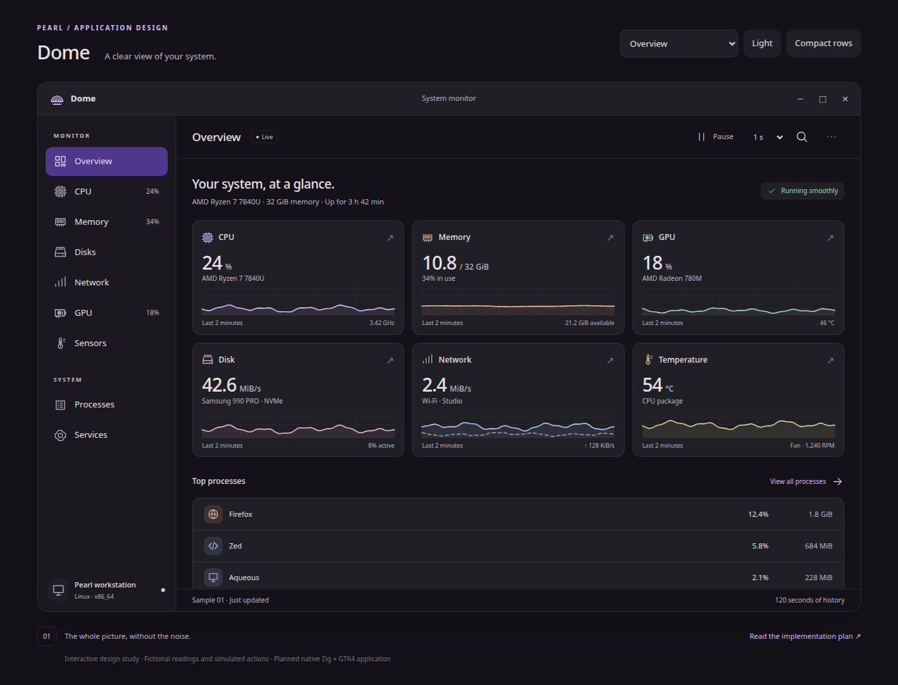

# Dome design review

Open [index.html](index.html) directly in a browser. The prototype works offline
with its adjacent `style.css` and `mockup.js`; no build, server, fonts or external
assets are needed. This is an interactive design study for the planned
**Zig 0.16.0 / GTK4** application, using the same review format as Phyto.



## Screen gallery

| Screen | Capture | Interactive state |
| --- | --- | --- |
| Six resource cards and busiest processes | [Dark](overview-dark.png), [light](overview-light.png) | [Overview](index.html) |
| Overall CPU utilization and topology | [CPU](cpu.png) | [CPU](index.html?view=cpu) |
| All 16 logical processors | [Core graphs](cpu-cores.png) | Open CPU and choose Logical processors |
| Physical memory, swap and composition | [Memory](memory.png) | [Memory](index.html?view=memory) |
| Storage transfers and filesystem capacity | [Disks](disks.png) | [Disks](index.html?view=disks) |
| Receive/send graphs and connection metadata | [Network](network.png) | [Network](index.html?view=network) |
| GPU engines, shared/dedicated memory and capabilities | [GPU](gpu.png) | [GPU](index.html?view=gpu) |
| Temperatures and fan speed | [Sensors](sensors.png) | [Sensors](index.html?view=sensors) |
| Searchable process table and selected details | [Processes](processes.png) | [Processes](index.html?view=processes) |
| User/system units and service details | [Services](services.png) | [Services](index.html?view=services) |
| Small resource summary | [Summary](summary.png) | [Summary](index.html?view=summary) |
| Appearance, units, history and density | [Preferences](preferences.png) | Open the toolbar's More button |
| Deliberate force-stop confirmation | [Force stop](force-stop.png) | Select a process and choose Force stop |
| Service action confirmation | [Service confirmation](service-confirmation.png) | Select a running service and choose Stop |
| 480 px overview with collapsible navigation | [Narrow](narrow.png) | Resize Overview to 480 px |
| Narrow process list in light mode | [Process list](processes-narrow.png) | [Light processes](index.html?view=processes&theme=light) |
| Process details in a narrow window | [Detail dialog](process-details-narrow.png) | Select a process below 980 px |
| Restricted process data and disabled controls | [Permission denied](permission.png) | [Restricted](index.html?view=permission) |
| GPU metrics unavailable | [Unsupported GPU](unavailable.png) | [Unsupported GPU](index.html?view=unavailable) |
| Disconnected network with explicitly stale history | [Disconnected](offline.png) | [Disconnected](index.html?view=offline) |
| Before the first complete sample | [Loading](loading.png) | [Loading](index.html?view=loading) |
| Search with no matching processes | [No results](empty.png) | [No results](index.html?view=empty) |
| Optional service manager unavailable | [No service manager](no-services.png) | [Unavailable services](index.html?view=no-services) |

## Try the prototype

- Use the sidebar or click overview cards to open resource pages. The selector
  above the window also exposes edge cases; it is a review tool, not app chrome.
- Switch CPU between Overall and Logical processors. Change the disk, network
  interface or GPU selector to inspect another fictional device.
- Pause/resume the simulated samples in the toolbar. Change the sampling
  interval or press F5 for a single sample, including while paused. Graphs update
  without replacing the table or moving keyboard focus.
- Search processes by name, PID or user; click column headings to sort; switch
  between raw processes and illustrative application groups. Filter by user or
  background processes. Select a row for its details.
- End process and Force stop open separate confirmations. Cancel preserves the
  fixture; confirming removes that one process from the preview until reload.
  Restricted processes have disabled controls and a reason.
- Switch Services between User and System. Search and select a service, inspect
  a sample log, or start/stop/restart it through a confirmation. Its fixture state
  updates; system actions show the expected authentication context.
- Open Preferences to change appearance, network units, history duration or row
  density, or enter the compact summary. Full monitor returns to Overview.
- At narrow widths, the menu button opens navigation, and process/service
  selection opens details in a dialog. Escape dismisses dialogs or navigation.
- Unsupported GPU exposes a capability explanation; Retry preserves the
  unavailable state. The network scene offers simulated reconnection, loading
  offers a first sample, and the empty search offers Clear filters.

Keyboard: Ctrl+F searches, Ctrl+1 opens Overview, Ctrl+2 opens Processes, Ctrl+P
pauses/resumes, F5 takes a sample, Alt+Enter inspects the selected process/service,
and Escape dismisses transient UI or clears search. Dialogs use browser-native
focus containment. The decorative window buttons represent future native
GTK/compositor controls.

URL parameters: `view=` selects any scenario in the review selector;
`theme=light` and `density=compact` set initial appearance. `freeze=1` disables
automatic fixture sampling for reproducible screenshots, while F5 still works.
Settings and simulated mutations are in memory and reset on reload.

## Visual provenance

The layout follows the [Dome plan](../IMPLEMENTATION_PLAN.md),
[Pearl's semantic colors](../../../../src/theme/theme.zig) and sibling
[Phyto's review conventions](../../../phyto/docs/mockups/README.md). Resource
colors are semantic lavender, peach, green, blue, pink and yellow variants with
separate light-mode values. Send/receive series use solid/dashed lines, and
numeric readings remain available independently of the graphs.

All SVG icons and graphs are original code in `mockup.js`; no screenshots,
artwork or implementation code from Mission Center are embedded. The prototype
requests installed Inter or Noto Sans, falling back to sans-serif. Cards use
opaque Pearl surfaces, restrained borders, 12 px corners and explicit focus
outlines. Navigation, scrollable content and the sample status remain separate.

The review heading, scenario controls and footer annotations sit outside the
proposed application window. HTML/CSS/SVG demonstrate the design; production
will use native GTK widgets and drawing, as specified in the plan.

## Verification

[verification.json](verification.json) records the browser version, tested widths,
interaction checks and screenshot metadata. To regenerate the 24 captures and
report with Python Playwright and system Chromium installed:

```sh
python3 subprojects/dome/docs/mockups/verify.py
```

Set `CHROMIUM=/path/to/chromium` to use another installation. The script only
replaces the capture PNGs and report in this folder. It blocks HTTP/HTTPS
requests and checks that none are attempted. Captures use scale 1 and a 1030 px
viewport height; narrow full-page images may be slightly taller to include the
review notes. The application viewport scrolls independently, so a screenshot
does not necessarily show every row on a page.

Checks cover 16 scenarios in dark/light at 390, 480, 560, 760, 980 and 1360 px,
plus device switching, CPU core graphs, searching, sorting, filtering, process
confirmations, service actions, pause/resume, preferences, compact summary,
narrow navigation and selection retention. A larger base-text layout stress
check and reduced-motion keyboard smoke check supplement normal-width checks.

## Boundaries

Every reading, device, user, PID, log entry and application group is fictional.
The examples represent multiple illustrative configurations, not measurements
from one physical workstation. Graphs are deterministic generated series;
selecting a longer history changes the illustrated time scale, not a real
retained dataset. The automatic timer moves graph fixtures but does not model
changing workloads or recalculate the displayed numeric summaries.

No host monitoring, filesystem access, real process signals, service changes,
authentication, GPU provider, saved configuration or persistent history is
implemented. Application groups reuse representative fixture rows and are not
a working cgroup or desktop-entry attribution algorithm. The table shows a
small fixture set; its performance does not establish native virtualization.

Native GTK themes, full column customization, localization, keyboard row-range
selection, 200% GTK text scaling, Orca and real hardware support remain native
implementation work. Browser semantics and screenshot checks do not establish
those capabilities. The [implementation plan](../IMPLEMENTATION_PLAN.md)
remains the production contract.
