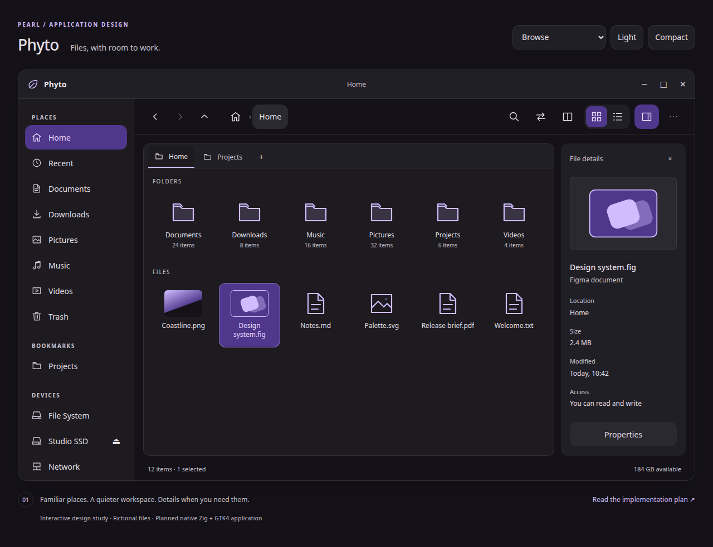

# Phyto design review

Open [index.html](index.html) directly in a browser. It works offline with its two
adjacent source files, `style.css` and `mockup.js`; there is no build or server step.
See the [native implementation report](../IMPLEMENTATION.md) for the working
Zig/GTK4 app and its scope, and the [implementation plan](../IMPLEMENTATION_PLAN.md)
for the full roadmap.

## Context menu proposal

Open [context-menus.html](context-menus.html) for the proposed Nemo-style menus.
Compare the M1 foundation with the target menus, switch contexts, theme and density,
and right-click a file tile or background. Actions only show review feedback.
The [context-menu implementation plan](../CONTEXT_MENUS_PLAN.md) specifies backend
requirements, menu availability, milestones and validation. This is separate from
the existing browsing prototype and does not change the native app.

Captures: [dark](context-menu-dark.png), [light](context-menu-light.png),
[narrow/compact](context-menu-narrow.png). The
[verification report](context-menu-verification.json) covers 60 combinations of
context, scope and width, plus submenu, pointer and keyboard checks. Reproduce
with `python3 subprojects/phyto/docs/mockups/verify_context_menus.py`; it uses the
same local Playwright/Chromium setup described below.

## Screens

| Mockup | Capture | Direct prototype state |
| --- | --- | --- |
| Icon view with file details | [Dark](browse-dark.png) | [Browse](index.html) |
| Light Material palette | [Light](browse-light.png) | [Light](index.html?theme=light) |
| Detailed list | [List](list.png) | [List](index.html?view=list) |
| Two independently navigable panes | [Split](split.png) | [Split](index.html?view=split) |
| Scoped filename search | [Search](search.png) | [Search](index.html?view=search) |
| Transfer progress and conflict | [Transfer](transfer.png) | [Transfer](index.html?view=transfer) |
| Compact window with Places drawer | [Narrow](narrow.png) | Resize Browse to 560 px |
| Empty folder | [Empty](empty.png) | [Empty](index.html?view=empty) |
| Permission denied | [Error](error.png) | [Error](index.html?view=error) |



## Try the prototype

- Use the review scenario selector above the window to compare screens. Switch
  light/dark and compact density there; those controls are not production chrome.
- Select a file to update Details, change grid/list views, or close Details.
- Use Places or the Projects tab to navigate the fixture folders. The breadcrumbs'
  location button explains the future path editor; Home returns to the root fixture.
- Toggle split view with its toolbar button or F3. Select a file in either pane
  or use F6 to change the active pane. Switch its view without changing the other.
  On narrow screens, Switch pane reveals the retained other pane.
- Search with the magnifier or Ctrl+F. Enter `design`, `notes`, or an unmatched
  name. Result rows include locations. Close search with its × button.
- Open More options to reveal hidden files and change sort. Ctrl+H also toggles
  the fixture `.config` folder.
- Open the transfer scenario and choose Skip, Replace or Keep both. Feedback is
  illustrative. The operations toolbar button shows a separate running-job example
  with Cancel transfer. Escape dismisses native browser dialogs.
- On a narrow window, Places opens the sidebar; choosing a place closes it.
  Scroll file contents, Details and Places independently when content is taller
  than the window. The outer title, navigation and status remain visible.

## Visual provenance and interpretation

Colors come directly from Pearl's [semantic theme](../../../../src/theme/theme.zig).
Spacing, typography and state direction follow Pearl's
[design specification](../../../../docs/IMPLEMENTATION_PLAN.md#3-visual-and-interaction-specification)
and Settings application. Browser fonts request installed Inter with Noto Sans
and sans-serif fallback; no font is downloaded or bundled. The small SVG icons
and abstract thumbnail placeholders are original vector artwork in `mockup.js`
and `style.css`. Production MIME icons should come from the installed icon theme.

The navigation toolbar contains the breadcrumb and view controls. Folder contents
follow directly below it; there is no separate large Home/location heading or subtitle.

The review heading, scenario number, annotations and implementation-plan link sit
outside the proposed application window. Window control glyphs are decorative;
actual window actions will be native GTK/compositor controls. Browser CSS is not
GTK CSS and is not intended to be copied verbatim into production resources.

## Verification

[verification.json](verification.json) records Chromium interaction and layout
checks, the screenshot viewport sizes and the browser version. The review script
blocks HTTP/HTTPS requests and uses only local mockup files. To reproduce with
Python Playwright and system Chromium already installed:

```sh
python3 subprojects/phyto/docs/mockups/verify.py
```

Set `CHROMIUM=/path/to/chromium` if required. The script overwrites only the nine
PNGs and `verification.json` in this directory. Captures use scale 1; desktop
viewport is 1280 × 984, narrow viewport 560 × 984. Full-page narrow captures may
be slightly taller than the viewport to include the review note.

Checks cover file selection, view switching, hidden-file visibility, density,
theme, search/no-results/exit, active pane and resize retention, transfer decisions,
cancellation feedback, error navigation and six scenarios at 390, 480, 560, 760,
980 and 1280 px. No JavaScript errors or horizontal document overflow were observed.
The screenshot review also checks hierarchy and clipping; this is not a claim
that every row fits without scrolling at every width.

## Boundaries

Everything is fictional and in memory. No filesystem access, real operations,
network mounts, actual previews or saved preferences exist here. Most Places
reuse a small sample listing; unsupported locations show an empty fixture.
Back/parent returns Home. Full independent tab/history behavior, real path entry,
multi-selection, folder double-click activation, Properties and New folder are
specified in the plan; some controls show an explanatory toast in this prototype.
The conflict checkbox is a visual proposal and does not affect a real queue.

Search is a small case-insensitive fixture filter. Split selection and view are
retained while switching panes, but it is not a full file-browser state model.
Thumbnail art is not a rendering of actual Figma files. Production directory
collision/merge, permanent-delete confirmation, offline mounts and other edge
states still need the P1 native gallery and later functional tests.

Keyboard/browser semantics are useful for review, but GTK focus behavior, Orca,
translations, high contrast, native GTK theme, 200% text and mixed-DPI rendering
must be verified during implementation. No native build or operation-integrity
claim follows from these browser checks.
